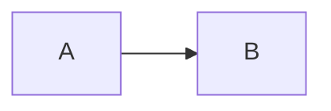

# AGENTS.md

## Project Overview

SvelteKit 2 blog (Svelte 5 runes) deployed to Vercel. Bilingual (EN/VI) using Paraglide i18n. Markdown content with custom rehype/remark plugins for diagrams, table labels, and checkboxes.

## Essential Commands

```bash
# Development
bun run dev

# Build
bun run build

# Type checking
bun run check

# Format/lint (auto-fix)
bun run format

# Preview production build
bun run preview
```

## Package Manager

**Bun** (not npm/yarn/pnpm). Lock file: `bun.lock`.

## Code Style & Formatting

**Biome** with strict settings:
- **Indentation**: Tabs (not spaces)
- **Quotes**: Single quotes
- **Semicolons**: Always
- **Line width**: 100 characters
- **Line endings**: LF

Run `bun run format` to auto-fix. Pre-commit hook runs lint-staged with Biome.

## Project Structure

```
src/
├── app.html              # HTML shell
├── app.d.ts              # SvelteKit type declarations
├── hooks.server.ts       # Paraglide middleware (locale detection)
├── hooks.ts              # Client hooks
├── content/
│   ├── articles/*.md     # Blog posts (English only, .en.md for i18n)
│   └── pages/*.md        # Static pages
├── lib/
│   ├── config.ts         # Site configuration (URL, socials, features)
│   ├── constants.ts      # Enums, regex patterns, paths
│   ├── types.ts          # TypeScript interfaces (PostMeta, BlogConfig)
│   ├── i18n.ts           # Translation helper (useTranslations)
│   ├── i18n-state.svelte.ts  # Reactive locale state
│   ├── design-system/    # Tokens, primitives, foundations
│   │   ├── tokens/       # Animation, colors, layout, spacing, typography
│   │   ├── foundations/  # SCSS for prose and code styling
│   │   └── primitives/   # Base components (Icon)
│   ├── components/
│   │   ├── layout/       # Header, Footer, GearMenu, ThemeToggle
│   │   └── ui/           # Reusable components (PostCard, TableOfContents, etc.)
│   ├── data/server.ts    # Content loading (import.meta.glob)
│   ├── markdown/         # Custom rehype plugins
│   ├── utils/            # Utility functions
│   ├── actions/          # Svelte actions (diagram rendering, pencil edge)
│   └── state/            # Svelte state (lightbox, toast)
├── routes/               # File-based routing
│   ├── +layout.svelte    # Root layout (Header, Footer, analytics)
│   ├── articles/[slug]/  # Dynamic article pages
│   └── ...               # Other routes
├── styles/               # Global SCSS
└── lib/paraglide/        # Generated i18n (gitignored)
```

## Content System

### Article Format

Files in `src/content/articles/`. Frontmatter fields:

```yaml
---
author: FM39hz
pubDatetime: 2025-07-07
modDatetime: 2026-08-17  # Auto-updated by pre-commit hook
title: Post Title
featured: false
draft: false
tags:
  - tag1
  - tag2
description: Brief description
---
```

**Gotcha**: The pre-commit hook (`scripts/update-dates.mjs`) automatically updates `modDatetime` when you modify an article. New articles get `pubDatetime` set automatically.

### Content Loading

`src/lib/data/server.ts` uses `import.meta.glob` for efficient content loading:
- `loadPosts()` - metadata only for list pages
- `loadPageEntriesAsync(slug)` - full content for individual pages
- `listArticleSlugs()` - for prerender entries

### Slug Parsing

`src/lib/utils/slug.ts` handles language-aware slugs:
- `parseSlug()` strips `.en.md`/`.vi.md` extensions
- `parseLang()` extracts language code from filename

## i18n (Paraglide)

- **Locales**: English (`en`), Vietnamese (`vi`)
- **Messages**: `messages/{locale}.json`
- **Generated code**: `src/lib/paraglide/` (gitignored)
- **Strategy**: URL-based (`/vi/...` prefix for Vietnamese)

Use `useTranslations()` from `$lib/i18n.ts` for UI strings. Messages are accessed via `$lib/paraglide/messages`.

## Markdown Processing

**MDX** via `mdsvex` with these plugins:

### Remark Plugins
- `remark-gfm` - GitHub Flavored Markdown
- `remark-math` - LaTeX math
- `remark-toc` - Table of contents
- Custom heading-range plugin for collapsible TOC

### Rehype Plugins
- `rehype-slug` - Auto-generate heading IDs
- `rehype-katex-svelte` - Math rendering
- `rehypeTableLabels` - Add `data-label` to table cells for responsive layout
- `rehypeTableCellCheckboxes` - Checkbox styling

### Special Code Blocks

````markdown


```vega-lite
{"$schema": "https://vega.github.io/schema/vega-lite/v5.json", ...}
```
````

These are rendered client-side via Svelte actions (`renderMermaid`, `renderVegaLite`).

## Design System

Located in `$lib/design-system/`:

- **Tokens**: Animation durations, colors, layout breakpoints, spacing, typography
- **Foundations**: SCSS for prose content and code blocks
- **Primitives**: Base components (Icon)

Use tokens from `$lib/design-system/tokens` for consistent styling.

## Component Patterns

### Svelte 5 Runes

All components use Svelte 5 runes mode (enabled globally in `vite.config.ts`):
- `$state()` for reactive state
- `$props()` for component props
- `$effect()` for side effects
- `$derived()` for computed values

### CSS Modules

Components use CSS Modules for scoped styles:
```
ComponentName.svelte
ComponentName.module.scss
```

### Class-Based Components

Complex components use class-based patterns (e.g., `SiteHeader` in `header.svelte.ts`):
- State managed via `$state()` class fields
- Side effects in `$effect()` blocks
- Exported to `.svelte` files for use with `new ClassName()`

## Testing

No test suite configured. Use `bun run check` for type checking.

## Deployment

**Vercel** with `@sveltejs/adapter-vercel`. Configuration in `vite.config.ts`.

Prerendering enabled globally (`src/routes/+layout.js`). Individual routes can override.

## Gotchas

1. **Paraglide generates code**: `src/lib/paraglide/` is gitignored. Run `bun run dev` to regenerate.

2. **Pre-commit auto-dates**: `scripts/update-dates.mjs` modifies article frontmatter on commit. Don't manually set `modDatetime`.

3. **MDX escapes**: Use `{@html \`...\`}` for raw HTML in mdsvex. See diagram handling in `vite.config.ts`.

4. **Biome strictness**: Many TypeScript rules disabled for `.svelte`/`.ts` files (SvelteKit conventions). See `biome.json` overrides.

5. **Tab indentation**: Biome enforces tabs. Don't use spaces.

6. **Content paths**: Articles use `POSTS_DIR = '/src/content/articles/*.md'` constant, not direct imports.

7. **Theme persistence**: Theme stored in localStorage. Check `$lib/utils/` for theme utilities.

8. **Analytics**: Vercel Analytics and Speed Insights injected in root layout. Disable via environment variables.

## Key Files for Reference

- `vite.config.ts` - Build config, mdsvex setup, diagram handling
- `src/lib/config.ts` - Site metadata, features, social links
- `src/lib/types.ts` - TypeScript interfaces
- `src/lib/data/server.ts` - Content loading patterns
- `src/lib/i18n.ts` - Translation usage patterns
- `biome.json` - Formatting/linting rules
- `scripts/update-dates.mjs` - Pre-commit date automation
