## Table of contents

## The Framework as an Architectural Parasite

Modern interactive simulation and game development are fundamentally constrained by runtime frameworks. Production methodologies routinely dictate building core logic directly around monolithic engine APIs, hardware-facing lifecycles, and localized rendering pipelines. Over the course of a software system's lifecycle, the external framework ceases to be an implementation detail; it effectively becomes the software architecture itself.

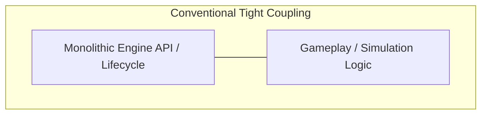

This structural coupling introduces an inversion of clean system design. A simulation domain model should conceptually exist independently of its visualization layer; an engine is structurally nothing more than a localized visualizer and peripheral interface. When simulation logic is tightly bound to platform-specific data structures, memory layout constraints, and runtime infrastructures, the underlying business domain is compromised. Frameworks are volatile technical implementations; simulations are domains. To preserve the structural integrity of complex simulations, a paradigm inversion is required: the complete separation of domain execution from its physical platform execution context.

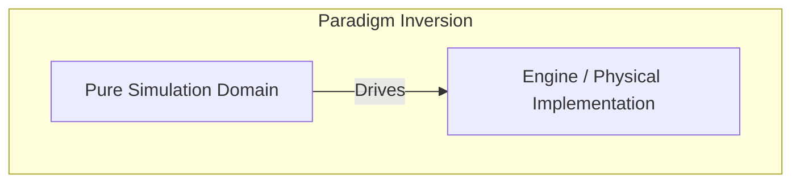

> _Architecture is a set of constraints. Anyone who reads it should be able to come back after two months and still write the game correctly._

---

### Abstract

This paper describes the architecture of Fantasia, a game framework built on the premise that game design and game infrastructure are fundamentally different concerns and should never be mixed. The architecture solves three core problems: (1) complete separation of game logic from infrastructure, allowing engine replacement without touching gameplay code, (2) enabling game designers to author all game content — characters, stats, AI behavior, state graphs — entirely in JSON without programming, and (3) catching every architectural violation at compile-time rather than runtime.

The architecture rests on three pillars: the ABC semantic model (Being–Concept–Aspect) as a ubiquitous language for describing game worlds, an immutable Knowledge database compiled from JSON at build-time, and a source generator pipeline that automatically produces typed code, execution schedules, and dispatch tables from declarative data.

Throughout this paper, a top-down 2D Action RPG is used as a running example to demonstrate each concept concretely.

## 0. Thesis

> **Game designer writes JSON. Programmer writes systems. Compiler handles the rest.**

Every design decision in this paper exists to serve the statement above. If a design doesn't serve it — it shouldn't exist.

- **Designer** writes no code. All game content lives in JSON using GDD-native language.
- **Programmer** writes no boilerplate. Pure logic only — one system, one job.
- **Compiler** (source generator) parses JSON → typed structs, assigns static IDs, scans dependencies, builds execution schedules, emits dispatch tables, detects conflicts. Wrong → compile error.

---

## 1. Game vs Infrastructure

**Why:** A game is not an engine. The GDD says "hit lands," not "AABB overlap." If infra terms leak into game code, changing the engine six months later means the game has to change too. That's wrong.

### 1.1 The Boundary Map

Consider a combat-oriented action game. The GDD speaks one language; code speaks two:

| GDD says       | Game code                                      | Infra code                        |
| -------------- | ---------------------------------------------- | --------------------------------- |
| "hit lands"    | `StrikeDef`, `Vulnerability`, `HitEvent`       | Overlap detection, distance check |
| "push apart"   | `SpaceClaim`, `PushApartSystem`                | Circle-push math                  |
| "opening"      | `VulnerabilityWindow`                          | —                                 |
| "knockback"    | `Knockback`, `StaggerTimer`                    | —                                 |
| "movement"     | `Velocity`, `MovementProfile`, `WorldPosition` | —                                 |
| "appearance"   | `Silhouette { Kind, Palette }`                 | Sprite atlas, draw calls, shader  |
| "button press" | `InputSnapshot { Buttons, Axis }`              | Hardware polling                  |
| "terrain"      | —                                              | Platform collision, tile map      |
| "camera"       | —                                              | Camera matrix, viewport           |
| "render"       | —                                              | SpriteBatch, render target        |

**Rule:** Game code does not contain `Collider`, `Hitbox`, `Hurtbox`, `Detection`, `Overlap`, `Contact`, `Sprite`, `Texture`, `Draw`, `Render`, `Pixel`, `GPU`, `Shader`, `Audio`, `Channel`. Infra owns all of that.

### 1.2 The Litmus Test

> Delete the entire `Prototype.Infrastructure` project and replace it with a new implementation (Godot instead of MonoGame, Jolt instead of BEPU). `Prototype.Game` must compile without changing a single line.

### 1.3 Case Study — "Hit Lands"

GDD: _"The player swings a sword, hits an enemy within range, dealing 1 damage and knocking it back."_

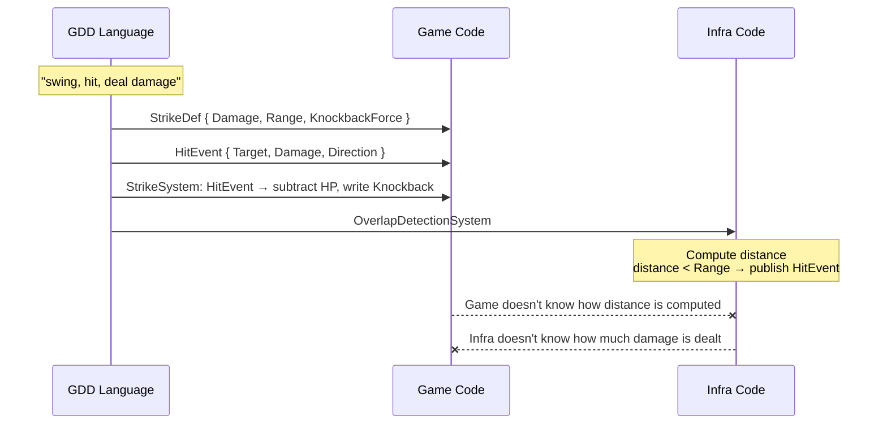

---

## 2. ABC — The Semantic Coordinate System

**Why:** A game needs a single language that both design and code understand. The designer says "the demon has Health" — code must not call it `HpComponent`. The designer says "it's chasing" — that's a state, not an enum.

### 2.1 Three Primitives

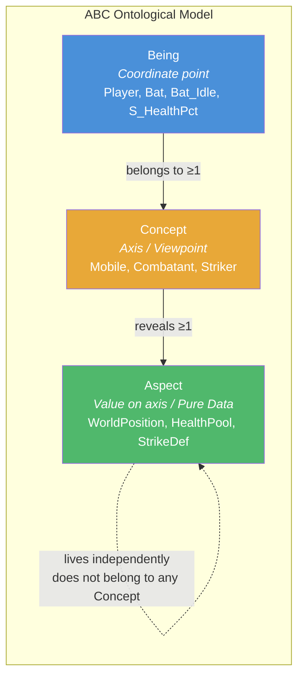

**Being** — a coordinate point in semantic space. Player, Bat, Grass, Bat_Idle, S_HealthPercent — all Beings. They live in Knowledge, not as entities.

**Concept** — a viewpoint on the game. Each Concept opens up a set of Aspects to look through. Concepts carry no data — they're purely viewpoints.

**Aspect** — pure data. Zero behavior. **Does not belong to any Concept.** A Concept merely "opens the window" to see it — the aspect lives independently.

$$B_i = \bigl(C_{B_i},\; A_{B_i}\bigr) \quad \text{where} \quad A_{B_i} = \bigcup_{c \,\in\, C_{B_i}} \text{Reveals}(c)$$

### 2.2 Example — A Character in Semantic Space

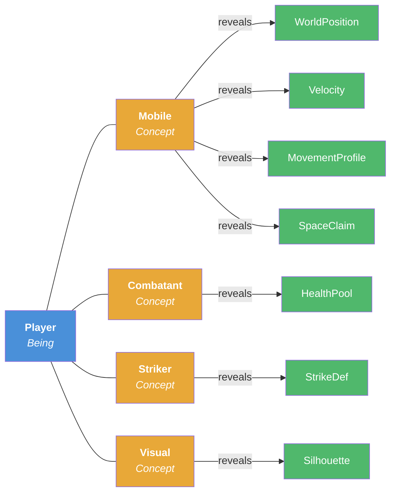

The Player Being sits at coordinate `{Mobile, Combatant, Striker, Visual}`. An enemy might be nearby in semantic space but lack `Striker`. A destructible prop might only have `{Breakable, Visual}`. AI states and sensors are also Beings — `Bat_Idle → [State]`, `S_HealthPercent → [Sensor]`.

### 2.3 Concept Reveals Aspect

Reveals is total: if a Being belongs to `Mobile`, it receives **all 6** Aspects. No cherry-picking.

| Concept      | Reveals                                                                       |
| ------------ | ----------------------------------------------------------------------------- |
| `Mobile`     | WorldPosition, Velocity, MovementProfile, Orientation, DepthLayer, SpaceClaim |
| `Combatant`  | HealthPool                                                                    |
| `Striker`    | StrikeDef                                                                     |
| `Vulnerable` | Vulnerability                                                                 |
| `Knockable`  | Knockback, StaggerTimer                                                       |
| `Agent`      | StateGraph                                                                    |
| `Visual`     | Silhouette                                                                    |
| `Breakable`  | DestructibleConfig, OnDestroy                                                 |
| `State`      | StateLinks, Desirability, StateGroup                                          |
| `Sensor`     | _(identity concept — reveals nothing)_                                        |

### 2.4 Aspect — Type Inference from JSON

Designers declare aspects using **primitive labels** — expressing intent, not .NET types:

```json
{
  "aspects": {
    "WorldPosition": { "Value": "vector" },
    "Velocity": { "Value": "vector" },
    "MovementProfile": {
      "MaxSpeed": "number",
      "Acceleration": "number",
      "Friction": "number"
    },
    "HealthPool": { "Current": "number", "Max": "number" },
    "StrikeDef": {
      "Damage": "number",
      "KnockbackForce": "number",
      "ActiveDuration": "number"
    },
    "SpaceClaim": { "Radius": "number" },
    "Knockback": { "Value": "vector", "Decay": "number" },
    "Silhouette": { "Kind": "text", "Palette": "text" },
    "StateGraph": { "Links": "ref", "Group": "ref" }
  }
}
```

**Inference cascade — narrowest first:**

| Label    | Intent              | Inference rule                                                                                               | Validation                                                                              |
| -------- | ------------------- | ------------------------------------------------------------------------------------------------------------ | --------------------------------------------------------------------------------------- |
| `vector` | Multi-axis quantity | `Vector2` (2 axes) / `Vector3` (3 axes) — count from values                                                  | All Beings using the same field must have the same axis count. Different → build error. |
| `number` | Numeric quantity    | `uint`/`ulong` (all ≥0) → `int`/`long` (has negative) → `float`/`double` (has decimal). Narrowest that fits. | Doesn't fit → build error.                                                              |
| `text`   | String              | `string`                                                                                                     |                                                                                         |
| `flag`   | Boolean             | `bool`                                                                                                       |                                                                                         |
| `ref`    | Being reference     | `Ref<TConcept>`                                                                                              | Wrong Concept → compile error.                                                          |

**No `any`. No `unknown`. No `object`. Zero runtime guessing.**

### 2.5 Being ≠ Entity

Being = design blueprint in Knowledge. Entity = component bag at runtime. An entity does not carry Being identity.

---

## 3. Data Pipeline — From JSON to Runtime

**Why:** Designers write JSON. Programmers write systems. Someone has to turn JSON into code. That someone is the source generator — at compile-time, not runtime.

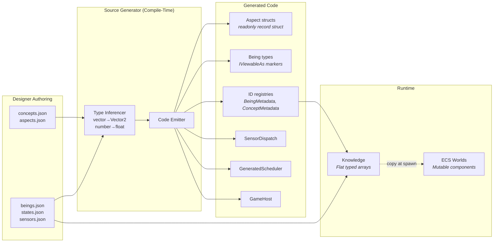

1. **Source gen** reads JSON as `AdditionalFiles` → emits Aspect structs, Being types, ID registries, SensorDispatch, GeneratedScheduler, GameHost.
2. **Knowledge builder** (startup) reads emitted registries + beings data → builds flat arrays indexed by Being ID.
3. **Runtime**: Knowledge immutable, ECS mutable. Materializer (§13) copies Knowledge → ECS components at spawn.

`$prototype` enables inheritance between Beings. Source gen resolves the chain **at compile-time** — inheritance does not exist at runtime.

---

## 4. Knowledge — Immutable Design Truth

**Why:** Design data doesn't change during play. "Player starts with MaxHP 4" is a design fact. "Entity #42 currently has 2 HP" is runtime state. Two different things, living in two different places. Flat pools, fast reads, no locks, no runtime parsing.

### 4.1 Two Query Primitives

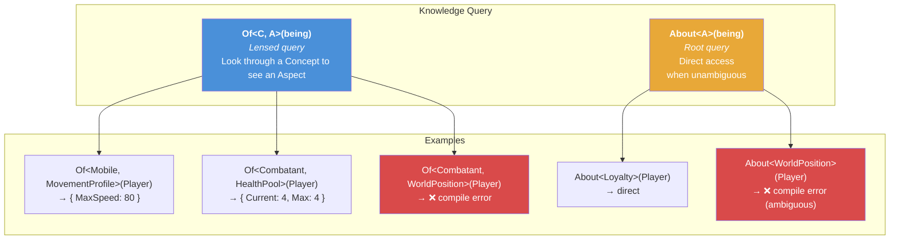

**`Of<TConcept, TAspect>(being)`** — lensed. Each (Concept, Aspect) pair has its own storage. Concept doesn't reveal Aspect → compile error.

**`About<TAspect>(being)`** — root. No lens needed — direct access when the Aspect is unambiguous for that Being. Ambiguous → compile error.

### 4.2 Lookup Path

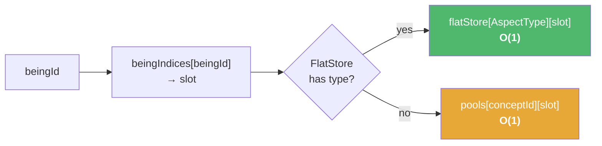

No boxing. No dictionary. No hashing. Pure index arithmetic. FlatStore is the hot path — all Aspects of the same type sit contiguously in memory.

### 4.3 Thread Safety by Construction

Knowledge is immutable after build → no locks, no synchronization. Knowledge access (`Of`, `About`) **does not count as Reads/Writes** in conflict analysis — it is not shared mutable state.

---

## 5. Identity — Two Ways to Point

**Why:** Beings are design data, living in Knowledge. Entities are living objects, in ECS runtime. Two worlds need two reference mechanisms.

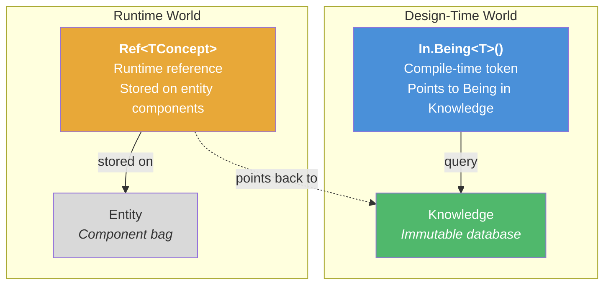

### 5.1 `In.Being<T>()` — Compile-Time Token

The only way to point to a Being in Knowledge. Wrong name = compile error.

**Rule:** Never store in a variable. Never pass through a method. Never compare at runtime. Use only at the call-site when querying Knowledge.

### 5.2 `Ref<TConcept>` — Runtime Reference

When a living entity needs to point to design data, use `Ref<TConcept>` — a concept-scoped pointer into Knowledge.

- `Ref<State>` — which state the entity is currently in
- `Ref<Sensor>` — which sensor is being queried
- `Ref<Effect>` — which effect to trigger on death

Scoped by Concept → compile-time safety: `Ref<State>` can only query Aspects that `State` reveals.

**No `Ref<Player>`. No `Ref<Bat>`.** Identity by **role**, not by **name**.

---

## 6. ECS — Abstract Store

**Why:** MonoGame, BEPU, Silk.NET are infra libraries — systems call them via `IFrameSystem`. But ECS is different: it's the **runtime substrate** — every system runs on it. Fantasia does not provide an ECS API. It doesn't know whether Arch, Friflo, or Flecs.NET is being used.

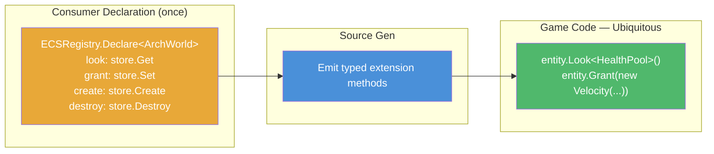

### 6.1 Declaration — Semantics First

The consumer registers typed handlers — no strings, no reflection. `Look`, `Grant` — the consumer names the operations. This is **ubiquitous language** for ECS, just as ABC is ubiquitous language for game data.

### 6.2 Source Gen → Typed API

Source gen reads the declaration → emits extension methods. Game code uses `Look<T>`, `Grant<T>`. Switch from Arch to Friflo → change the declaration, game code untouched.

### 6.3 Why Not an Interface?

An interface (`IECSStore`) would force every ECS engine into the same shape. Wrong — each engine has a different API surface. Declaration lets the consumer **map** semantics onto a specific API; source gen emits a typed bridge. No runtime dispatch.

---

## 7. World — Execution Boundary

**Why:** Many systems run concurrently. A World is a wall. Gameplay must not touch Render.

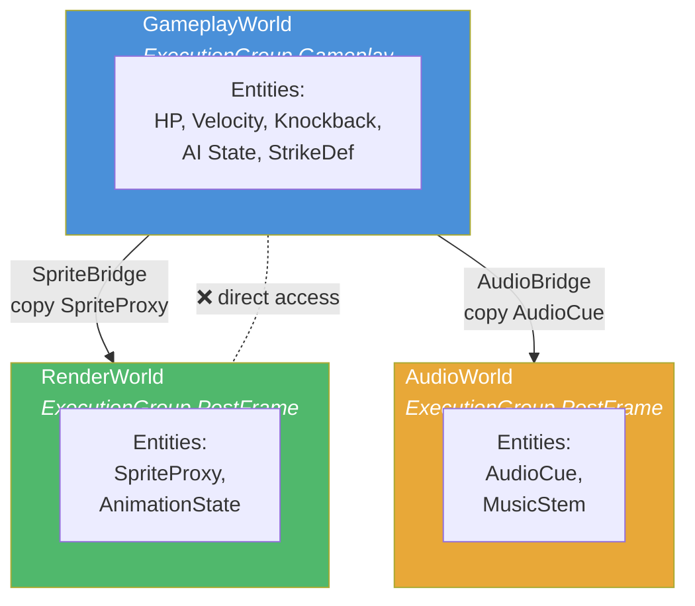

### 7.1 Isolation Guarantee

Entity #42 in GameplayWorld ≠ Entity #42 in RenderWorld. Same ID, different world = two completely different objects. Cross-world communication **only** through Bridge (§12).

### 7.2 Why Separate

1. **Parallel rendering** — different databases, no conflicts
2. **Headless testing** — drop RenderWorld + AudioWorld, game logic runs without a GPU
3. **Engine swap** — delete all render systems, replace with new ones, GameplayWorld unchanged

---

## 8. Component — Living State

**Why:** Knowledge is design (immutable). But games need state that changes every frame — HP decreasing, position shifting, knockback decaying. Components are where living state lives.

### 8.1 Three Kinds of Component

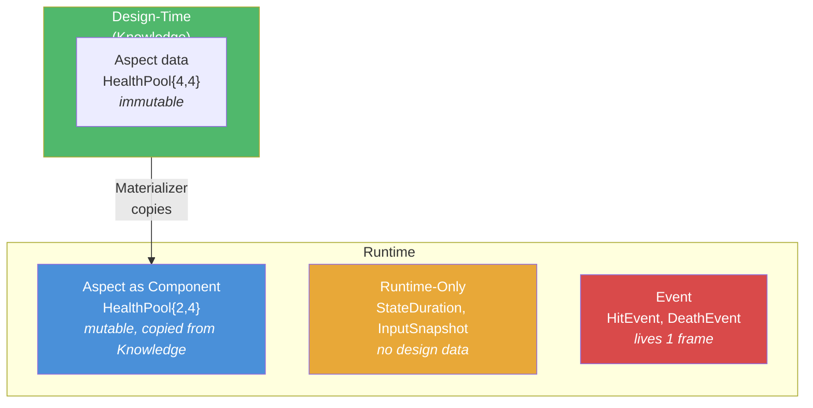

**Aspect as Component** — same type for Knowledge (immutable) and ECS (mutable). Spawn = copy. Entity lives independently. No sync back.

**Runtime-Only Component** — runtime only: `StateDuration`, `InputSnapshot`, `SlugTimer`. No design data. Declared manually in Domain.

**Event Component** — 1-frame signal: `HitEvent`, `DeathEvent`. `world.Publish<T>()` = **Write** in conflict analysis.

**`Ref<TConcept>` as Component** — entity points to design data. `Ref<State>` = "which state am I in." No `Ref<Player>`.

---

## 9. System — Behavior

**Why:** One system, one job. Source gen scans the body. No boilerplate.

### 9.1 One System, One Sentence

Every system should be expressible as a **single short sentence**:

| System             | One sentence                |
| ------------------ | --------------------------- |
| `FrictionSystem`   | Friction slows things down  |
| `SpeedClampSystem` | Speed cannot exceed maximum |
| `MovementSystem`   | Velocity changes position   |
| `DecisionSystem`   | AI picks the next state     |
| `StrikeSystem`     | Strikes deal damage         |
| `HealthSystem`     | Zero HP means death         |

If you can't say it in one sentence → the system does too much, split it.

### 9.2 Contract

`[FrameSystem(typeof(World))]` + `Run()`. No constructor params. World is the only data bus. Knowledge is read-only context — source gen injects a `_knowledge` field into the partial class automatically.

### 9.3 Auto Reads/Writes Scan

| Call-site                         | Counted as      |
| --------------------------------- | --------------- |
| `entity.Look<T>()`                | Reads T         |
| `entity.Grant<T>()`               | Writes T        |
| `world.Publish<T>()`              | Writes T        |
| `_knowledge.Of<>()` / `About<>()` | **Not counted** |

`Look<T>` / `Grant<T>` must be **closed generic at call-site**. Open-generic helpers → analyzer can't follow → forbidden.

### 9.4 Conflict Analysis → Wave Scheduling

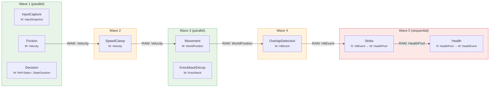

| Conflict   | Condition              | Consequence   |
| ---------- | ---------------------- | ------------- |
| RAW        | A writes X, B reads X  | B waits for A |
| WAW        | A writes X, B writes X | Sequential    |
| WAR        | A reads X, B writes X  | B waits for A |
| No overlap | R/W sets disjoint      | Parallel      |

**Waves are decided by source gen.** Developers don't edit them. `[RunAfter]` only for rare tie-breaks — must include a comment explaining why. Cycles → compile error.

---

## 10. StateEngine — The Decision Primitive

**Why:** Action games need AI. Naive approach: FSM in code, one file per state, transition logic scattered everywhere. Adding a state = adding code. Designers can't do it themselves. We need a shared primitive that's data-driven and can express multiple AI paradigms.

### 10.1 Primitive Aspects — Not Locked to One AI Pattern

The aspects `StateLinks`, `Desirability`, and `StateGroup` are **building blocks**. Designers compose them to express different AI models:

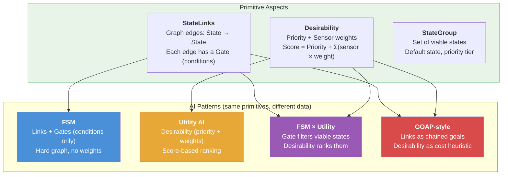

One `StateEngine.Evaluate`. One `DecisionSystem`. Different data. Designers choose the pattern through JSON composition — not through code.

### 10.2 Evaluation Flow

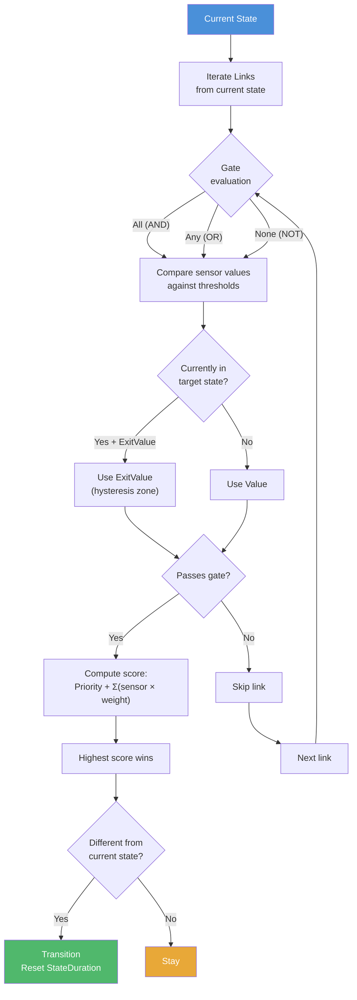

`StateEngine.Evaluate` is a **pure function**. No side effects. Deterministic.

### 10.3 Authoring in JSON

For example, in a game with enemy AI:

```
Enemy_Idle:
  → Enemy_Wander when timer > 2s
  → Enemy_Chase when distance < 80px

Enemy_Chase:
  → Enemy_Wander when distance > 120px (exit: 100px — hysteresis)
  Desirability: priority 2, distance × -0.01 (closer → higher score)
```

Adding a state = adding a JSON entry. **No C# changes.** DecisionSystem is written once, generic for all AI in the game.

---

## 11. Sensor — Perception

**Why:** StateEngine needs floats. World state isn't a float. Sensors bridge the gap.

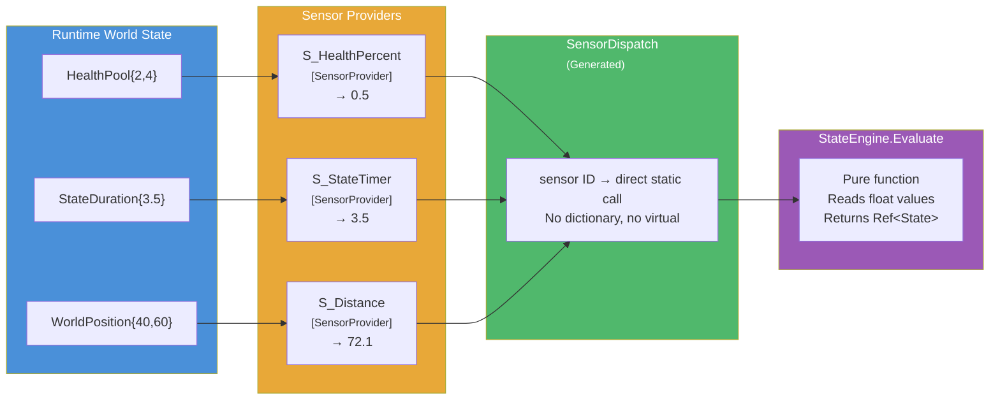

### 11.1 Static Method — Zero Virtual Call

Sensor = Being (has ID) + static method → float. No state. No interface. Source gen emits dispatch: sensor ID → direct static call. JIT can inline.

### 11.2 Game vs Infra Sensors

Sensor providers live in whichever project matches what they **read**:

- `HealthPercentSensor` reads a game component → `Prototype.Game`
- `DistanceSensor` needs spatial queries → `Prototype.Infrastructure`

Game code only knows sensor values exist. It doesn't know how they're computed.

### 11.3 Extension

1. Declare a Being: `"S_Stamina": { "$Sensor": {} }`
2. Write a static method + `[SensorProvider]`
3. Rebuild → dispatch table adds the branch automatically. No other code changes.

---

## 12. Bridge — Cross-World Sync

**Why:** Worlds are isolated (§7). Gameplay knows where entities are. Render needs to know to draw them. Bridges copy data across worlds at defined sync points.

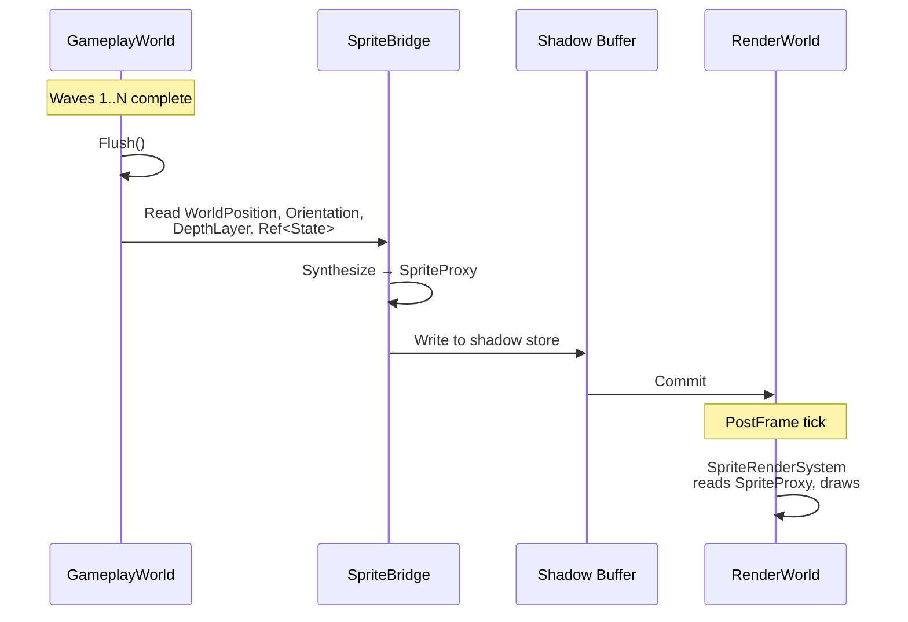

### 12.1 Explicit Reads/Writes

Bridges **differ** from game systems: they use **explicit `[Reads]` `[Writes]`** instead of auto-scan. Reason: bridges cross world boundaries; body scanning alone cannot express "reads from which world, writes to which world."

### 12.2 Entity Linking — `Counterpart<Entity>`

Spawn in GameplayWorld → automatically creates a counterpart in RenderWorld via `Counterpart<Entity>`. Destroy → counterpart is also destroyed.

### 12.3 Minimum Surface Area

Bridges don't copy individual components. They **synthesize** a struct serving the target world:

```
SpriteProxy = {
    Position   ← WorldPosition.Value
    Direction  ← Orientation.Value
    Depth      ← DepthLayer.Layer
    StateRef   ← Ref<State>
}
```

RenderWorld only knows `SpriteProxy`. It doesn't know `Velocity`, `HealthPool`, or `Knockback`. The target world receives exactly and only what it needs.

### 12.4 Double Buffer at Barrier

Gameplay flushes → bridge writes to shadow store → PostFrame reads committed data. The target world always receives a consistent snapshot.

### 12.5 Bridges Are Infra

Bridges live in `Prototype.Infrastructure`. Game code doesn't know they exist.

---

## 13. Materializer — Bringing Entities to Life

**Why:** A Being is a blueprint (Knowledge). An entity is a living object (ECS). The Materializer turns blueprints into reality.

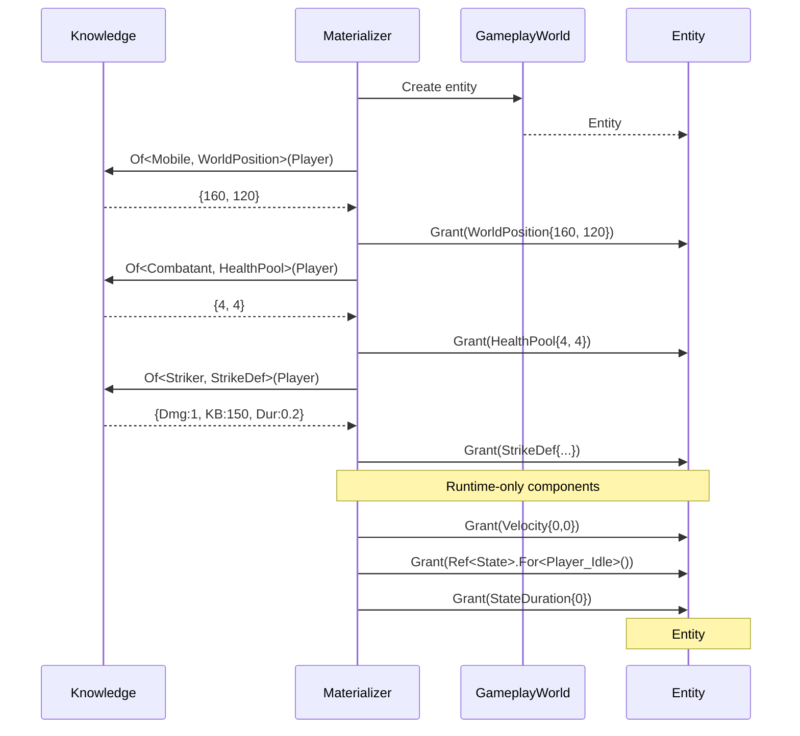

### 13.1 Copy Semantics

Materializer copies Knowledge → ECS components. After that, the entity lives **independently**: buffing its MaxSpeed doesn't change Knowledge. Another entity spawned from the same Being still gets the original values.

**Knowledge → copy → Component. One-way. No sync back.**

---

## 14. Frame Pipeline

**Why:** Games need rhythm. Input before gameplay. Physics needs a fixed step. Render last.

### 14.1 Execution Groups

| Order | Group       | Purpose                      | Tick rate     |
| ----- | ----------- | ---------------------------- | ------------- |
| 1     | PreFrame    | Input capture, platform sync | Variable      |
| 2     | FixedUpdate | Physics                      | Fixed (1/60s) |
| 3     | Gameplay    | Game logic                   | Variable      |
| 4     | PostFrame   | Rendering, audio, UI         | Variable      |

**Group is an architectural barrier.** Designer decides the frame phases.  
**Wave is a compiler barrier.** Source gen infers from R/W analysis.  
Two different layers.

### 14.2 Tick Pipeline

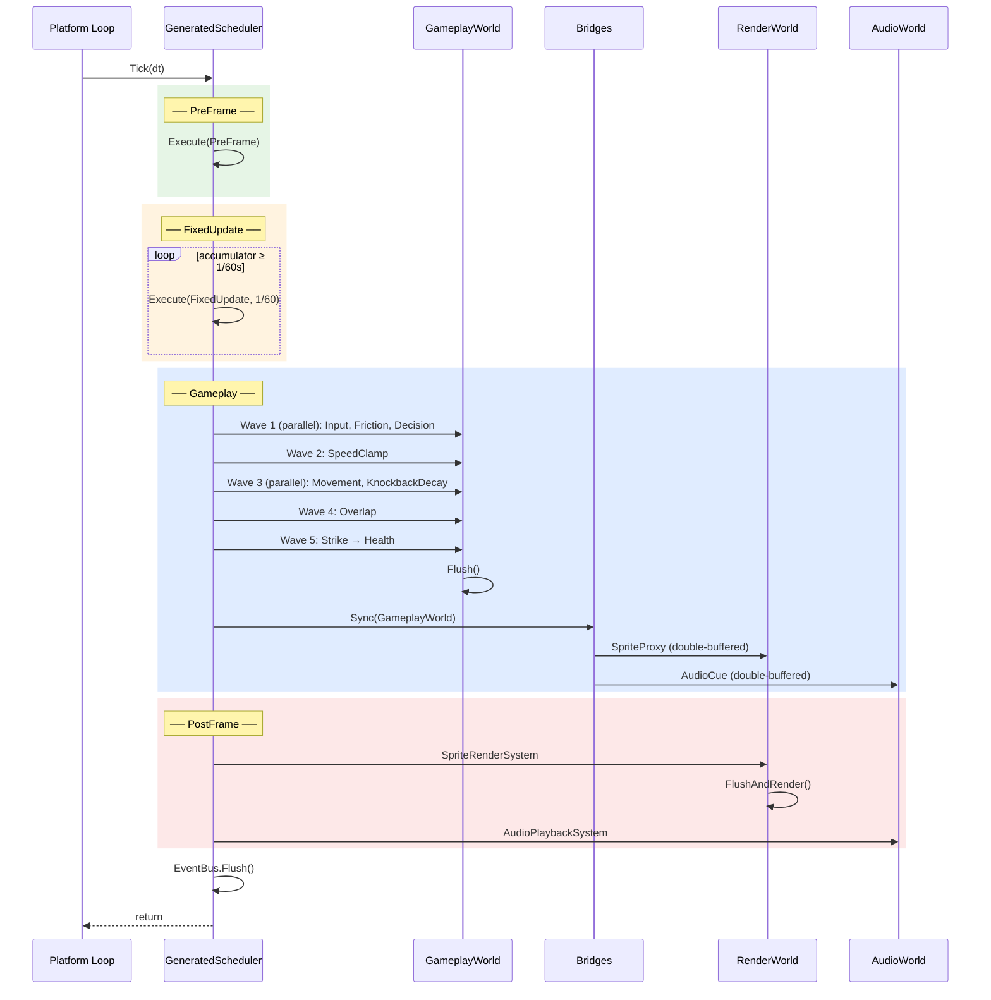

### 14.3 Generated Scheduler & Host

**GeneratedScheduler** — source gen reads `[World]`, `[FrameSystem]`, `[Bridge]`, `[SensorProvider]` → emits system instantiation, Knowledge injection, wave execution, bridge execution, flush logic.

**GameHost** — also generated from attributes. The consumer only sets up the pipeline + ECS registration + platform loop:

```csharp
var knowledge = new Pipeline(new RegistrySet())
    .AddSource("Core", new JsonDataLoader(), "Data/")
    .Run(out var diagnostics);

ECSRegistry.Declare<ArchWorld>(look: ..., grant: ...);

while (running) {
    var dt = Platform.GetDeltaTime();
    GameHost.Tick(dt);           // static — generated
    Platform.SwapBuffers();
}
```

---

## 15. Project Topology

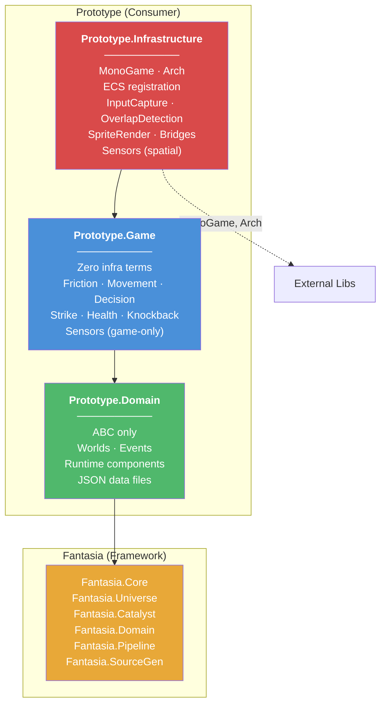

**Dependency rule:** `Prototype.Game` must not reference MonoGame, Arch, or any hardware library. If the NuGet dependency graph contains them → build break.

### Systems Reference

**Game layer:**

| System           | Reads (scan)                | Writes (scan)               |
| ---------------- | --------------------------- | --------------------------- |
| FrictionSystem   | Velocity, MovementProfile   | Velocity                    |
| SpeedClampSystem | Velocity, MovementProfile   | Velocity                    |
| MovementSystem   | WorldPosition, Velocity     | WorldPosition               |
| DecisionSystem   | Ref\<State\>, StateDuration | Ref\<State\>, StateDuration |
| StrikeSystem     | HitEvent                    | HealthPool                  |
| PushApartSystem  | WorldPosition, SpaceClaim   | Velocity                    |
| LifespanSystem   | StaggerTimer, SlugTimer     | StaggerTimer, SlugTimer     |

**Infra layer:**

| System                 | Reads (scan)                            | Writes (scan) |
| ---------------------- | --------------------------------------- | ------------- |
| InputCaptureSystem     | (hardware)                              | InputSnapshot |
| OverlapDetectionSystem | WorldPosition, StrikeDef, Vulnerability | HitEvent      |
| CameraSystem           | WorldPosition                           | CameraState   |

**Bridges:**

| Bridge       | Route             | Data                                                          |
| ------------ | ----------------- | ------------------------------------------------------------- |
| SpriteBridge | Gameplay → Render | WorldPosition, Orientation, Depth, Ref\<State\> → SpriteProxy |
| AudioBridge  | Gameplay → Audio  | DeathEvent, HitEvent → AudioCue                               |

> Reads/Writes in these tables are illustrative. Ground truth is the scan of `Run()` body.

---

## 16. Invariants

No exceptions. No "it depends."

**1 · ABC is the only language.**  
Everything in the game is a Being. Every Being has Concepts. Every Concept reveals Aspects.

**2 · `In.Being<T>()` — never store, never runtime.**  
The only way to point to a Being in Knowledge.

**3 · Game code doesn't know specific Being names.**  
Only `Ref<State>`, `Ref<Effect>`, `Ref<Sensor>`. No `Ref<Player>`.

**4 · Game code contains no infra terms.**  
No `Collider`, `Hitbox`, `Sprite`, `Render`, `Audio`, `GPU`.

**5 · Knowledge is immutable.**  
`Of` is lensed, `About` is root. Materializer copies. No sync back.

**6 · An entity is a component bag.**  
It does not carry Being identity. It does not know "I am Player."

**7 · ECS is an abstract store.**  
Consumer declares semantics. Fantasia doesn't know what Arch is.

**8 · Ubiquitous language is the API name.**  
`Look<T>`, `Grant<T>`. Consumer names them.

**9 · Systems don't write `[Reads]` `[Writes]`.**  
Source gen scans the body. `Look<T>` = Read. `Grant<T>` = Write. Knowledge access is not a Read.

**10 · Group is an architectural barrier. Wave is a compiler barrier.**

**11 · Sensors are static. Source gen dispatches.**

**12 · Bridges use explicit `[Reads]` `[Writes]`.**  
Unlike game systems. Bridges are infra.

**13 · StateEngine is a pure function.**  
Same primitive aspects, different data → FSM, UA, GOAP. Adding a state = adding JSON.

**14 · GeneratedScheduler and GameHost — devs don't edit.**

**15 · Zero reflection. Zero DI. Zero runtime discovery.**

---

_Architecture is a set of constraints. Constraints give freedom. Freedom gives games._
