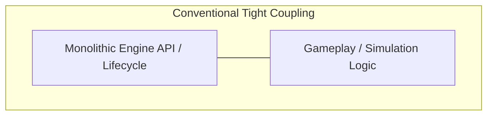
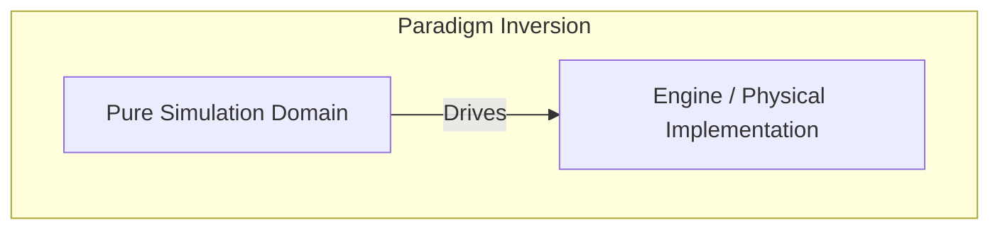
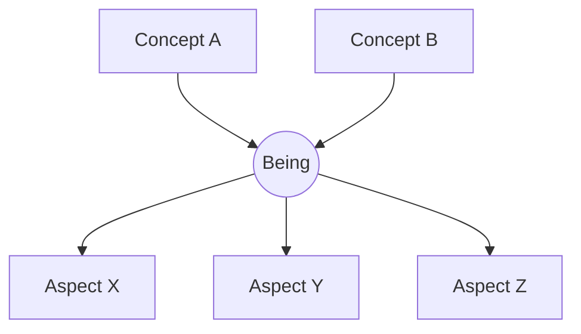
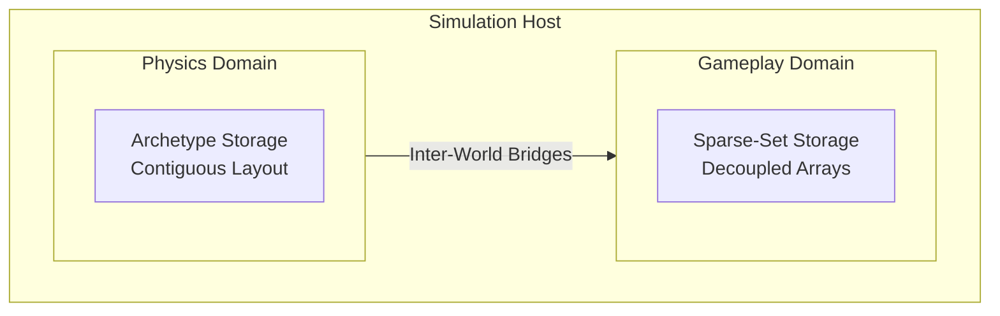
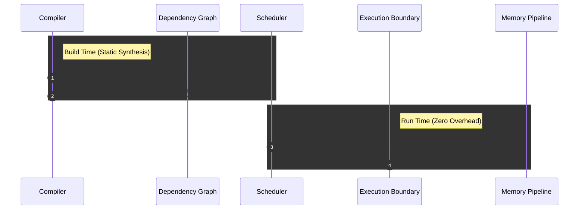
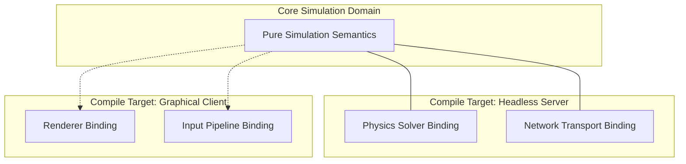

## Table of contents

## The Framework as an Architectural Parasite

Modern interactive simulation and game development are fundamentally constrained by runtime frameworks. Production methodologies routinely dictate building core logic directly around monolithic engine APIs, hardware-facing lifecycles, and localized rendering pipelines. Over the course of a software system's lifecycle, the external framework ceases to be an implementation detail; it effectively becomes the software architecture itself.

This structural coupling introduces an inversion of clean system design. A simulation domain model should conceptually exist independently of its visualization layer; an engine is structurally nothing more than a localized visualizer and peripheral interface. When simulation logic is tightly bound to platform-specific data structures, memory layout constraints, and runtime infrastructures, the underlying business domain is compromised. Frameworks are volatile technical implementations; simulations are domains. To preserve the structural integrity of complex simulations, a paradigm inversion is required: the complete separation of domain execution from its physical platform execution context.

## The Trichotomy of Separation

To completely decouple simulation rules from underlying engineering choices, the application architecture must be separated into three mathematically orthogonal layers:

The core simulation domain is formalized via three structural primitives known as the **ABC Model**, from micro to macro:

- **Aspect (A):** An observation lens carrying a flat, pure data structure representing a single localized state property.
- **Being (B):** An independent coordinate point of existence within the global system state registry.
- **Concept (C):** An orthogonal semantic viewpoint or static type perspective through which a Being is classified and filtered.

Mathematically, the simulation state space is defined as a semantic space generated by the Cartesian product of the Concept power set and the Aspect power set:

> $$B_i = (C_{B_i}, A_{B_i}) \quad \text{where} \quad C_{B_i} \subseteq C, \ A_{B_i} \subseteq A$$

To avoid structural degradation and abstraction leakage, systemic equilibrium requires that the cardinalities of components remain closely proportional:

> $$A \sim B \sim C$$

By adhering to this constraint, the simulation language remains purely semantic, agnostic of physical memory topologies.

## Heterogeneous State Spaces and Execution Environments

While standard decoupled architectures rely on uniform runtime abstractions, real-world execution optimization demands physical memory-access flexibility. Distinct sub-domains within a single simulation require entirely different physical memory layouts:

- **Archetype-Based Storage:** Organizes data structures contiguously in memory for dense component combinations. This minimizes cache misses during linear, mass-parallel operations such as global physics and spatial transforms.
- **Sparse-Set Storage:** Organizes data in decoupled arrays optimized for frequent entity structural modifications, such as the rapid allocation and removal of volatile state tags or status flags.

A resilient architectural model must reject the constraint of a single global database engine. It must parameterize the underlying state store type completely, enabling a heterogeneous configuration where separate execution worlds run concurrently on distinct storage models optimized for their unique data-access vectors. Rather than forcing a performance compromise, the layout of the state space is treated as an isolated compilation target.

## Compile-Time Synthesis vs. Runtime Abstraction

The classic mechanism for achieving decoupling in software engineering is runtime abstraction—specifically virtual method dispatch, dynamic dependency injection, and runtime object-graph reflection. In high-throughput simulations, however, these mechanisms introduce unacceptable runtime overhead, unpredictable cache behavior, and execution latency.

To preserve pure performance alongside total decoupling, the architecture must be resolved entirely at **compile time**. By utilizing a static compile-time architecture compiler, the declarative definitions of worlds, systems, and execution groups are intercepted during compilation. The compiler statically determines data dependencies, constructs access-conflict graphs, and builds unrolled execution schedules before the application binary is ever executed.

Type casting between the agnostic domain semantics and the concrete storage layers is pushed to the extreme boundary of execution. By generating explicit, unrolled static execution blocks, type checking and physical layout resolution occur exactly once per world execution boundary. This approach eliminates runtime boxing, dynamic graph traversal, and virtual dispatch overhead. The runtime environment is stripped of all structural "magic"; it exists solely to execute predictable, pre-compiled static linear memory pipelines.

## Orthogonal Declarative Bindings

Under this compile-time inversion paradigm, framework integrations are handled via independent, optional declarative bindings. Interfaces such as rendering pipelines, physical solvers, network transports, and peripheral input systems are managed as external metadata traits applied directly to the configuration.

Because these bindings are strictly orthogonal to the core domain semantics, they can be swapped or stripped at compile time without modifying a single line of simulation logic. For example, compiling a headless server build requires nothing more than omitting the rendering and input metadata traits. The architecture compiler responds by omitting the corresponding glue code entirely, producing a lean binary free of presentation memory overhead, graphic library links, or execution environment baggage.

## Core Architectural Principles

- **Architecture Over Runtime:** Structural relationships, access validation, and hardware-facing integration points must be fully resolved before execution. The runtime is merely a mechanical execution loop.
- **Zero Reflection Mechanics:** Eliminating dynamic dependency injection and runtime layout determination guarantees total execution predictability and seamless ahead-of-time (AOT) compilation compatibility.
- **Composition Over Abstraction:** External framework modules should not be wrapped inside opaque abstraction facades. Instead, they must be composed explicitly at the compilation boundary through structural glue code generated based on pure domain blueprints.

---

**Hanoi, 07/07/2026**
