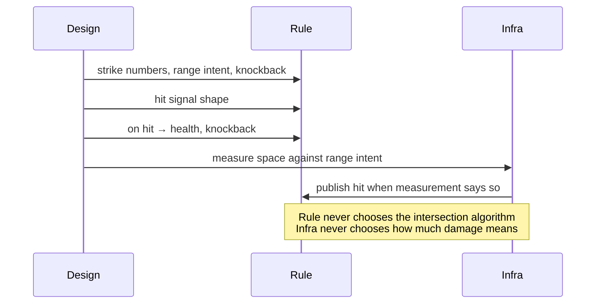
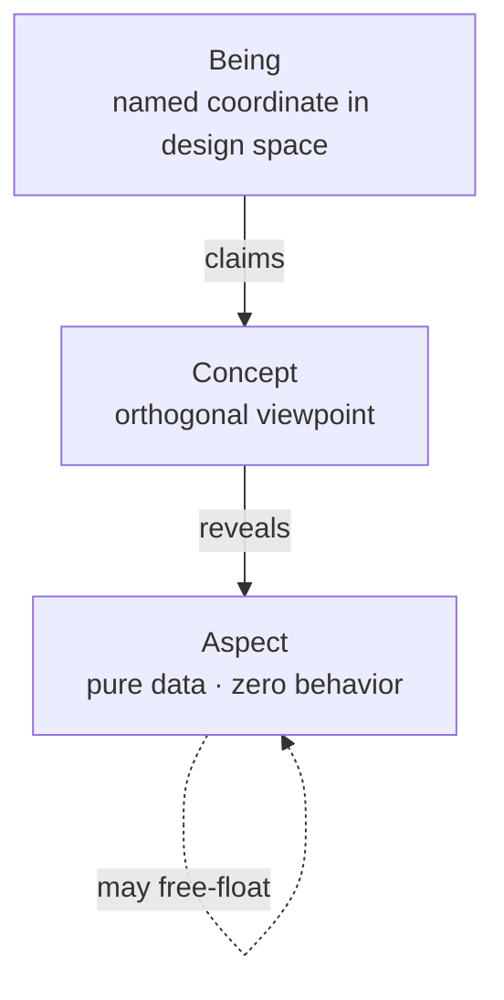
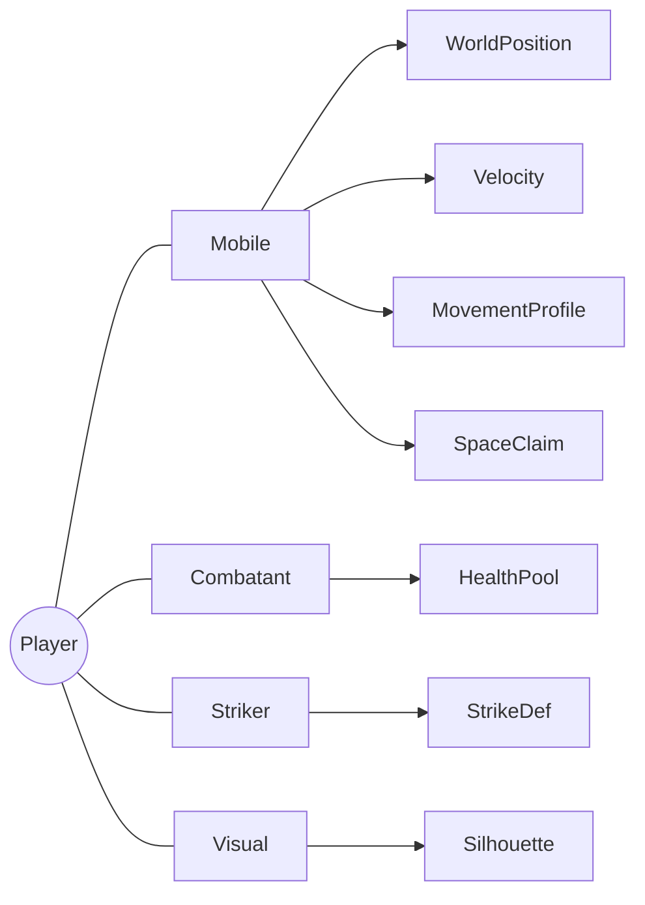
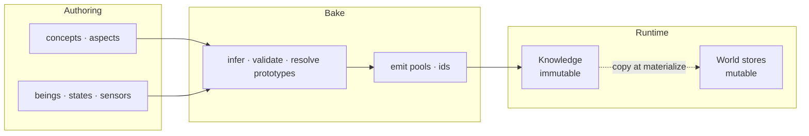
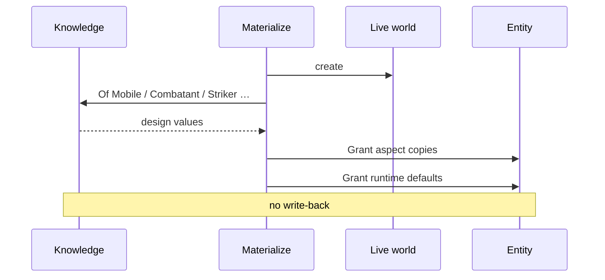
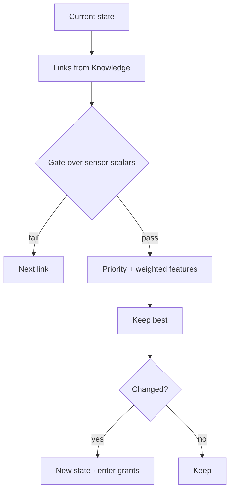

I already argued elsewhere that a game, at minimum, is about rule and potential possibility space, where agents can alter trajectories of it. It could be wrong or not, but it is what it is, just about game itself. But why does we, as indie developer, still creating our game as parasite inside a blackbox? What could be wrong about the way we see the game architecture itself?

## Table of contents

## Misconceptions

When people say they "use game architecture," they often think about SOLID, about performance, folder organization.
And under that sits a deeper mess: we start treating the game as if it were the tool we used to implement it.
But, why? Why it is need to be like that?

Because if the game is imagined as a database, you protect rows before you protect what a hit means. If it is imagined as a pile of scripts, every content problem becomes another labeled graph, and designers stop authoring possibility, events get ordered and agency thins out.
Infrastructure can host a game, but they are not the game, and the same goes for engine, patterns, folder trees, and pretty diagrams: useful, replaceable, and still not the thing.

So, what is actually an architecture for game?

## The line I keep coming back to

Game architecture, is nothing too special, it could be flatten in to 1 line:

> **Designers parameterize the game. Programmers write rules. The boundary between those jobs is enforced by architecture and compiler, not by code review and convention.**

Content identity, numbers, legal trajectories, and grants are parameterization. Generic reading of roles and aspects, mutation of life, and ordering of conflicts are rules. Measuring space, devices, and pixels is infrastructure. When a programmer hardcodes _what_ as a proper noun in code, they have taken parameterization away from design.

If something does not serve that line, cut it. I will keep a top-down 2D action game in mind (move, strike, take hits, AI that chases, grass that breaks, sprites that face the right way) so the constraints stay testable, and the ideas are not limited to that genre. When code shows up below, it is only shape: permission at a call site, not an API you must adopt.

A few consequences fall out right away. If swapping the machine rewrites the rule, the boundary was never real. If new content needs proper-noun branches inside rule code, parameterization already failed. If packages, names, and schedule disagree with the separations you claim, the diagram was decoration.

## Rule against machinery

A design document does not speak in GPU types, or some case, Engine types. It says _hit lands_, _knockback_, _opening_, _the bat is chasing_. Infrastructure speaks in overlaps, atlases, device polls, solver steps. Share those vocabularies in the same functions, and changing the machine changes the game. That is the first failure mode I care about.

| Design says                   | Game rule                                     | Infrastructure                          |
| ----------------------------- | --------------------------------------------- | --------------------------------------- |
| Hit lands                     | strike definition, hit signal, health write   | Overlap / distance / contact generation |
| Push apart                    | space claim, separation policy                | Circle-push or physics penetration math |
| Opening                       | vulnerability window                          |                                         |
| Knockback                     | knockback, stagger timers                     |                                         |
| Movement                      | velocity, movement profile, world position    | Optional character-controller solver    |
| Appearance                    | silhouette intent (kind, palette, ...)        | Sprite atlas, draw calls, shaders       |
| Button                        | input snapshot / commands                     | Hardware polling, focus, rebinding UI   |
| Terrain                       | walkability as game facts, if rules need them | Tile collision, nav mesh build          |
| Camera / render / audio graph | follow intent, if authored                    | Matrices, viewports, mixers, voices     |

Rule do not name colliders, hitboxes, sprites, textures, draw, GPU, shader channels, or audio graphs. Infrastructure owns those words, while rule owns what a hit means once a hit is known to have occurred.

Here is the litmus I actually use. Delete infrastructure (renderer binding, input binding, spatial backend), replace it with another engine, another physics, or headless stubs, and game rule should still stand unchanged. If rule reaches infrastructure "only for a vector type," the camel's nose is already inside, and math will not stay lonely.

Take "hit lands." Design means the player swings, something in range is hit, one damage is dealt, and knockback follows. Split measurement from resolution: infrastructure measures space against a range intent and publishes a hit when the measurement says so, then rule receives that fact and writes health and knockback. Rule never chooses the intersection algorithm, and infrastructure never chooses how much damage means. Architecture is just the refusal to let one function do both forever.



Measurement can sit near gameplay in the schedule and still be infrastructure, because it publishes a fact and does not own the damage table. One function holding both is not pragmatism; it is debt.

Why this matters for the parasite question: if your rule is written in engine words, the game is not hosted by the engine. The game is trapped inside it.

So that why i have a thing call 'The ABC model'

## A, B or C, what is that?

Rule and design still need a shared way to talk about what exists as design. `HpComponent` and `MoveComp` are storage slang, not that language. I don't want a second entity model, and I don't claim the game is a database of objects. I just need coordinates for design truth.

Three primitives have been enough for me.

**Aspect** is aspect. A glance, a minimal set of structure, that you could see through.

**Being** is...a thing. That's it. A thing inside your game. A state, a character definition, an effect,...doesn't matter. It is what it is.

**Concept** is a pure concept in your game. There is a viewpoint for you to see through varios of things and don't realy care what that thing is. It is revealing an aspect dedicated to only that concept.



$$B_i = \bigl(C_{B_i},\; A_{B_i}\bigr) \quad \text{where} \quad A_{B_i} = \bigcup_{c \,\in\, C_{B_i}} \text{Reveals}(c)$$

Reveals is total. Claim `Mobile`, and you get every aspect `Mobile` reveals, because cherry-picking produces "almost Mobile" rows that break queries and train designers badly. Aspects are not exclusive property of a concept either: a concept opens a window, and the same data can free-float when no viewpoint wrapper earns its keep, like a single loyalty scalar.



Nearby you might find an enemy without `Striker`, a pot with only `Breakable` and `Visual`, `BatIdle` claiming `State`, and `SDistance` claiming `Sensor`. One Knowledge, many roles, so generic rule keys off roles and aspects, not marketing names. In an action game, `Mobile` might open world position, velocity, movement profile, orientation, depth, and space claim; `Combatant` opens health; `Striker` opens strike definition; `Vulnerable` and `Knockable` open vulnerability and knockback; `Visual` opens silhouette intent; `Breakable` opens destructible config and an on-destroy link; `State` opens links, desirability, and groups; and `Sensor` is often identity-only because the being _is_ the probe. Your set will differ, but the demand does not: viewpoints stay explicit, data stays pure, and composition stays orthogonal.

Designers should not choose `Single` vs `Double`. They declare quantity intent such as vector, number, text, flag, or role-scoped ref, and a bake maps intent to storage types while rejecting inconsistency. No `any`, no `unknown`, and no untyped bags on the authoring boundary, because runtime guessing is how design truth stops being Knowledge.

Being is not entity. A being lives in Knowledge, does not mutate in play, and is identified by design name, while an entity lives in a world store, mutates, and holds a handle local to that world: "that bat instance on screen." An entity is a bag of live fields, and it need not know it is Player. Debug may show spawn source, but rule that scales by `if (is Player)` will not scale.

Again, this is not "the game is a schema." It is just how design and rule share coordinates without collapsing into storage slang or class trees: viewpoint against free-form bags, role against proper noun.

## Knowledge against life

"Player max HP is 4" is design. "Entity 17 has 2 HP" is life. Those are different kinds of truth, and if you put them in one address space you get either live buffs rewriting the next spawn's blueprint, or endless reparsing because nothing was ever frozen.

Designers write structured data, and the format is mechanism: JSON, tables, graphs, whatever. Before the hot loop, that data has to become typed, indexed, immutable memory of design. I call that **Knowledge**: not config, not prefab, not "mutable by accident," but design fact frozen for the session, or until an explicit reload you treat as a new freeze.



The stages are logical rather than required class names: merge sources under an explicit policy, resolve prototypes so runtime never walks parents, cross-ref every pointer so it hits a being that claims the required role, flatten into dense pools, and freeze. After freeze there is no mutation of Knowledge. Optional compile-time emission of typed markers, sensor dispatch, and schedules is only a way to fail early. Frozen Knowledge and accountable rule are the point, not a generator brand.

Honest access is either lensed or unambiguous. Through a concept lens you ask for an aspect that concept reveals, so `Mobile` plus movement profile is valid while `Combatant` plus world position is not. Direct aspect access is allowed only when unambiguous, like a unique loyalty scalar rather than world position when multiple paths could own it. Invalid lens or ambiguity fails before play when the toolchain allows it, and you should not invent a third path that returns null and hopes. In shape, that is `Of(concept, aspect, being)` for the lensed case and `About(aspect, being)` for the direct one:

```csharp
// shape of permission, not a mandate
knowledge.Of<Mobile, MovementProfile>(In.Being<Player>());
knowledge.Of<Combatant, HealthPool>(In.Being<Player>());
knowledge.About<Loyalty>(In.Being<Player>());
```

Hot-path Knowledge reads should be index arithmetic into contiguous pools after freeze, not string-name dictionary walks every frame. Exact layout is implementer work; the claim is only that after freeze, design reads are O(1)-shaped and allocation-free.

This next part is easy to get wrong. Looking at Knowledge is **not** a mutable read/write conflict against other rules, because Knowledge is immutable context. If you treat `Of` / `About` as schedule noise, you create false dependencies and train people to ignore the real graph, the one over life. There are no locks for Knowledge reads, and there should be no mysteries about who wrote MaxSpeed in design, because design does not change while the frame runs.

Design space and live space also point differently. At bake and at call sites that mean "this exact Knowledge entry," use a typed design token that turns a compile-time name into an id so misspellings fail early. Tokens address Knowledge; they are not a second id system stuffed into every live component. When an entity must remember a knowledge linkage such as current AI state, death effect, or probe definition, store a role-scoped ref like `Ref<State>`, `Ref<Effect>`, or `Ref<Sensor>`, not `Ref<Player>` or `Ref<Bat>`. A state ref may only read what `State` reveals, and identity by role keeps rules generic. Branching on Player, Bat, or GrassBreak as proper nouns grows linearly with content, so content identity belongs in authoring and validation, where every Breakable declares OnDestroy, not in if-ladders inside rules.

Knowledge holds design, and components hold life. After spawn, aspects may appear as mutable component copies and take ordinary reads and writes; runtime-only fields such as timers and input snapshots do the same; signals such as hit or death are published when something occurs, so publish counts as a write and consumers are ordered after. The same aspect shape can be design data and component payload, because immutability is a property of where the value lives, not of the type name. Role-scoped refs on entities are how life points back at Knowledge without becoming beings.

A being is a blueprint, and an entity is a living bag. Materialization is the one-way copy: create the entity, copy design data, grant defaults, and never write back. After that, the instance is independent, so changing this MaxSpeed does not edit Knowledge and the next spawn still reads design. Effects, volumes, debris, and actors should converge on "materialize being X at pose Y," not permanent `CreateGrassBreak()` methods. Rule publishes intent, materialization applies the being's aspect schema, and missing required links fail at bake rather than falling back to hardcoded names. When decision switches a state ref, copying aspects from the state-being onto the entity is still materialization, only triggered by transition rather than first spawn.



Why split Knowledge and life so hard? Because if you cannot tell design fact from this-instance-now, you already lost the difference between law and weather, and once that is gone, the blackbox owns you again.

## Rules, and honest reads and writes

Rules need mutable fields. That place is often an ECS, or SoA tables with the same permissions, and I do not care which vendor. I care that rule can touch life without importing engine words, and that every mutable touch is visible to ordering, because order without visible dependence is fake.

Once per project or domain, map a small surface onto the concrete store, then let rule speak those verbs. Meaning matters more than spelling, and in the shape I use, life is looked and granted:

```csharp
// shape: consumer names the verbs; mapping stays in infrastructure
Store.Declare<MyWorldBackend>(
    look:    (store, e) => /* read component */,
    grant:   (store, e, c) => /* write component */,
    create:  (store) => /* new entity */,
    destroy: (store, e) => /* destroy */
);
// rule then speaks: entity.Look<HealthPool>(), entity.Grant(velocity)
```

Why not force one lowest-common interface on every backend? Backends differ, and a thin interface becomes either a lie or slow virtual soup. Declaration plus typed surface keeps rule ubiquitous while mapping stays local to infrastructure. Different domains may want different layouts, whether dense iteration for broad sets or sparse churn for volatile tags, and that is fine because domains do not share stores. You do not need dual-backend complexity inside one domain in advance, only the right to split when access patterns diverge. Structural create and destroy mid-rule reshuffle dense storage and break parallel readers, so those changes are intents committed at known barriers. Field grants that do not change layout may be direct if store and schedule allow it, and project rules should say which is which.

If you cannot state a rule in one short sentence, split it. Friction slows velocity, speed cannot exceed profile max, velocity changes position, an agent picks the next legal state, hits apply damage and knockback intent, and zero HP means death. Multi-sentence rules hide extra writes and become dumps.

A rule is bound to one world, exposes a run entry, and treats that world's store as its data bus. Knowledge is read-only context and is never counted as mutable conflict. Constructor-injected god services recreate the global soup under a cleaner name.

Every touch of mutable state must be visible to the scheduler, whether by attribute or by closed-generic call-site scan. Looking a component is a read, granting a component is a write, and publishing a signal is a write, while Knowledge `Of` and `About` are not mutable conflicts. Life participates in conflict analysis; Knowledge does not, because it is frozen context. `Look` and `Grant` must be closed generic at the call site, because open helpers that hide `Grant<T>` behind an unconstrained `T` make dependence analysis impossible, and on any path that claims automatic ordering they should be forbidden. And do not create a mutable local just to hold something you looked: if that intermediate is used by the current rule, it deserves its own rule run before this one.

Conflicts become waves. If A writes X and B reads X, B runs after A. If both write X, order them. If A reads X and B writes X, B runs after A. If there is no shared mutable touch, they may parallelize.


Phases such as capture, fixed, gameplay, and late are architectural slots for the frame, and the names are only illustrative. Waves inside a phase are mechanical consequences of conflicts. Humans declare worlds to phases and rules to worlds; they should not maintain wave tables by taste. Explicit run-after is rare and commented, and cycles are defects. Waves from dependence truth rather than preference is what "enforced by architecture and compiler" means for time: not code review, not convention hope.

Clockwork, injection, decision, and resolution can share a scheduler without sharing meaning. Friction, decay, and integrate have no choice; input capture is agency entering from outside; decision chooses among legal edges; strike and health are pure consequence of signals and data. Measurement that turns overlap into hit is infrastructure even when scheduled near gameplay, because it publishes a fact and does not own the damage table. Publish is a write, and consumers are ordered after.

Behavior over life has to be small, accountable in reads and writes, and free of content proper nouns. Otherwise parameterization dies in the programmer's calendar, and order dies in hope.

## Agency without turning the game into machines

Games need trajectories, for both player and AI, that designers can extend without a new type per label. The move is not "pick FSM or utility AI as the identity of intelligence." It is small composable data, one pure evaluator, and side effects elsewhere. From a hard graph until you truly need heavier scoring or planning, you should not rewrite the evaluator twice.

Not because the game is a state machine, but because trajectories through possibility space can be parameterized, and parameterization is the point.

Authors choose the pattern by data: hard edges only, scores only, or gates that filter and scores that rank. Hybrid is common, and one evaluator covers either way. State links are directed edges with gates, gates compare sensor scalars with optional exit thresholds for hysteresis, desirability turns priority and weighted sensors into a score, and state groups hold candidate sets, tiers, and defaults.



`Evaluate` stays pure: Knowledge plus current state plus features yields the next state or the same one. Invulnerability, spawns, and overrides do not live inside the scorer. On transition, separate rules look at life and grant what the state-being in Knowledge carries. That is how "roll gives i-frames" becomes authoring, because the roll state carries the grant, instead of a permanent dodge rule that only exists because Knowledge was underused.

Decision wants scalars, and the world is not scalars, so sensors extract. A sensor definition is a being, a provider is a closed function from world state to values, and dispatch is closed rather than reflective soup on the hot path. Providers over pure gameplay fields live with rule, while providers that need spatial acceleration live with infrastructure. Rule consumes floats, not query internals. Providers that look game fields participate in ordinary read accounting when they run as rules, and the evaluator itself should still receive floats rather than opening the store freely inside scoring.

If this starts to feel like "the game is a graph of states," stop. The graph is one authoring shape for legal trajectories. The game remains the possibility space those trajectories move through, under rules, at $\Delta t$, with agents able to force change.

## What a frame is allowed to mean

A frame is a traceable $\Delta t$ transaction: injection in, rules under a defendable order derived from reads and writes, structural mutation at barriers, optional projection across ownership walls, and one-frame signals cleared. That is enough for the outer loop, and it is also where "rule + possibility space + agents" stops being abstract and starts being software.

Two knobs get mixed all the time. An **execution phase**, or group, is order and tick policy in the frame, while a **world** is an ownership wall around one mutable store and the rules bound to it. There is no sacred cast of RenderWorld and AudioWorld. You declare walls when ownership, tick policy, replaceability, or layout actually diverge. Headless work may need only one sim world, a fat client may add presentational walls later, and stable physics may place a world on a fixed phase. Architecture constrains isolation and scheduling, not a product diagram of names.

Entity 42 in world A is not entity 42 in world B, rules in A do not `Look` into B's store, and cross-wall data moves only through bridges at barriers. A single-world project simply has no bridges, and that is honesty rather than a missing pillar. Split when writer sets or tick policies must not be shared, and do not split because a blog showed three boxes.

Capture is usually where injection lands, such as input or net input. Fixed holds work that needs stable $dt$, if any. Gameplay holds primary rule worlds. Late holds consumers of snapshots, if any. Phases are not worlds: a phase may host zero or more worlds, empty phases are fine, and waves are derived inside a phase's rules from R/W conflicts. Humans bind worlds to phases and rules to worlds; they do not maintain wave tables by taste.


Bridges only earn keep when two ownership walls must exchange a snapshot without sharing a store. They are the only legal cross-wall writers, and they run after the source has flushed. Body scan inside one store cannot express "read A, write B," so bridges declare both ends explicitly: reads from the source wall, writes into the destination wall. Ordinary Look/Grant accounting is not enough. Read what downstream needs, synthesize a minimum proxy rather than the whole entity, snapshot it, and commit before the destination phase runs. Destination rules read proxy only, counterpart lifecycle is infrastructure concern, and double-buffering keeps a consistent frame. Game rule does not reference bridges, and zero bridges is valid.

Declared worlds, rules, optional bridges, and sensor providers are enough to derive a schedule. The host that advances $\Delta t$ stays thin. Hand-edit that schedule to insert one rule without updating dependence truth, and the model is theater. The platform is not the game.

Agency enters, rules advance possibility under order that follows honest reads and writes, machinery measures, and presentation may watch, without rewriting the law. That is the opposite of living as a parasite inside a blackbox: the host can change, and the rule still stands.

## When the separations are real

Dependencies are architecture. If rule can reach a renderer through packages, the boundary is already fiction. Authoring shapes and markers hold no behavior and no I/O; game rule holds rules and sensors over game fields with no engine packages, no draw, and no device poll; infrastructure holds bindings, measurement, bridges, and presentation, and does not exclusively own damage tables or AI policy. Edges point inward.

None of that matters if rule still hardcodes content. The only leverage I trust is the share of decisions that live in Knowledge. Numbers, distances, and forces belong in authoring. A new state for an existing role belongs in authoring, maybe with one new sensor. A new effect being belongs in authoring, with materialize already generic. Swapping a spatial backend or renderer belongs in infrastructure only. Headless tests omit presentational walls.

Feature pressure always revives weak paths that look reasonable in the moment. Camera becomes a global singleton, roll invulnerability becomes a bespoke rule flipping hurt flags, attack volumes are hand-spawned inside the attack rule, breakable death effects fall back to a hardcoded name, knockback feel is a magic constant, and effect spawn is an ad-hoc constructor. The strong path stays the same: rules know how to look life and grant generically, and how to read Knowledge without treating it as mutable conflict, while Knowledge remains the sole source of _what_.

One swing makes the layers honest. Strike numbers and range intent live in Knowledge. Pressing attack is infrastructure writing an input snapshot or command. Entering attack state is decision plus state Knowledge. Arming measurement or spawning a volume is state grants, or infrastructure armed by intent. Overlap true is infrastructure publishing hit, which is a write of a signal. HP and knockback are rule: read the hit, write health and knockback. The sprite facing the swing is presentational, either in its own wall if you split or in the same store carefully if you did not. If one function owns two of those rows from different layers, the separation was already gone. A schedule that cannot see those writes is not a schedule; it is hope.

## Well, it is about game itself

Is your game is running inside an engine, or above it? If one day technology fallback, what did you do? What if your game grow faster than the engine capable itself, than the way you initialy thought it could be?

I do not reject the engine usage idea, but personally, there is not a real issue if you think above of an engine.

> After all, as indie developer, we're creating games, not a parasite whose run inside some kind of blackbox

This, is not an architecture overview. It is a **viewpoint** to saw through your hardcoded behavior.
