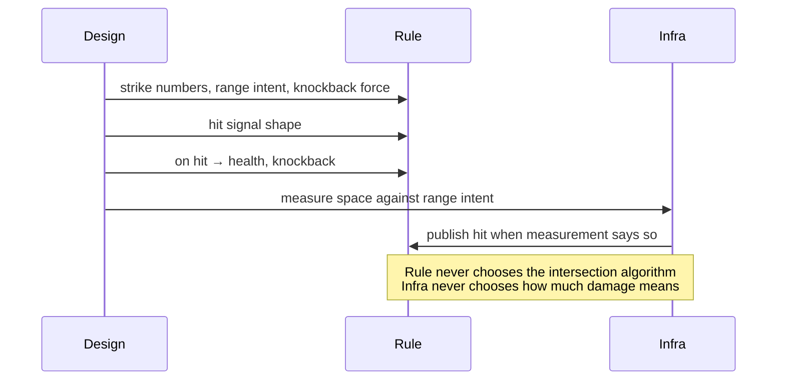
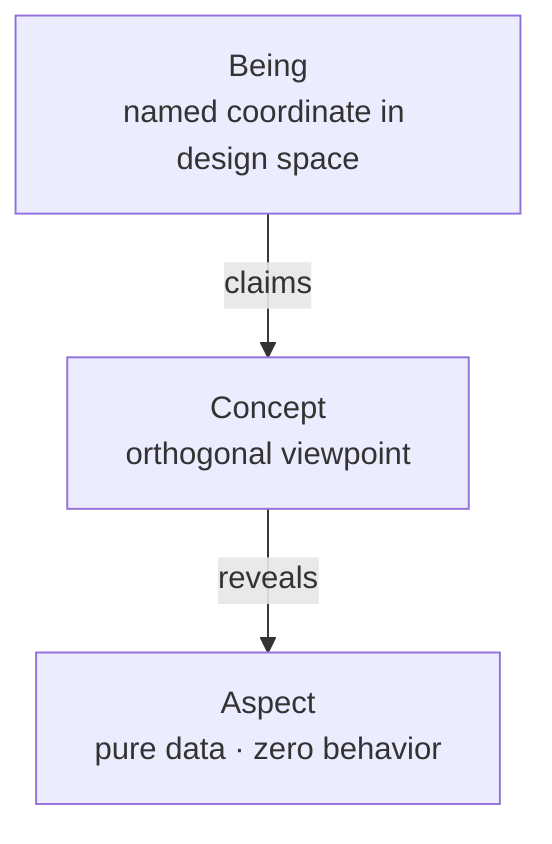
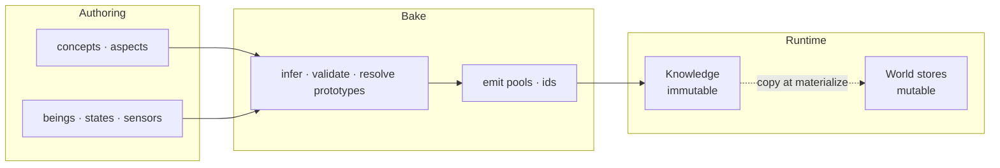
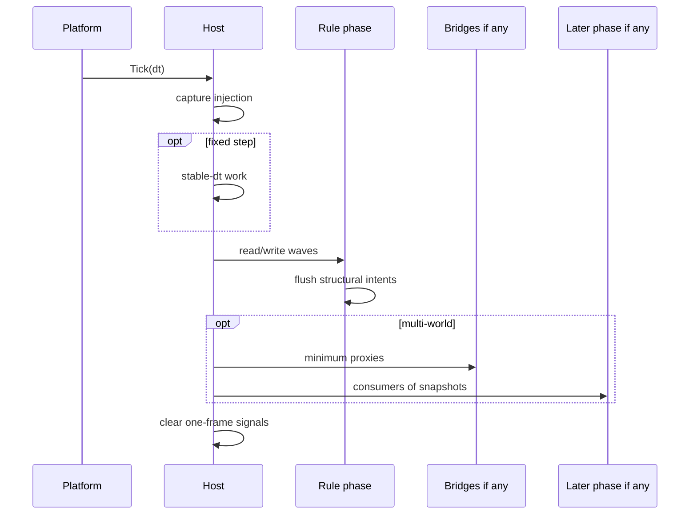

I am not defining a product. I am trying to get clearer about a word we spend too casually: _architecture_. Not which engine wins, not which store is fashionable, not which diagram photographs well-only what has to stay true if the thing we are hosting is still a game two months from now, after the machine under it has been swapped, stubbed, or half-rewritten.

This sits next to an earlier line of thought. If a game is, at minimum, an agent-driven system over a rule-based possibility space that agents can alter at a traceable $\Delta t$, then architecture is not decoration around that fact. It is whatever keeps the _rules_ parameterized and the _possibility space_ legible when software, teams, and content start pressing on them.

## Table of contents

## The wrong objects

When people say they “have architecture,” they often mean something nearby but smaller.

An ECS, or any other store, holds live fields. Useful. Replaceable. Not the game. A pattern catalog-singleton, event bus, service locator, clean hierarchy-names habits of arrangement. Habits are not constraints. The engine’s own shape-actor graphs, component soups, a stock frame loop-is a host. Hosts change; the rule of the game should not have to change with them. A diagram can age beautifully on a slide while packages, names, and frame order quietly disagree with every box. That is theater.

There is a second, deeper mistake: treating the _game itself_ as if it were one of the tools we use to implement it.

A game is not a relational database. Tables, foreign keys, and join plans can host facts; they do not decide what a hit means, what an opening is, or which trajectories an agent is allowed to force. If your mental model of the game is “rows and relations,” you will optimize for storage and query shape long before you have protected the possibility space.

A game is not a pile of state machines. States and transitions are one way to parameterize trajectories through rule-space-useful, often necessary, never the identity of the thing. When every content problem becomes “add another machine,” agency collapses into a graph of labels, and designers stop authoring possibility; they author spaghetti with pretty names.

A game is not a script. Scripts order events. Games hold a space of legal moves under rules, advanced in $\Delta t$, open to agents. A cutscene, a quest beat, a hand-authored sequence can live _inside_ a game if it is still rule-shaped; it cannot replace the game without turning the product into something else wearing a controller.

So if architecture is not the store, not the pattern list, not the engine tree, not the diagram-and if the game is not a database, not a stack of machines, not a scenario-what is left for architecture to be?

## What I am willing to defend

To me, architecture is a set of separations you can still write by after the heat of a feature has passed. Separations that decide who may parameterize what, who may mutate what, and which words are allowed on which side of a package edge. Not a catalog of things you _have_. A small number of refusals you keep.

The claim is deliberately small:

> **Designers parameterize the game. Programmers write rules. The boundary between those jobs is enforced by construction-not by code review hope.**

Everything below is me trying to make that line operational enough to argue with. If a construct does not serve it, I would rather cut it than keep it for completeness. A top-down 2D action game-move, strike, take hits, AI that chases, grass that breaks, sprites that face the right way-stays in mind so the constraints stay testable. Nothing here is limited to that genre. When C# shows up, it is only shape: permission at a call site, not an API to adopt.

## Rule against machinery

A design document does not speak in GPU types. It says _hit lands_, _knockback_, _opening_, _the bat is chasing_. Infrastructure speaks in overlaps, atlases, device polls, solver steps. When those vocabularies share the same functions, **changing the machine changes the rule**. That is the first failure mode I care about, and it lasts until the boundary is restored.

| Design says                   | Rule side                                     | Machinery side                          |
| ----------------------------- | --------------------------------------------- | --------------------------------------- |
| Hit lands                     | strike definition, hit signal, health write   | Overlap / distance / contact generation |
| Push apart                    | space claim, separation policy                | Circle-push or physics penetration math |
| Opening                       | vulnerability window                          | -                                       |
| Knockback                     | knockback, stagger timers                     | -                                       |
| Movement                      | velocity, movement profile, world position    | Optional character-controller solver    |
| Appearance                    | silhouette intent (kind, palette, …)          | Sprite atlas, draw calls, shaders       |
| Button                        | input snapshot / commands                     | Hardware polling, focus, rebinding UI   |
| Terrain                       | walkability as game facts, if rules need them | Tile collision, nav mesh build          |
| Camera / render / audio graph | follow intent, if authored                    | Matrices, viewports, mixers, voices     |

Rule does not name colliders, hitboxes, sprites, textures, draw, GPU, shader channels, or audio graphs. Machinery owns those words. Rule owns _what a hit means_ once a hit is known to have occurred.

The litmus I keep returning to is blunt. Delete the infrastructure assembly-renderer binding, input binding, spatial backend. Replace it with another: a different engine, different physics, headless stubs. **Game rule still compiles, unchanged.** If rule imports infrastructure packages “only for a vector type,” the camel’s nose is already inside. Math types will not stay lonely.

Take the sentence “hit lands.” Design: the player swings, something in range is hit, one damage, knockback. Split measurement from resolution. Machinery measures space against a range intent and publishes a hit when the measurement says so. Rule, on that signal, writes health and knockback. Rule never chooses the intersection algorithm. Machinery never chooses how much damage means. Architecture, here, is simply the refusal to let one function own both forever.

## A language for design truth

Rule and design still need a shared way to talk about what exists in the catalog. Component names invented by programmers for storage-`HpComponent`, `MoveComp`-are not that language. What I want is a coordinate system for **design truth**, not a second runtime entity model, and not a schema for a database of “game objects.”

Three primitives have been enough for me to think with.

A **being** is a named point in design space: a character definition, an AI state, a sensor definition, an effect template, a prototype-catalog entries, not living instances. A **concept** is a viewpoint, not a parent class and not a tag. Tags mark; concepts constrain visibility. Through `Mobile` you may see what `Mobile` reveals, and nothing else via that lens. Concepts carry no fields. An **aspect** is pure data-no methods that implement game rule. The same shape may later appear as a mutable component in a live store; the role (catalog versus life) is usage, not a second type hierarchy.

If a being claims a concept, it receives every aspect that concept reveals-not a casual subset. Cherry-picking produces “almost Mobile” rows that break queries and train designers badly. Aspects are not exclusive property of a concept either; a concept opens a window, and the same data shape can appear in other stories, or free-float when no viewpoint wrapper earns its keep.

Nearby in the same space: a player that claims mobility, combat, striking, appearance; an enemy without striking; a pot with only breakable and visual; an idle AI state as a being that claims state; a distance probe as a being that claims sensor. One catalog, many roles-so generic rule can key off roles and aspects, not marketing names and proper nouns.

Designers should not choose storage widths. They declare quantity intent; a bake or generator maps to types and rejects inconsistency. No untyped bags on the authoring boundary. Runtime guessing is how catalogs stop being knowledge.

And beings are not entities. A being lives in the catalog, does not mutate in play, and is identified by design name. An entity lives in a world’s store, mutates, and holds a handle local to that world-“that bat instance on screen.” An entity is a bag of live fields. It need not “know it is Player.” Debug may show spawn source; rule that scales by `if (is Player)` will not scale at all.

This is still not “the game is a schema.” It is only a way for design and rule to share coordinates without collapsing into storage jargon or class trees.

## Catalog against life

Designers write structured data-JSON, tables, graphs; the format is mechanism. Something must turn that into typed, indexed, immutable catalog memory before the hot loop runs. I call the result **Knowledge**, because I need a word for design truth that is not “config,” not “prefab,” and not “the database.”

“Player max HP is 4” is design. “Entity 17 has 2 HP” is life. One address space for both produces either live buffs rewriting the next spawn’s blueprint, or perpetual reparsing of authoring graphs because nothing was ever frozen. Knowledge is read-only for the session, or until an explicit reload you treat as a new freeze.

Access should be honest. Through a concept lens you may ask for an aspect that concept reveals. Direct aspect lookup only when unambiguous. Invalid lens or ambiguity fails before play when the toolchain allows it-not with a null and a hope. Hot-path catalog reads should be index arithmetic into contiguous pools, not string-name walks every frame. Exact layout is an implementer’s problem; the claim is only that after freeze, catalog reads are constant-time-shaped and allocation-free. Catalog reads are not mutable conflicts for scheduling. They are immutable context. Treating them as schedule noise trains people to ignore the real schedule.

Design space and live space need different ways to point. A typed design token addresses Knowledge. A role-scoped ref on an entity-current state, on-death effect, probe definition-points at a role, not at a cast-list proper noun. Identity by role is what keeps rules generic. Content identity belongs in authoring and validation (“every breakable declares what it becomes on destroy”), not in if-ladders inside rule.

Life, on the entity, is three kinds of field that matter to me: mutable copies of aspects after spawn; runtime-only scratch (timers, input snapshot); signals for one-frame facts (`Hit`, `Death`). Immutability is a property of the store role, not of the type name.

Materialization is the one-way copy from being to entity: create, copy aspects, grant defaults, never write back. Changing this instance’s max speed does not edit Knowledge; the next spawn still reads the catalog. Effects, volumes, debris, actors should converge on “materialize this being here,” not on permanent constructors named after content. Missing required links fail at bake. When decision switches a state ref, copying aspects from the state-being onto the entity is still materialization-only triggered by transition rather than first spawn.

## Rules, not a god object

Rules need a place for mutable fields. That place is often an ECS, or tables with the same permissions. I do not care which vendor. I care that rule can speak a small surface-look, grant, create, destroy-without importing engine types, and that every touch of mutable state is visible to ordering.

If you cannot state a rule in one short sentence, it is probably smuggling writes. Friction slows velocity. Speed cannot exceed profile max. Velocity changes position. An agent picks the next legal state. Hits apply damage and knockback intent. Zero HP means death. Multi-sentence rules hide extra writes and become dumping grounds.

A rule is bound to one world and treats that world’s store as its bus. Knowledge is read-only context. God services injected into everything recreate the global soup under a cleaner name. Looking is a read. Granting is a write. Publishing a signal is a write. Open helpers that hide grants behind unconstrained types make dependence analysis impossible; on any path that claims automatic ordering, they are a lie.

Conflicts become order. Write-then-read, write-then-write, read-then-write: sequence them. Disjoint touches may run together. Phase slots of a frame-capture injection, fixed step if you need it, primary rule, late consumers-are architectural. Waves inside a phase are mechanical consequences of conflicts, not a second timeline maintained by taste. Cycles are defects.

Clockwork, injection, decision, and resolution can share a scheduler without sharing a meaning. Friction has no choice. Input is agency entering from outside. Decision chooses among legal edges. Strike and health are consequence of signals and data. Measurement that turns overlap into a hit is machinery even when it sits near gameplay: it publishes a fact; it does not own the damage table.

## Agency without turning the game into machines

Action games need trajectories-player and AI-that designers can extend without a new type per label. The move is not “pick FSM or utility AI as the identity of intelligence.” It is: small composable data, one pure evaluator, side effects elsewhere. From a hard graph up until the day you truly need heavier scoring or planning, the evaluator should not have to be rewritten twice. That is not because the game _is_ a state machine. It is because trajectories through possibility space can be parameterized, and parameterization is the point.

Links, gates, scores, groups: authors choose the pattern by data-hard edges only, scores only, gates that filter and scores that rank. Evaluation stays pure: current ref, catalog links, sensor floats → next ref or same. Enter effects-invulnerability, spawns, overrides-are not buried in the scorer. They live on the state-being in Knowledge and are applied by generic rules on transition. “Roll gives i-frames” becomes authoring, not a permanent dodge rule that exists only because the catalog was underused.

Decision wants scalars; the world is not scalars. Sensors extract. A sensor definition is a being. A provider is a closed function. Dispatch is closed-not a reflective plugin soup on the hot path. Providers over pure gameplay fields live with rule; providers that need spatial acceleration live with machinery. Rule consumes numbers, not query internals.

If this starts to feel like “the game is a graph of states,” stop. The graph is one authoring shape for legal trajectories. The game remains the possibility space those trajectories move through, under rules, at $\Delta t$, with agents able to force change.

## What a $\Delta t$ is allowed to mean

A frame is a traceable $\Delta t$ transaction: injection in, rules run under an order you can defend, structural mutation committed at barriers, optional projection across ownership walls, one-frame signals cleared. That is all I need the outer loop to mean.

Two knobs keep getting mixed, so I separate them when I think. A **phase** is order and tick policy in the frame. A **world** is an ownership wall around one mutable store and the rules bound to it. There is no sacred cast of render-world and audio-world. You declare walls when ownership, tick policy, replaceability, or layout actually diverge-not because a blog showed three boxes. Entity 42 in one wall is not entity 42 in another. Cross-wall traffic, if any, moves only through explicit bridges at barriers, synthesizing a minimum proxy, never sharing a writer set. A single-world project simply has no bridges. That is not a missing pillar; it is honesty about how many ownership walls you earned.

Given declared worlds, rules, optional bridges, and sensor providers, a schedule can be derived. Hand-editing that schedule to “insert one rule in the middle” without updating dependence truth turns the model into theater. The host that exposes `Tick(dt)` to the platform is thin on purpose. The platform is not the game.

## When the separations are real

Dependencies are architecture. If the dependency graph can reach a renderer from rule, the boundary is already fiction. Domain holds authoring shapes and markers-no behavior, no I/O. Rule holds rules and sensors over game fields-no engine packages, no draw, no device poll. Infrastructure holds bindings, measurement, bridges, presentation-and must not exclusively own damage tables or AI policy. Edges point inward toward a small shared kernel of catalog types and host abstractions.

None of this matters if rule still hardcodes content. The share of decisions that live in Knowledge is the only leverage I trust. Tune numbers in authoring. Add a state for an existing role in authoring, maybe with one new sensor. Add an effect being and materialize it. Swap spatial backend or renderer in infrastructure only. Run headless by omitting presentational walls.

Under feature pressure the weak paths reappear: camera as global singleton; roll invulnerability as a bespoke rule; attack volumes hand-spawned in the attack rule; breakable death effects falling back to a hardcoded name; knockback feel as a magic constant; effect spawn as an ad-hoc constructor. The strong path is always the same shape. Rules know how to read Knowledge and mutate aspects generically. Knowledge remains the sole source of _what_.

## What I refuse to negotiate away

Few enough to remember. If it is taste, it is not here.

Rule and machinery do not share vocabulary or package edges that fail the litmus. Being, concept, and aspect are the catalog language; reveals are total; aspects are pure data. Knowledge is immutable after freeze; materialize copies one way; no catalog write-back from entities. Entities are live bags in exactly one world; they are not beings; cross-world traffic is bridges only when multiple worlds exist. Live catalog linkage is role-scoped; rule does not scale by proper nouns. Rules are one-sentence, world-bound, and read/write-accountable; order follows conflicts; phases are frame slots, not product names. Decision is pure evaluation over parameterized primitives; sensors are closed extractions to scalars. Structural mutation and cross-wall sync happen at barriers. New content defaults to authoring, not new rule types. No reflective hot-path discovery of rules, sensors, or catalog rows-close the set at bake.

One swing, labeled once, to keep the layers honest. Strike numbers and range intent live in Knowledge. Press attack is machinery writing a command. Enter attack is decision plus state Knowledge. Arm measurement is intent from state or machinery armed by that intent. Overlap true is machinery publishing hit. Health and knockback are rule. Sprite facing the swing is presentation. If one function owns two of those rows, it is a temporary hack that will demand interest.

I keep coming back to the same shift in attention: stop treating architecture as a catalog of patterns, and start treating it as enforced separations-rule against machinery, catalog against life, viewpoint against free-form bags, world against world only when ownership actually diverges, pure decision against enter-side effects, measurement against resolution, authoring velocity against engineer bottlenecks. And underneath those separations, refuse the smaller collapses: the game is not a database of objects, not a heap of machines, not a script with input.

Engines, stores, and generators are mechanisms. They should be swappable precisely because the separations are real. When the separations are fake-when packages, names, and frame order disagree-no amount of stylish structure will keep the possibility space legible later.

After all, we as indie developer should create games, not a parasite ran inside an engine, so we couldn't (or shouldn't, precisely) try to fight it.

> Architecture is a set of constraints. Anyone who reads it should be able to come back after two years of rest and still write the game correctly.

I am not selling a toolchain. I am trying to keep the constraints harsh enough to write by, and few enough to remember-and not to negotiate them away the first time a feature fits more easily in the wrong layer.
