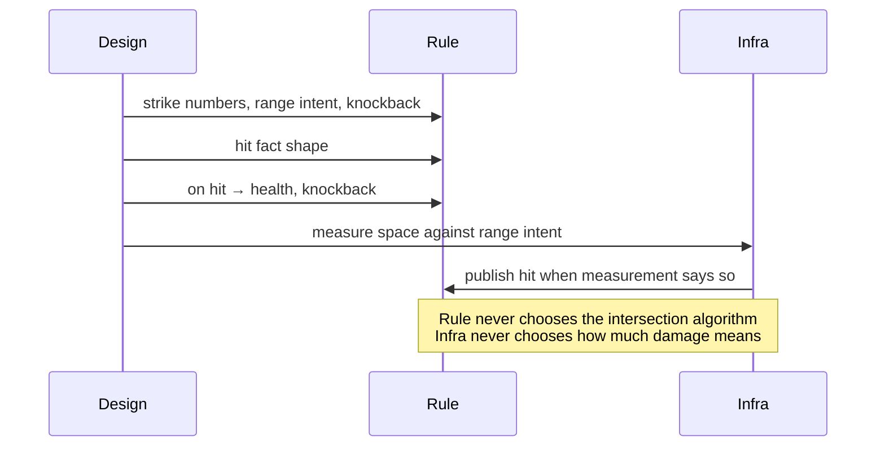
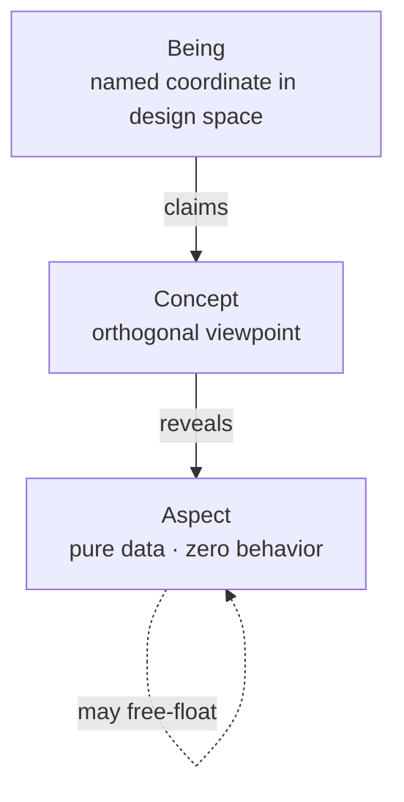
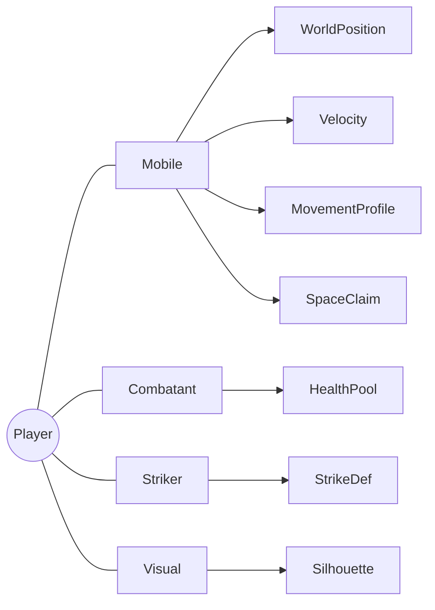
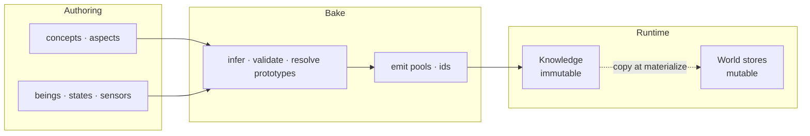
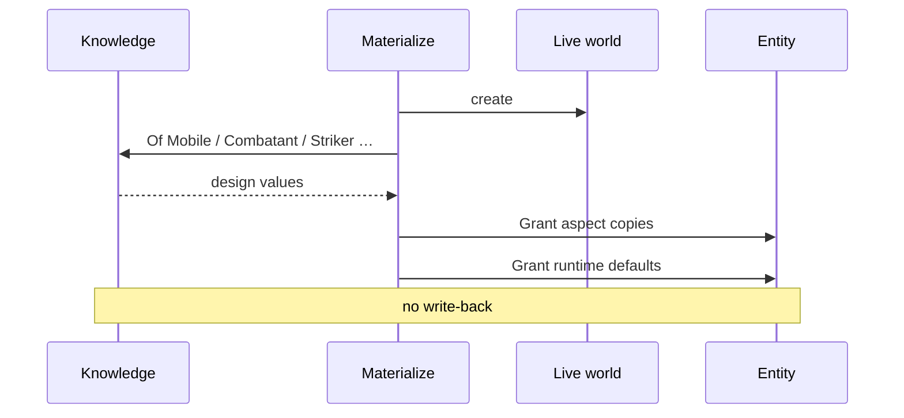
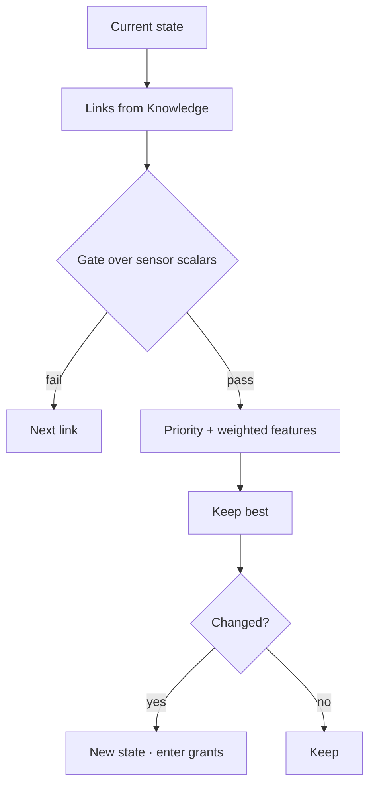

I've argued elsewhere that a game, at minimum, is a rule and a possibility space, where agents are free to bend its trajectory. That claim can be wrong or right, it isn't the point here. The point is a smaller, more embarrassing question: why do so many of us, as indie developers, keep building our games as parasites living inside someone else's blackbox? And what exactly is wrong with how we picture "architecture" in the first place?

## Table of contents

## Misconceptions

Ask a room of developers what "game architecture" means and you'll get folder diagrams, benchmark numbers, and a suspicious number of opinions about where `Utils.cs` should live. Underneath that surface is a quieter confusion: we've started treating the game as indistinguishable from the tools used to build it. Worth asking why that habit took root.

Picture a game as nothing but a database, and the reflex is to protect table schemas long before anyone has decided what a punch actually _means_. Picture it as a pile of scripts, and every design problem becomes a rigid call graph. Either way, the same thing happens: the ability to weave possibilities quietly disappears, events get bolted into forced sequences, and agency, the whole reason a _game_ is a game and not a slideshow, evaporates.

Infrastructure can host a world. It is not the world. Engines, design patterns, elegant class hierarchies, all the diagrams people love to screenshot, genuinely useful, and entirely replaceable. None of them are the essence of the game.

So what does the architecture of a game actually look like, once you strip the furniture out?

## The line I keep coming back to

No arcane mystery here. It compresses into one sentence I keep taping back onto the wall whenever I forget it:

> **Designers parameterize the game. Programmers write rules. The boundary between those jobs is enforced by the compiler, not by code review and good intentions, that is architecture.**

A short glossary, since these three words are about to carry the entire article:

- **Parameterization**, content, numbers, trajectories: everything a designer tunes.
- **Rules**, the generic reading of concepts and aspects, the mutation of life, the ordering of conflicts: everything a programmer writes.
- **Infrastructure**, measuring space, polling devices, pushing pixels, physics boxing: everything that makes the first two run on a machine.

The moment a programmer hardcodes a _proper noun_ into a rule, `if (isPlayer)`, `if (enemyType == "Bat")`, parameterization has quietly been stolen back from design. If some piece of your codebase can't hold up this balance, let it fall. None of this is genre-specific, and wherever code shows up in this post, treat it as a silhouette of what's _permitted_, not a template demanding obedience.

## Game & infrastructure

A design document doesn't talk about GPU types or engine internals. It says _hit lands_, _knockback_, _opening_, _the bat is chasing_. Infrastructure talks about overlaps, atlases, device polls, solver steps. The instant those two vocabularies share a function body, changing the machine changes the game, and that's the first failure mode worth guarding against.

| Design says             | Game rule                                   | Infrastructure                          |
| ----------------------- | ------------------------------------------- | --------------------------------------- |
| Hit lands               | strike definition, hit fact, health write   | overlap / distance / contact generation |
| Push apart              | space claim, separation policy              | circle-push or physics penetration math |
| Opening                 | vulnerability window                        | ,                                       |
| Knockback               | knockback, stagger timers                   | ,                                       |
| Movement                | velocity, movement profile, world position  | optional character-controller solver    |
| Appearance              | silhouette intent (kind, palette...)        | sprite atlas, draw calls, shaders       |
| Button                  | input snapshot / commands                   | hardware polling, focus, rebinding UI   |
| Terrain                 | walkability as game facts, if rules need it | tile collision, nav-mesh build          |
| Camera / render / audio | follow intent, if authored                  | matrices, viewports, mixers, voices     |

Rules never name colliders, hitboxes, sprites, textures, draw calls, shader channels, or audio graphs, infrastructure owns that vocabulary. Rules only own what a hit _means_, once a hit is already known to have happened.

Here's the test I keep applying: strip the visuals, run the game as pure text. Does it still run cleanly? Or does it suddenly need a runtime type from nowhere, some stray reflection call, or, worst case, refuse to compile at all? The moment a rule reaches into infrastructure "just for a vector type," the camel's nose is already inside the tent, and the rest of the math will not stay outside for long.

Take something as ordinary as "a hit lands." In design terms: the player swings, something in range gets hit, damage is dealt, the target is knocked back. Split _measurement_ from _resolution_:

- Infrastructure measures space against a range intent, and publishes a hit fact once the measurement says so.
- Rule receives that fact and writes the health reduction; a separate rule causes the knockback.
- Rule never picks the intersection algorithm. Infrastructure never decides what the damage number means.



Architecture, in this narrow sense, is just the refusal to let one function do both jobs forever. Measurement can sit right next to gameplay in the schedule and still be infrastructure, it publishes a fact, it doesn't own the damage table. One function holding both isn't pragmatism, it's debt with a grace period.

And this is exactly why the "parasite" question matters: if a rule is written in the engine's own words, the game isn't _hosted_ by the engine. It's _trapped_ inside it.

Fast or fun, doesn't matter, it has to be a game first. So instead of leaning on inheritance chains and vague abstraction, here's the model I actually use.

## A, B, or C, what is that?

Rule and design still need a shared vocabulary for what exists as design. `HpComponent` and `MoveComp` are storage slang, not that vocabulary. I don't want a second entity model, and I'm not claiming the game _is_ a database of objects, I just need coordinates for design truth. Three primitives have covered every case I've hit so far:

- **Aspect**, a glance. A minimal, pure structure you can see through. Zero behavior.
- **Being**, a thing. A state, a character definition, an effect, doesn't matter which. It is what it is: a named coordinate in design space.
- **Concept**, a pure viewpoint. A lens for looking across many different beings without caring what they individually are, revealing exactly the aspect that concept cares about.



$$B_i = \bigl(C_{B_i},\; A_{B_i}\bigr) \quad \text{where} \quad A_{B_i} = \bigcup_{c \,\in\, C_{B_i}} \text{Reveals}(c)$$

Two rules keep this from decaying into a taxonomy tree:

- **Reveals is total.** Claim `Mobile`, and you get _every_ aspect `Mobile` reveals, no cherry-picking. Partial claims produce "almost Mobile" rows that break queries and quietly train designers to distrust the system.
- **Aspects aren't exclusive property of one concept.** A concept only opens a window; the same data can free-float when no viewpoint wrapper actually earns its keep, a single loyalty scalar doesn't need a concept standing guard over it.



Not every being claims every concept, an enemy might skip `Striker`, a pot might only have `Breakable` and `Visual`, `BatIdle` might claim only `State`, `SDistance` might claim only `Sensor`. One Knowledge base, many roles. Generic rules key off roles and aspects, never marketing names.

In an action game specifically, the split might look like: `Mobile` opens position, velocity, movement profile, orientation, depth, space claim; `Combatant` opens health; `Striker` opens strike definition; `Vulnerable`/`Knockable` open vulnerability and knockback; `Visual` opens silhouette intent; `Breakable` opens destructible config and an on-destroy link; `State` opens links, desirability, and groups; `Sensor` is often identity-only, because the being _is_ the probe. Your own set will differ, the demand behind it won't: viewpoints stay explicit, data stays pure, composition stays orthogonal.

One more authoring rule worth keeping: designers shouldn't be the ones choosing `Single` vs `Double`. They declare _quantity intent_, vector, number, text, flag, role-scoped ref, and the bake step maps that intent to a concrete storage type, rejecting anything inconsistent. No `any`, no `unknown`, no untyped bag sitting at the authoring boundary, because runtime guessing is exactly how design truth stops being _Knowledge_.

Also worth being pedantic about: **a being is not an entity.**

|                  | Being       | Entity         |
| ---------------- | ----------- | -------------- |
| Lives in         | Knowledge   | a world store  |
| Mutates in play? | No          | Yes            |
| Identified by    | design name | a local handle |

An entity is a bag of live fields, and it doesn't need to _know_ it's "Player." Debug tooling can show spawn source if it wants, but a rule that scales by `if (is Player)` will not scale, no matter how convenient it looks today.

To be clear, none of this means "the game is a schema." It's just how design and rule share coordinates without collapsing into storage slang or class trees, viewpoint against free-form bags, role against proper noun.

## Knowledge, and... life?

"Player max HP is 4" is design. "Entity 17 currently has 2 HP" is life. Two different kinds of truth. Cram them into the same address space and you get one of two failure modes: live buffs quietly rewriting the blueprint every future spawn reads from, or endless reparsing because nothing was ever actually frozen.

Designers write structured data, JSON, tables, graphs, whatever format is convenient, the format is a mechanism, not the point. Before that data hits the hot loop, it has to become typed, indexed, immutable memory of design intent. I call that **Knowledge**: not config, not a prefab, not "mutable by accident", design fact, frozen for the session, or until an explicit reload that you treat as a fresh freeze.



The bake stages are logical steps, not mandated class names: merge sources under an explicit policy, resolve prototypes so runtime never has to walk a parent chain, cross-reference every pointer so it lands on a being that actually claims the required role, flatten everything into dense pools, then freeze. After freeze, Knowledge does not mutate, full stop. Any compile-time emission of typed markers, sensor dispatch tables, or schedules is just a way to fail _early_; it isn't the point, and neither is which generator produced it. Frozen Knowledge and accountable rules are the point.

Through a conceptual lens, you always ask for the aspect that concept actually reveals, `Mobile` plus movement profile is valid, `Combatant` plus world position is not, because `Combatant` never claimed that window. Direct aspect access stays available for free-floating aspects, since a concept is a viewpoint, not a taxonomy, a unique loyalty scalar doesn't need to borrow someone else's lens. An invalid lens or an ambiguous reference should fail before play, whenever the toolchain allows it; resist the temptation to invent a third path that quietly returns null and hopes for the best. In shape, that's `Of(concept, aspect, being)` for the lensed case, and `About(aspect, being)` for the direct one:

```csharp
// shape of permission, not a mandate
knowledge.Of<Mobile, MovementProfile>(In.Being<Player>());
knowledge.Of<Combatant, HealthPool>(In.Being<Player>());
knowledge.About<Loyalty>(In.Being<Player>());
```

Here's the part people trip over most often: **reading Knowledge is not a mutable read/write conflict against other rules**, because Knowledge is immutable by construction. Treat `Of`/`About` as scheduling noise and you'll invent false dependencies, and quietly train everyone to stop trusting the real dependency graph, the one that actually lives over mutable life. No locks needed for Knowledge reads. No mystery about who last wrote `MaxSpeed`, because design does not change mid-frame.

Design space and life space also _point_ differently. At bake time, and at any call site meaning "this exact Knowledge entry," use a typed design token, a compile-time name turned into a marker, so a misspelling fails immediately rather than at 2am in production. Tokens address Knowledge; they are not a second ID system smuggled into every live component. When an entity needs to remember a Knowledge linkage, current AI state, a death effect, a probe definition, it stores a role-scoped ref: `Ref<State>`, `Ref<Effect>`, `Ref<Sensor>`. Not `Ref<Player>`, not `Ref<Bat>`. A state ref may only read what `State` reveals, and identity-by-role is what keeps rules generic. Branching on `Player`, `Bat`, or `GrassBreak` as proper nouns grows linearly with content, that kind of identity belongs in authoring and validation (every `Breakable` declares its own `OnDestroy`), not in an if-ladder buried inside a rule.

Knowledge holds design; components hold life. After spawn, aspects can appear as mutable component copies and take ordinary reads and writes. Runtime-only fields, timers, input snapshots, do the same. Facts like "hit" or "death" get published the moment they occur, and publishing counts as a write, so any consumer is scheduled after it. The same aspect _shape_ can be both design data and component payload, immutability is a property of _where_ a value lives, not of its type name. Role-scoped refs on entities are how life points back at Knowledge without ever becoming a being itself.

A being is a blueprint. An entity is a living bag. Materialization is the one-way copy: create the entity, copy the design data across, grant the defaults, and never write back. After that point, the instance is independent, bumping this entity's `MaxSpeed` doesn't touch Knowledge, and the next spawn still reads the original design value. Effects, volumes, debris, and actors should all converge on "materialize being X at pose Y," not accumulate into a zoo of permanent `CreateGrassBreak()`-style methods. Rule publishes intent; materialization applies the being's aspect schema; a missing required link fails at bake time rather than silently falling back to a hardcoded name. When a decision switches a state ref, copying the state-being's aspects onto the entity is _still_ materialization, it's just triggered by a transition instead of a first spawn.



Why fight this hard for the Knowledge/life split? Because the moment you can no longer tell "design fact" from "this-instance-right-now," you've already lost the distinction between rule and possibility space, and once that's gone, the blackbox owns you again.

## Rules, and the quiet virtue of honest reads and writes

Rules need mutable fields to work with. That home is usually an ECS, or an SoA table with equivalent permissions, the vendor doesn't matter to me. What matters is that a rule can touch life without importing a single word from the engine's own vocabulary, and that every mutable touch stays visible to scheduling, because "ordering" without visible dependence is just theater.

Once per project (or per domain), map a small, deliberate surface onto the concrete store, and let rules speak only those verbs. Meaning matters far more than spelling, in the shape I use, life is _looked_ and _granted_:

```csharp
// shape: consumer names the verbs; mapping stays in infrastructure
Store.Declare<MyWorldBackend>(
    look:         (store, e) => /* read */,
    grant:        (store, e, c) => /* write */,
    materialize:  (store) => /* create */,
    destruct:     (store, e) => /* destroy */
);
// rule then speaks: entity.Look<HealthPool>(), entity.Grant(velocity)
```

Why not force one lowest-common-denominator interface across every backend? Because backends genuinely differ, and a thin universal interface becomes either a lie or a slow soup of virtual calls. Declaration plus a typed surface keeps the rule's vocabulary ubiquitous while the actual mapping stays local to infrastructure. Different domains can reasonably want different layouts, dense iteration for broad sets, sparse churn for volatile tags, and that's fine, because domains don't share stores. You don't need dual-backend complexity inside one domain up front; you only need the _right_ to split once access patterns actually diverge. Structural create/destroy mid-rule reshuffles dense storage and breaks parallel readers, so those operations are committed as intents at known barriers, not fired off mid-flight. Field grants that don't change layout can be direct, if the store and schedule allow it, and a project should be explicit about which is which.

A useful gut check: **if you can't state a rule in one short sentence, split it.**

- Friction slows velocity.
- Speed cannot exceed the movement profile's max.
- Velocity changes position.
- An agent picks the next legal state.
- A hit applies damage and a knockback intent.
- Zero HP means death.

Multi-sentence rules hide extra writes and slowly turn into dumping grounds.

A rule is bound to exactly one world, exposes a single run entry, and treats that world's store as its data bus. Knowledge is read-only context and never counts as a mutable conflict. Constructor-injected god services just recreate the same global soup under a more respectable-sounding name.

Every touch of mutable state has to be visible to the scheduler, whether by attribute or by closed-generic call-site scanning. `Look`ing a component is a read; `Grant`ing one is a write; publishing a fact is also a write, and its consumers are ordered after it. Knowledge's `Of`/`About` are not mutable conflicts, full stop, Knowledge is frozen context, and life is what actually participates in conflict analysis. `Look` and `Grant` must be closed-generic at the call site: an open helper that hides `Grant<T>` behind an unconstrained `T` makes dependence analysis genuinely impossible, and any path that claims "automatic ordering" needs to forbid that pattern outright. And resist the urge to stash something you just looked at into a mutable temp "just for this rule", if that intermediate value is actually consumed here, it deserves to be its own rule, scheduled to run before this one.

> Remember to focus on where fact and rule intersect, that's where the architecture actually lives.
> At that intersection, a rule is declarative about facts: it names what it looks at and what it grants. It is not an imperative script driving other rules, hiding order inside a call stack, or mutating a temp so a later step can "just know." Procedure _inside_ a single `Grant` path, clamp, integrate, is fine. Orchestration _across_ facts is not: that belongs to separate rules and the wave graph, not to one function barking commands at the rest of the system.

Conflicts resolve into waves:

- If A writes X and B reads X → B runs after A.
- If both A and B write X → they need an explicit order.
- If A reads X and B writes X → B runs after A.
- If neither shares a mutable touch → they may run in parallel.


Phases, capture, fixed, gameplay, late, are just architectural slots for the frame; the names are illustrative, not sacred. Waves _inside_ a phase are the mechanical consequence of conflicts, not a table someone maintains by taste. Humans declare worlds to phases and rules to worlds; they don't hand-author wave tables. Explicit "run after" annotations should be rare and always commented; cycles are defects, not edge cases to route around. Waves derived from dependence truth rather than preference is what "enforced by architecture and compiler" actually means when applied to time, not a code review, not a convention everyone hopes gets followed.

Clockwork, injection, decision, and resolution can all share one scheduler without sharing meaning. Friction, decay, integration, no choice involved, purely mechanical. Input capture is agency entering from outside. Decision chooses among legal edges. Strike and health are pure consequences of signals and data. Measurement that turns an overlap into a hit is infrastructure even when it's scheduled right next to gameplay, because it publishes a fact and never owns the damage table. Publishing is a write; consumers are ordered after it.

Behavior over life has to stay small, accountable in its reads and writes, and free of content proper nouns. Break that discipline and parameterization quietly dies in the programmer's calendar, while ordering dies in hope.

## Wait, why do we even need a "decision type"?

Games need trajectories, for the player and for AI, that a designer can extend without a brand-new type for every new label. The move here isn't "pick FSM or utility AI as the One True identity of intelligence." It's a small composable set of aspects, one pure evaluator, and side effects living somewhere else entirely. Whether you're starting from a hard graph or eventually need heavier scoring or planning, the evaluator shouldn't need to be rewritten from scratch to get there. I call these three aspects `gate`, `desirability`, and `link`, three small pieces, and they've been enough for every kind of decision I've needed. (And no, I don't want to hear about your behavior-tree soup.)

This isn't "the game is a state machine." It's that trajectories through possibility space can be parameterized, and parameterization is the entire point.

Authors choose the pattern through data alone: hard edges only, scores only, or gates that filter combined with scores that rank. Hybrids are common, and one evaluator covers every case. State links are directed edges guarded by gates; gates compare sensor scalars, with optional exit thresholds for hysteresis; desirability turns priority plus weighted sensors into a score; state groups hold candidate sets, tiers, and defaults.



`Evaluate` stays pure: Knowledge, current state, and features go in, the next state (or the same one) comes out. Invulnerability windows, spawns, overrides, none of that lives inside the scorer. On transition, separate rules look at life and grant whatever the state-being in Knowledge carries. That's how "rolling grants i-frames" becomes an authoring decision instead of a bespoke, permanent dodge rule that only exists because Knowledge was underused in the first place.

Decisions want scalars; the world is not made of scalars, so sensors do the extraction. A sensor _definition_ is a being, a _provider_ is a closed function from world state to values, and dispatch stays closed rather than turning into reflective soup on the hot path. Providers over pure gameplay fields live alongside rules; providers that need spatial acceleration live with infrastructure. Rule code consumes floats, never query internals. Providers that look at game fields participate in ordinary read accounting when they run as rules, and the evaluator itself should still receive plain floats rather than reaching into the store freely mid-score.

If any of this starts to feel like "the game is a graph of states", stop right there. The graph is one authoring shape for legal trajectories. The game itself remains the possibility space those trajectories move through, governed by rules, advancing at $\Delta t$, with agents able to force a change of course.

## What actually _is_ a "frame"?

A frame is a traceable $\Delta t$ snapshot. That's the entire contract the outer loop needs, and it's also the exact point where "rule + possibility space + agents" stops being a philosophy and starts being software.

Two knobs get conflated constantly, so it's worth separating them cleanly:

- An **execution phase** (or group) is order and tick policy within the frame.
- A **world** is an ownership wall around one mutable store and the rules bound to it.

There is no sacred lineup of `RenderWorld` and `AudioWorld` waiting to be declared. Walls go up when ownership, tick policy, replaceability, or layout actually diverge, not because a diagram somewhere shows three boxes. Headless work might need exactly one sim world; a fat client might add presentational walls later; stable physics might sit pinned to a fixed phase. Architecture constrains isolation and scheduling. It is not a product diagram of fashionable names.

We don't chase the service locator, we chase execution order. There is no event bus anywhere in this picture; the world store, together with conflict-driven scheduling, already does everything an event bus would promise.

Entity 42 in world A is not entity 42 in world B. Rules in A never `Look` into B's store, and cross-wall data moves only through bridges, at defined barriers. A single-world project simply has no bridges, that's honesty, not a missing pillar. Split when writer sets or tick policies genuinely can't be shared; don't split because a blog post once showed three boxes and it looked tidy.

Capture is usually where injection lands, input, net input. Fixed holds anything needing a stable $dt$, if there is any. Gameplay holds the primary rule worlds. Late holds consumers of snapshots, if there are any. Phases are not worlds, a phase may host zero or more worlds, empty phases are perfectly fine, and waves are derived _inside_ a phase, purely from R/W conflicts among its rules. Humans bind worlds to phases and rules to worlds; they don't maintain wave tables by hand.


Bridges only earn their keep when two ownership walls need to exchange a snapshot without ever sharing a store. They're the only legal cross-wall writers, and they run only after the source has flushed. A plain scan inside one store can't express "read A, write B", bridges have to declare both ends explicitly: reads from the source wall, writes into the destination wall. Ordinary `Look`/`Grant` accounting isn't enough here. Read exactly what downstream needs, synthesize a minimal proxy rather than dragging the whole entity across, snapshot it, and commit before the destination phase runs. Destination rules read the proxy and nothing else; the counterpart's lifecycle is purely an infrastructure concern; double-buffering keeps the frame consistent throughout. Game rules never reference bridges directly, and zero bridges is a perfectly valid state to be in.

Declared worlds, rules, optional bridges, and sensor providers are enough on their own to derive a full schedule. The host advancing $\Delta t$ stays deliberately thin. The moment someone hand-edits that schedule to slot in one extra rule without updating the underlying dependence truth, the whole model becomes theater, the platform is not the game, and it shouldn't get to pretend otherwise.

Agency enters, rules advance the possibility space under an order that follows honest reads and writes, machinery measures what needs measuring, and presentation is free to watch, without ever rewriting the law. That's the exact opposite of living as a parasite inside a blackbox: the host can change out from under you, and the rule still stands.

## When the separations are real

Dependencies are the lifeblood of any architecture. If a gameplay rule can casually reach into a rendering package, the boundary was already a polite fiction. Authoring shapes hold no behavior and make no outside calls. Game rules hold sovereignty over gameplay fields, pure logic and sensors, with zero engine packages, zero rendering calls, zero device polling. Infrastructure owns bindings, physical measurement, bridges, and presentation, but it has no business owning what damage _means_ or what counts as intent. Dependency arrows point inward, always.

None of this separation matters if rules keep hardcoding content anyway. The only leverage worth trusting is how much decision-making has actually been handed to Knowledge. Distances, forces, numerical weights, these belong to the authors. Introducing a new state for a familiar role is an act of authoring. Materializing a new effect is an act of authoring, handled by a system that stays blind to the specifics. Swapping the renderer or the spatial engine is an act of infrastructure, full stop.

Feature pressure will keep tempting you toward paths that feel reasonable in the moment and corrode everything six months later. The camera quietly becomes a global singleton. A dodge mechanic spawns a bespoke rule frantically flipping vulnerability flags by hand. Damage volumes get manually birthed deep inside attack logic. The elegant flow of destruction devolves into a hardcoded name being called from somewhere it has no business being called from. These are the symptoms of decay, and the resilient path doesn't bend for them: rules keep their generic capacity to observe and grant life, reading Knowledge without ever triggering a mutable conflict, while Knowledge remains the one and only source of truth.

## It really is about the game itself

If the engine you're standing on suddenly fell behind, changed its license terms, or simply stopped scaling with your ambitions, what happens to your project? Do you lose years of work, or do you just write a new set of infrastructure bindings for the rules you already have?

There's nothing wrong with commercial engines. The problem starts the moment we let an engine's internal structure quietly dictate the boundaries of our design space.

> After all, as indie developers, the goal is to make games, not to run as a parasite inside someone else's blackbox.

This was never meant to be an architecture overview. It's a viewpoint, meant to cut through your own hardcoded habits, including, probably, a few of mine.
