This article is about **how to host a game in software** without letting the engine, the content pipeline, or the frame loop quietly rewrite what the game is. It is not an engine tutorial, not a library pitch, and not a claim that one storage layout is sacred. C# is used only as a dialect for sketches of _shape_-signatures and call sites that show permission, not production APIs you must adopt.

## Table of contents

The thesis is small enough to keep on one line:

> **Designers parameterize the game. Programmers write law as systems. The boundary between those jobs is enforced by construction-not by code review hope.**

Everything below exists to make that line operational. If a construct does not serve it, cut it.

A running example stays with us: a top-down 2D action game-move, strike, take hits, AI that chases, grass that breaks, sprites that face the right way. The example is concrete so the constraints stay testable. The architecture is not limited to that genre.

---

## 1. Game law and infrastructure are different jobs

A game design document does not speak in GPU types. It says _hit lands_, _knockback_, _opening_, _the bat is chasing_. Infrastructure speaks in overlaps, atlases, device polls, and solver steps. When those vocabularies share the same functions, **changing the machine changes the law**. That is the first architectural failure mode, and it is permanent until the boundary is restored.

### 1.1 Boundary map

| Design says                   | Lives in game law                                     | Lives in infrastructure                 |
| ----------------------------- | ----------------------------------------------------- | --------------------------------------- |
| Hit lands                     | `StrikeDef`, `Hit` signal, health write               | Overlap / distance / contact generation |
| Push apart                    | `SpaceClaim`, separation policy                       | Circle-push or physics penetration math |
| Opening                       | `Vulnerability` window                                | -                                       |
| Knockback                     | `Knockback`, stagger timers                           | -                                       |
| Movement                      | `Velocity`, `MovementProfile`, `WorldPosition`        | Optional: character controller solver   |
| Appearance                    | `Silhouette { Kind, Palette }` (or equivalent intent) | Sprite atlas, draw calls, shaders       |
| Button                        | `InputSnapshot` / commands                            | Hardware polling, focus, rebinding UI   |
| Terrain                       | walkability as **game facts** if rules need them      | Tile collision, nav mesh build          |
| Camera / render / audio graph | follow _intent_ if authored                           | Matrices, viewports, mixers, voices     |

**Rule of thumb for law code:** it does not name colliders, hitboxes, sprites, textures, draw, GPU, shader channels, or audio graphs. Infrastructure owns those words. Rule owns _what a hit means_ once a hit is known to have occurred.

### 1.2 Litmus

Delete the infrastructure assembly (renderer binding, input binding, spatial backend). Replace it with another (different engine, different physics, headless stubs). **Game law still compiles, unchanged.**

If law imports infrastructure packages “only for `Vector2`,” the camel’s nose is already inside. Math types will not stay lonely.

### 1.3 Case: “hit lands”

Design: _the player swings, something in range is hit, 1 damage, knockback._

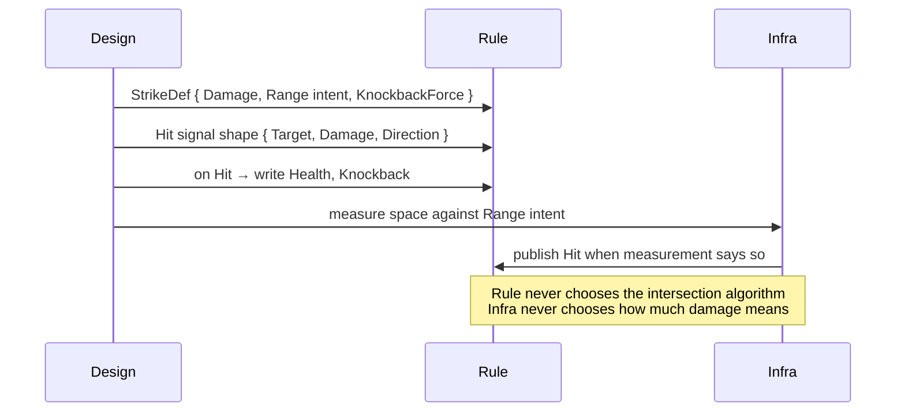

Split the sentence “hit lands” into **measurement** and **resolution**. Architecture is the refusal to let one function do both forever.

---

## 2. Semantic coordinates: Being, Concept, Aspect

Rule and design need a **shared language** for what exists in the catalog. ECS component names invented by programmers (`HpComponent`, `MoveComp`) are not that language. The model below is a coordinate system for **design truth**, not a runtime entity model.

### 2.1 Three primitives

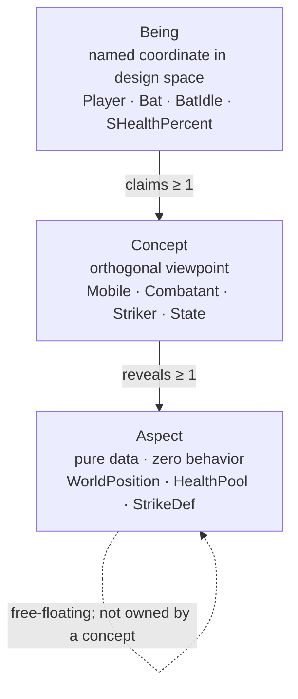

- **Being** - a named point in design space. Characters, AI states, sensor definitions, effect templates, prototypes: all beings if they are catalog entries. Beings live in the immutable catalog (**Knowledge**). They are not entities.
- **Concept** - a viewpoint, not a parent class and not a tag. Tags mark; concepts **constrain visibility**: through `Mobile` you may see the aspects `Mobile` reveals, and nothing else via that lens. Concepts carry no fields.
- **Aspect** - a pure data shape. No methods that implement game law. The same struct type may later appear as a mutable ECS component; the _role_ (catalog vs live) is usage, not a second type hierarchy.

$$B_i = \bigl(C_{B_i},\; A_{B_i}\bigr) \quad \text{where} \quad A_{B_i} = \bigcup_{c \,\in\, C_{B_i}} \text{Reveals}(c)$$

**Reveals is total.** Claiming _Mobile_ means receiving every aspect _Mobile_ reveals-not a casual subset. Cherry-picking produces “almost Mobile” rows that break queries and training for designers.

Aspects are **not exclusive property** of a concept. A concept opens a window; the aspect type can appear in other stories (including free-floating on a being when no viewpoint wrapper earns its keep-e.g. a single loyalty scalar).

### 2.2 Worked silhouette

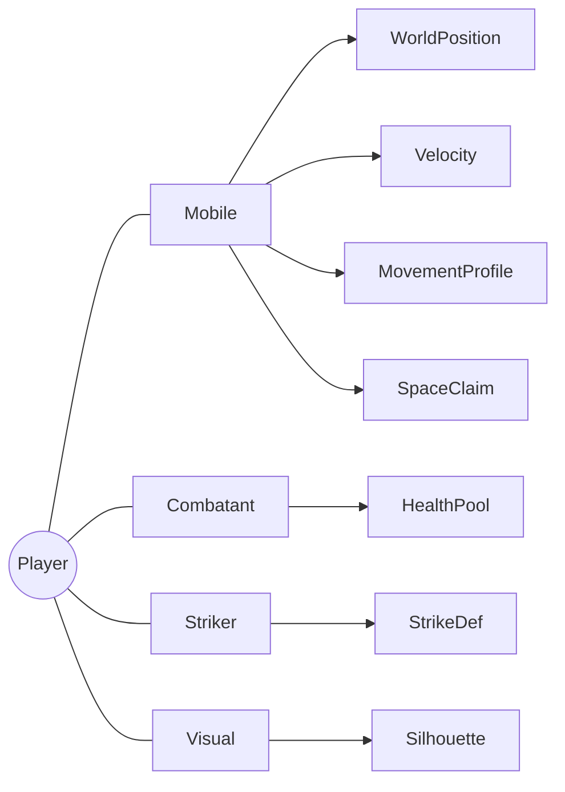

Nearby in semantic space: an enemy without `Striker`; a pot with only `Breakable` + `Visual`; `BatIdle` as a being that claims `State`; `SDistance` as a being that claims `Sensor`. **One knowledge, many roles**-so generic law can key off _roles and aspects_, not marketing names.

### 2.3 Example concept → aspect table (action game)

| Concept      | Reveals (illustrative)                                                        |
| ------------ | ----------------------------------------------------------------------------- |
| `Mobile`     | WorldPosition, Velocity, MovementProfile, Orientation, DepthLayer, SpaceClaim |
| `Combatant`  | HealthPool                                                                    |
| `Striker`    | StrikeDef                                                                     |
| `Vulnerable` | Vulnerability                                                                 |
| `Knockable`  | Knockback, StaggerTimer                                                       |
| `Agent`      | (entry to decision graph data)                                                |
| `Visual`     | Silhouette                                                                    |
| `Breakable`  | DestructibleConfig, OnDestroy                                                 |
| `State`      | StateLinks, Desirability, StateGroup                                          |
| `Sensor`     | often identity-only (the being _is_ the probe id)                             |

Your game’s table will differ. The architectural demand is the same: **viewpoints are explicit; data is pure; composition is orthogonal.**

### 2.4 Authoring intent, not CLR types

Designers should not choose `Single` vs `Double`. They declare quantity _intent_; a bake or generator maps to storage types and rejects inconsistency.

| Label    | Intent                         | Typical inference discipline                                      |
| -------- | ------------------------------ | ----------------------------------------------------------------- |
| `vector` | multi-axis quantity            | axis count fixed per field name across all beings                 |
| `number` | scalar                         | narrowest numeric fit; reject overflow / mixed semantics silently |
| `text`   | opaque string                  | string                                                            |
| `flag`   | boolean                        | bool                                                              |
| `ref`    | catalog pointer scoped by role | `Ref<TConcept>`-shaped; wrong role fails bake/compile             |

No `any`, no `unknown`, no untyped bags on the authoring boundary. Runtime guessing is how catalogs stop being Knowledge.

### 2.5 Being ≠ entity (stated once)

|                  | Being                                | Entity                        |
| ---------------- | ------------------------------------ | ----------------------------- |
| Where            | Knowledge (catalog)                  | A world’s store               |
| Mutates in play? | No                                   | Yes                           |
| Identity         | Design name / static id              | Handle local to a world       |
| Examples         | Player def, BatChase, SHealthPercent | “that bat instance on screen” |

An entity is a **component bag**. Architecturally it need not “know it is Player.” Debug may show spawn source; law must not require `if (is Player)` to scale.

---

## 3. From authoring to frozen Knowledge

Designers write structured data (JSON, tables, graphs-format is mechanism). Something must turn that into **typed, indexed, immutable** catalog memory before the hot loop runs. Call the result **Knowledge**.

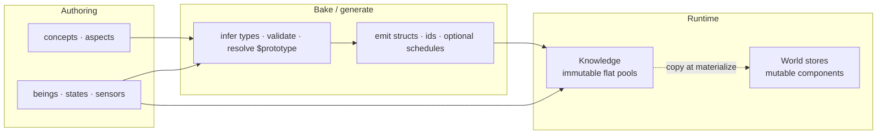

**Pipeline responsibilities (logical stages, not required class names):**

1. Load and merge sources (base game, DLC, mods) under explicit merge policy.
2. Schema-check aspects and concept reveals.
3. Resolve prototype / inheritance chains **here**-runtime does not walk parents.
4. Cross-ref: every _$ref_ points at a being that claims the required concept.
5. Flatten into dense pools indexed by being id / aspect type.
6. Freeze. After freeze, no catalog mutation.

_$prototype_ (or equivalent) is an **authoring convenience**. After bake, only leaf values exist in pools.

Optional compile-time emission (typed being markers, aspect structs, sensor dispatch, system schedules) is a **strategy** for catching errors early. The architecture requires _frozen, typed Knowledge and accountable law_-not a particular generator brand.

---

## 4. Knowledge: immutable design truth

### 4.1 Why it is separate from the world store

“Player max HP is 4” is design. “Entity 17 has 2 HP” is life. One address space for both produces either:

- live buffs rewriting the next spawn’s blueprint, or
- perpetual reparsing / cloning of authoring graphs because nothing was ever frozen.

Knowledge is read-only for the session (or until an explicit reload boundary you treat as a new freeze). Therefore: no locks for catalog reads, no GC churn from catalog traffic, no “who wrote MaxSpeed” mysteries.

### 4.2 Query shapes

Two primitives cover honest access:

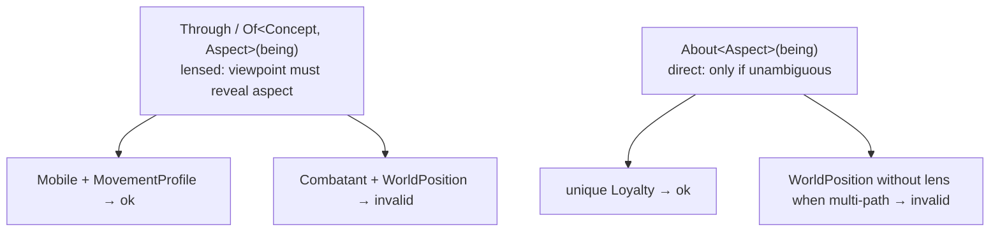

```csharp
// Shape only
var move = knowledge.Of<Mobile, MovementProfile>(In.Being<Player>());
var hp   = knowledge.Of<Combatant, HealthPool>(In.Being<Player>());
var loy  = knowledge.About<Loyalty>(In.Being<Player>());
```

Invalid lens or ambiguity fails **before** play when the toolchain allows it. Do not invent a third query that “just returns null and hopes.”

### 4.3 Lookup economics

Hot path Knowledge reads should be **index arithmetic** into contiguous pools (being → slot → aspect column), not dictionary walks of string names per frame. Exact layout is implementer’s problem; the architectural claim is: **catalog reads are O(1)-shaped and allocation-free after freeze.**

### 4.4 Knowledge and conflict analysis

Knowledge reads are **not** mutable read/write conflicts for system scheduling. They are immutable context. Treating them as `Reads<Knowledge>` noise creates false dependencies and trains people to ignore the real schedule.

---

## 5. Identity: two pointers, two lifetimes

Design space and live space need different ways to point.

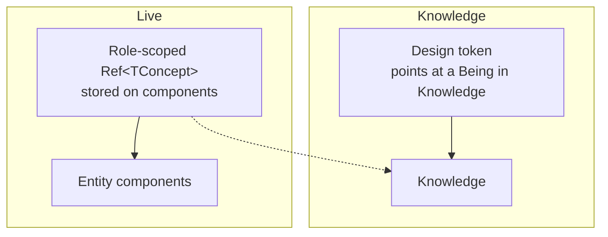

### 5.1 Design tokens

At bake/call sites that mean “this exact knowledge entry,” use a **typed design token** (compile-time name → id). Misspellings fail early. Discipline: tokens are for **addressing Knowledge**, not for becoming a second parallel id system inside every live component.

### 5.2 Role-scoped refs on entities

When an entity must remember a knowledge linkage-current AI state, which effect to spawn on death, which sensor definition to evaluate-store:

```csharp
Ref<State>   currentState;
Ref<Effect>  onDeath;
Ref<Sensor>  probe;
// not Ref<Player>, not Ref<Bat>
```

Scoping by **concept/role** means a `Ref<State>` can only be used to read aspects _State_ reveals. Identity by **role**, not by cast list name, is what keeps systems generic.

### 5.3 What law is forbidden to do

Rule that branches on _Player_ / _Bat_ / _GrassBreak_ as proper nouns will grow linearly with content. Content identity belongs in authoring and validation (“every Breakable must declare OnDestroy”), not in `if` ladders inside systems.

---

## 6. The world store: ECS as substrate, not religion

Systems need a place for mutable fields. That place is usually an ECS (or SoA tables with the same permissions). **The architecture does not mandate a vendor.** It mandates a **semantic surface** law can use without importing engine types.

### 6.1 Declare semantics, map storage

Once per project (or per domain), map operations onto the concrete store:

```csharp
// Shape: consumer names the verbs
Store.Declare<MyWorldBackend>(
    look:   (store, e) => /* read component */,
    grant:  (store, e, c) => /* write component */,
    create: (store) => /* new entity */,
    destroy:(store, e) => /* destroy */
);
// Rule then speaks: entity.Look<HealthPool>(), entity.Grant(velocity)
```

Why not a single lowest-common-denominator `IEcsStore` interface forced on every backend? Because backends differ; a thin interface becomes either a lie or a slow virtual soup. **Declaration + typed surface** keeps law ubiquitous while the mapping stays local to infrastructure.

### 6.2 Heterogeneous domains

Different domains may honestly want different layouts: dense archetype iteration for broad physics-like sets; sparse structural churn for volatile gameplay tags. That is allowed **because domains do not share stores**. Premature dual-backend complexity inside one domain is not required by the architecture-only the permission to split when access patterns diverge.

### 6.3 Structural mutation

Mid-system spawn/destroy that reshuffles dense storage breaks parallel readers. Architectural direction: **structural changes are intents** committed at known barriers (command buffer / flush). Field grants that do not change archetype layout may be direct if the store and schedule allow it-be explicit about which is which in your project rules.

---

## 7. Worlds and groups: ownership vs schedule slots

Two different knobs. Mixing them up produces fake architecture.

| Knob                | What it is                                                           | Who decides            |
| ------------------- | -------------------------------------------------------------------- | ---------------------- |
| **Execution group** | A phase of the frame (order + tick policy)                           | Architecture / host    |
| **World**           | An ownership wall around one mutable store + the systems bound to it | **Your project setup** |

There is **no fixed cast** of “must have RenderWorld / AudioWorld.” You declare the worlds you need and assign each to a group. Headless server: one sim world in `Gameplay` is enough. Fat client: sim + presentational worlds in later groups. Physics-heavy title: a world in `FixedUpdate`. The architecture constrains **isolation and scheduling**, not a product diagram of world names.

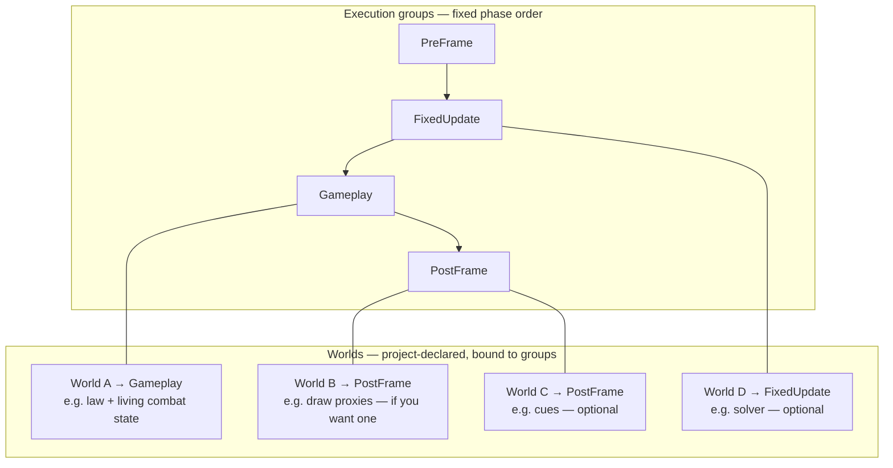

### 7.1 Isolation rules (when you have more than one world)

- Entity id `42` in world A is **not** entity `42` in world B. Coincidence of integers is not identity.
- Systems bound to world A do not `Look` into world B’s store.
- Cross-world data moves only through **bridges** at defined barriers (§11).
- If the project is a **single world**, bridges are simply unused—not a missing pillar.

### 7.2 Why add a world (earn the wall)

1. **Ownership** - different mutation rights / cognitive boundaries (law store vs presentation store).
2. **Group placement** - different phase or tick policy (fixed step vs variable).
3. **Replaceability** - omit presentational worlds on server/CI; law worlds untouched.
4. **Layout freedom** - §6.2, per store.

Do **not** split because a blog showed three boxes. Split when two sets of state must not share a writer set—or must not share a tick policy.

### 7.3 Groups vs waves (once)

**Groups** are architectural phases (`PreFrame` → `FixedUpdate` → `Gameplay` → `PostFrame`—names illustrative; the point is ordered slots with tick rules).  
**Waves** are R/W dependence **inside** a group for systems of worlds that run there. Humans pick groups when declaring worlds/systems; waves are derived.

---

## 8. Components: what lives on an entity

Knowledge holds design. Components hold **life**. Three kinds matter:

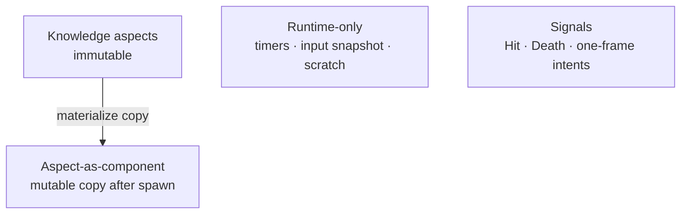

| Kind                | Source                          | Scheduling note                                     |
| ------------------- | ------------------------------- | --------------------------------------------------- |
| Aspect as component | Copied from Knowledge at spawn  | Ordinary reads/writes                               |
| Runtime-only        | Defaults / infra / systems      | Ordinary reads/writes                               |
| Signal              | Published when something occurs | Treat publish as **write**; consumers ordered after |

Same C# aspect struct can be knowledge data and component payload; **immutability is a property of the store role**, not of the type name.

`Ref<TConcept>` components are how live entities point at knowledge roles without becoming beings themselves.

---

## 9. Systems: law as one-sentence processes

### 9.1 Grain

If you cannot state a system in **one short sentence**, split it.

| System     | Sentence                             |
| ---------- | ------------------------------------ |
| Friction   | Friction slows velocity              |
| SpeedClamp | Speed cannot exceed profile max      |
| Movement   | Velocity changes position            |
| Decision   | Agent picks next legal state         |
| Strike     | Hits apply damage / knockback intent |
| Health     | Zero HP means death                  |

Multi-sentence systems hide extra writes and become dumping grounds.

### 9.2 Contract

A system is bound to **one world**, exposes a `Run` (name secondary), and treats that world’s store as its data bus. Knowledge is read-only context. Constructor-injected god services recreate the global soup.

```csharp
// Shape
[FrameSystem(typeof(GameplayWorld))]
partial class FrictionSystem
{
    public void Run(float dt)
    {
        // Look / Grant on GameplayWorld entities
        // knowledge.Of / About as needed - not counted as mutable conflicts
    }
}
```

### 9.3 Accountable reads and writes

Every touch of mutable state must be visible to the scheduler-by attribute or by closed-generic call-site scan:

| Call shape                         | Counts as              |
| ---------------------------------- | ---------------------- |
| `Look<T>()` / read component `T`   | Read `T`               |
| `Grant<T>()` / write component `T` | Write `T`              |
| `Publish<T>()` signal              | Write `T`              |
| `knowledge.Of` / `About`           | Not a mutable conflict |

Open generic helpers that hide `Grant<T>` behind an unconstrained `T` make dependence analysis impossible-**forbid them** on paths that claim automatic scheduling.

> And, remember to not create mutable variable to represent a thing that you just read. If you have to do so, it deserves its own system

### 9.4 Conflict → waves

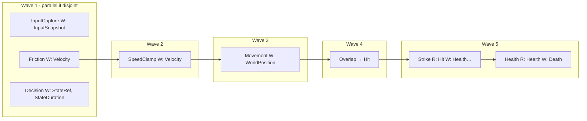

| Conflict | Condition               | Effect          |
| -------- | ----------------------- | --------------- |
| RAW      | A writes X, B reads X   | B after A       |
| WAW      | both write X            | order them      |
| WAR      | A reads X, B writes X   | B after A       |
| Disjoint | no shared mutable touch | may parallelize |

**Groups** (PreFrame / FixedUpdate / Gameplay / PostFrame—names illustrative) are architectural phase slots. **Waves** inside a group are mechanical consequences of conflicts. Humans declare worlds→groups and systems→worlds; they should not maintain wave tables by taste. Explicit `RunAfter` is a rare, commented escape hatch. Cycles are defects.

### 9.5 Clockwork vs agency (same scheduler, different meaning)

| Kind       | Examples                   | Notes                              |
| ---------- | -------------------------- | ---------------------------------- |
| Clockwork  | friction, decay, integrate | no choice                          |
| Injection  | input → snapshot/commands  | agency entry from outside          |
| Decision   | state graph evaluation     | choice among legal edges           |
| Resolution | strike, health             | pure consequence of signals + data |

Measurement systems (overlap → _Hit_) are **infrastructure** even when scheduled near gameplay: they publish facts; they do not decide damage tables.

---

## 10. Decision: parameterized trajectories

Action games need AI and player state machines that designers can extend **without a new C# type per state**. The architectural move is not “pick FSM or utility AI as identity.” It is: **small composable aspect + one pure evaluator**. It is what it is, as from FSM up until you have to has UA or GOAP in your game, you never have to touch your decision evaluator twice.

### 10.1 Primitives

| Aspect / data | Role                                                                         |
| ------------- | ---------------------------------------------------------------------------- |
| StateLinks    | Directed edges state → state, each with a gate                               |
| Gates         | Compare sensor scalars (AND/OR/NOT); optional exit thresholds for hysteresis |
| Desirability  | Priority + weighted sensors → score                                          |
| StateGroup    | Candidate sets / tiers / defaults                                            |

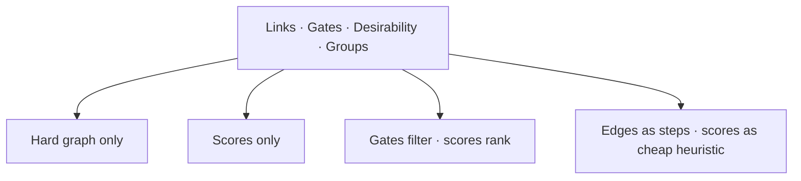

One evaluator; authors choose the pattern by **data**. Hybrid is the common action-game default.

### 10.2 Evaluation flow

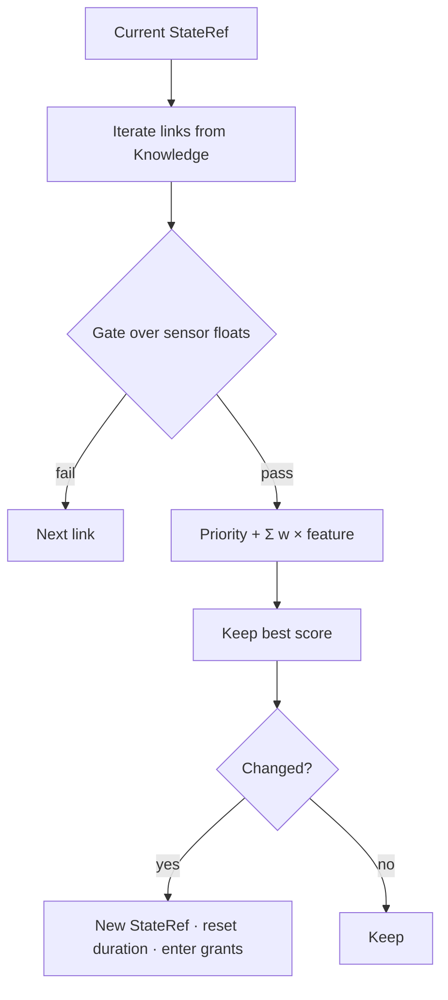

`Evaluate(...)` should be **pure**: Knowledge + current ref + feature bag → next ref (or same). Side effects (grant invulnerability, spawn volume, velocity override) are **not** buried inside the scorer. They are separate systems that, on state change, read aspects attached to the **state being** in Knowledge and apply them to the entity.

That split is how “roll gives i-frames” becomes authoring (`PlayerRoll` carries `InvincibilityGrant`) instead of a permanent `DodgeRollSystem` that only exists because Knowledge was underused.

### 10.3 Sensors

Decision wants varies value; but the world is not. So, we must have sense in someway, right?

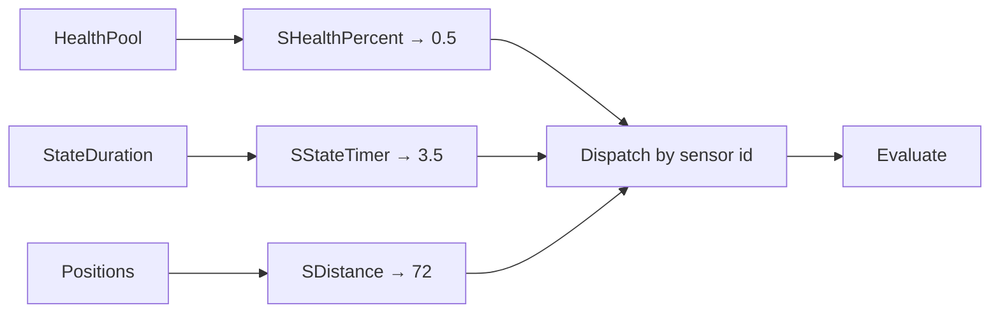

- Sensor **definition** is a being.
- Sensor **provider** is a closed function that sense world-state into values.
- Dispatch is closed, not a reflective plugin soup on the hot path.
- Providers that read pure gameplay fields live with game law assemblies; providers that need spatial acceleration live with infrastructure. Rule consumes **floats**, not query internals.

Extension path: declare sensor being → implement provider → rebuild dispatch. Decision systems remain untouched.

---

## 11. Bridges: cross-world projection (when worlds are plural)

If every system shares one world, skip this section in practice. Bridges earn keep only when **two ownership walls** must exchange a snapshot without sharing a store.

Worlds do not share mutable state. Bridges are the **only** legal cross-world writers, and they run at barriers after the source world has flushed—typically at a group boundary (e.g. after `Gameplay` waves, before a `PostFrame` world ticks).

### 11.1 Sequence (illustrative)

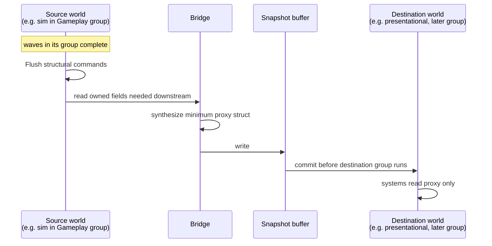

### 11.2 Properties

1. **Explicit cross-world reads/writes** - body scan inside one store cannot express “read A, write B.” Bridges declare both ends.
2. **Synthesize minimum surface** - do not copy the whole entity. Destination learns a proxy shaped for its job, not the source’s full component set.
3. **Counterpart lifecycle** - spawn in source may create a counterpart in destination; destroy propagates. Linking maps are bridge/infrastructure concern.
4. **Double-buffer / snapshot** - consumers see a consistent frame, not a tearing mid-wave view.
5. **Bridges are infrastructure** - game law does not reference them.
6. **Optional** - zero bridges is valid; N bridges follow N world edges you actually declared.

---

## 12. Materialization: knowledge made into life

A being is a blueprint. An entity is a living bag. **Materialization** is the one-way copy:

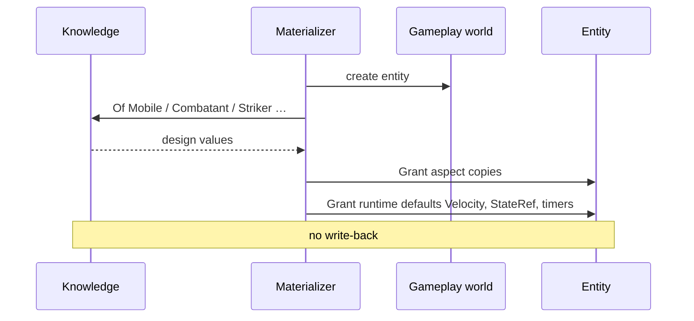

### 12.1 Copy semantics

After materialize, the entity is independent. Changing this instance’s MaxSpeed does not edit Knowledge. The next spawn still reads the catalog.

### 12.2 Generic materialize vs bespoke constructors

Effects, hit volumes, debris, and actors should converge on **“materialize being X at pose Y (with optional overrides)”** rather than permanent `CreateGrassBreak()` methods. Rule publishes _intent_ (spawn this effect being here); materialization applies the being’s aspect schema. Missing required links (e.g. breakable without death effect) fail **at bake**, not via silent fallbacks to hardcoded being names in systems.

### 12.3 State enter as secondary materialize

When decision switches `Ref<State>`, generic applicators may copy **state-being aspects** onto the entity (grants, spawns, overrides). That is still materialization of catalog truth-just triggered by transition rather than first spawn.

---

## 13. Frame pipeline

A frame is a **traceable $\Delta t$ transaction**: injection in, systems run by **group**, waves inside each world/group by R/W, optional bridges at barriers, signals cleared.

### 13.1 Groups (phase slots)

| Order | Group (name illustrative) | Typical role                                      | Rate              |
| ----- | ------------------------- | ------------------------------------------------- | ----------------- |
| 1     | PreFrame                  | Capture injection (input, net input on server, …) | variable          |
| 2     | FixedUpdate               | Worlds/systems that need stable $dt$ (if any)     | fixed accumulator |
| 3     | Gameplay                  | Primary law worlds                                | variable          |
| 4     | PostFrame                 | Worlds that only consume snapshots (if any)       | variable          |

**Groups are not worlds.** A group may host zero or more worlds you declared. Empty groups are fine. Waves are compiler-derived **inside** a group’s systems—not a second hand-edited timeline.

### 13.2 End-to-end tick

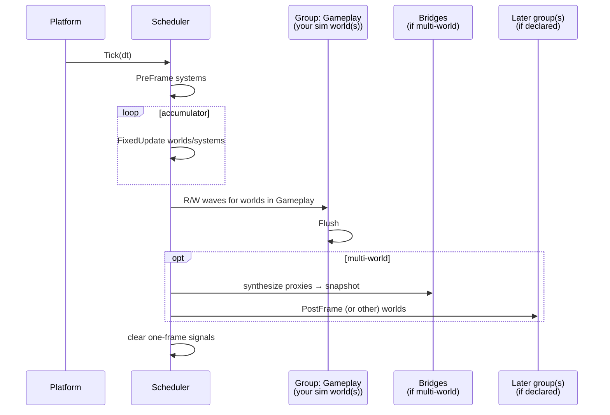

### 13.3 Scheduler and host as derived artifacts

Given **declared** worlds (each bound to a group), systems, optional bridges, and sensor providers, a **scheduler** can be derived: construct systems, inject Knowledge, run groups in order, waves inside, flush, bridge, continue. A thin **host** exposes `Tick(dt)` to the platform loop. Developers do not hand-edit the derived schedule to “insert one system in the middle” without updating dependence truth—otherwise the model is theater.

```csharp
// Shape of the outer loop — worlds/groups are setup, not a fixed product cast
var knowledge = BakeKnowledge(sources);
// e.g. host.AddWorld<SimWorld>(ExecutionGroup.Gameplay);
// optional presentational worlds → later groups
BindStore<...>(...);
while (running)
{
    var dt = Platform.DeltaTime();
    Host.Tick(dt);          // derived schedule over your setup
    Platform.Present();     // client only; server may have no present step
}
```

---

## 14. Assembly topology (permissions as project structure)

Dependencies are architecture. A shape that matches the constraints:

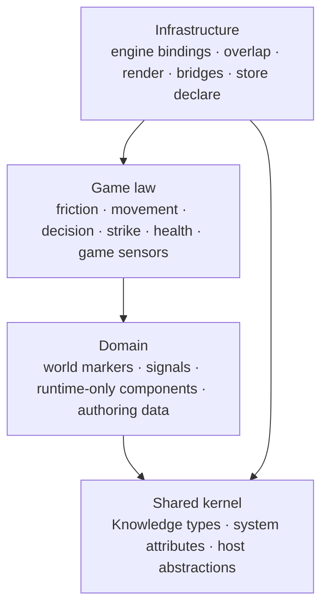

| Assembly       | Allowed                                              | Forbidden                                        |
| -------------- | ---------------------------------------------------- | ------------------------------------------------ |
| Domain         | concepts/aspects authoring, markers, events          | behavior, I/O                                    |
| Game law       | systems + sensors over game fields                   | engine packages, draw, device poll               |
| Infrastructure | bindings, measurement, bridges, presentation systems | exclusive ownership of damage tables / AI policy |

Package references must make the litmus in §1.2 mechanically true. If the dependency graph can reach a renderer from law, the boundary is already fiction.

### 14.1 Illustrative system placement

**Game law (examples):** Friction, SpeedClamp, Movement, Decision, Strike, Health, PushApart policy, lifespan timers, generic state-enter applicators.

**Infrastructure (examples):** InputCapture, Overlap/Hit publishing, Camera presentation, Sprite render, Audio playback, spatial sensors, all bridges.

Ground truth for reads/writes is always the system body (or its explicit declarations)-tables in documents go stale; the schedule does not get to.

---

## 15. Leverage: when the architecture is actually working

The semantic model and the world split are worthless if law still hardcodes content. **Leverage** is the share of decisions that live in Knowledge.

| Change                                 | Healthy cost                                |
| -------------------------------------- | ------------------------------------------- |
| Tune numbers / distances / forces      | Authoring only                              |
| Add AI/player state for existing roles | Authoring + maybe one new sensor            |
| Add effect being                       | Authoring; materialize path already generic |
| Swap spatial backend                   | Infrastructure only                         |
| Swap renderer                          | Infrastructure only                         |
| Headless sim tests                     | Omit presentation worlds                    |

### 15.1 Patterns that restore leverage

These are not optional polish; they are how §2–§12 stay honest under feature pressure:

| Pressure           | Weak path                                 | Strong path                                                |
| ------------------ | ----------------------------------------- | ---------------------------------------------------------- |
| Camera target      | Global singleton                          | Concept/role on the entity (`CameraFocus` + follow params) |
| Roll i-frames      | Bespoke dodge system sets hurt flags      | State being carries grant; generic enter applicator        |
| Attack volumes     | Attack system hand-spawns                 | State carries `SpawnOnEnter`; generic materialize          |
| Breakable death FX | Fallback `In.Being<GrassBreak>()` in code | Required `OnDestroy` ref at bake                           |
| Knockback feel     | Hardcoded decay 0.85                      | Aspect on the defender being / concept                     |
| Effect spawn       | Ad-hoc `Create` with magic fields         | Materialize effect being from Knowledge schema             |

**Meta-rule:** systems know _how to read Knowledge and mutate aspects generically_. Knowledge remains the sole source of _what_.

---

## 16. Invariants

Few enough to remember. If it is taste, it is not here.

1. **Game law and infrastructure do not share vocabulary or package edges** that fail the litmus in §1.2.
2. **Being / Concept / Aspect is the catalog language**; reveals are total; aspects are pure data.
3. **Knowledge is immutable after freeze**; materialize copies one way; no catalog write-back from entities.
4. **Entities are component bags in exactly one world**; they are not beings; cross-world traffic is bridges only (and only if multiple worlds exist). Worlds are project-declared and bound to **execution groups**—not a fixed Render/Audio cast.
5. **Live catalog linkage is role-scoped (`Ref<TConcept>`)**; law does not scale by proper nouns.
6. **Systems are one-sentence, world-bound, and R/W-accountable**; waves follow conflicts; **groups** are architectural phase slots.
7. **Decision is pure evaluation over parameterized primitives**; sensors are closed extractions to scalars.
8. **Structural mutation and cross-world sync happen at barriers**; snapshots are consistent.
9. **Leverage is mandatory:** new content defaults to authoring, not new law types.
10. **No reflective hot-path discovery** of systems, sensors, or catalog rows-bake/generate/close the set.

---

## 17. Full mental model (one pass)

```text
AUTHORING
  beings claim concepts; concepts reveal aspects; values fill aspects
  prototypes resolved · refs validated · types inferred
  → FREEZE → Knowledge (immutable pools)

SETUP
  declare world(s) → bind each to an execution group
  bind systems to worlds; bridges only on edges you created

FRAME Δt
  for each group in order:
    run that group’s systems in R/W waves
    flush as required
    run bridges out of worlds that finished (if any)
  clear one-frame signals

SPAWN / TRANSITION
  materialize: Knowledge aspects → components + defaults
  state enter: state-being aspects → grants / spawns

PERMISSION
  Domain ⊂ Game law ⊂ Infrastructure (dependencies point inward to kernel)
  law never imports engine presentation stacks
```

### 17.1 The swing, labeled once

| Beat                           | Layer                                                                            |
| ------------------------------ | -------------------------------------------------------------------------------- |
| Strike numbers, range intent   | Knowledge (Striker / StrikeDef)                                                  |
| Press attack                   | Infra → InputSnapshot / command                                                  |
| Enter attack state             | Decision + state Knowledge                                                       |
| Arm measurement / spawn volume | State grants or infra armed by intent                                            |
| Overlap true                   | Infra publishes `Hit`                                                            |
| HP and knockback               | Rule                                                                             |
| Sprite faces swing             | Presentational systems (own world/group if you split; else same store with care) |

If one function owns two rows from different layers, it is a temporary hack that will demand interest.

---

## Closing

Another way to think about game architecture is to stop treating “architecture” as a catalog of patterns (ECS, singleton, event bus) and start treating it as **enforced separations**:

- law against machinery,
- catalog against life,
- viewpoint against free-form bags,
- world against world (when you declared more than one),
- group against group (phase order),
- pure decision against enter-side effects,
- measurement against resolution,
- authoring velocity against engineer bottlenecks.

Engines, stores, and generators are mechanisms. They should be swappable precisely because the separations are real. When the separations are fake-when packages, names, and frame order disagree-no amount of stylish structure will keep the game’s possibility space legible two months later.

> Architecture is a set of constraints. Anyone who reads it should be able to come back after two months and still write the game correctly.

The constraints above are meant to be harsh enough to write by, and few enough to remember. Implement them with whatever toolchain your team can bear; just do not negotiate them away the first time a feature fits more easily in the wrong layer.
