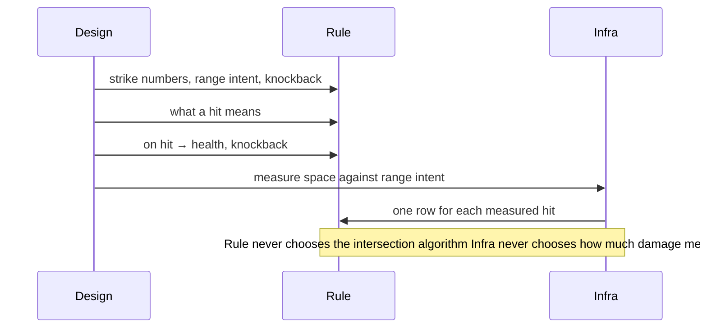
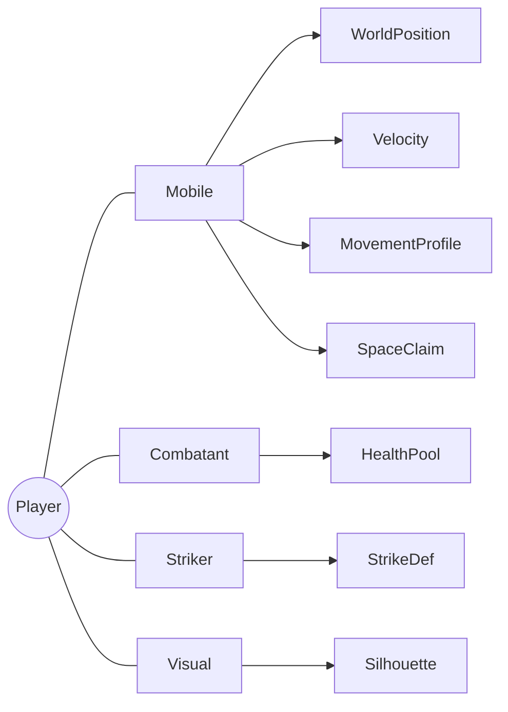
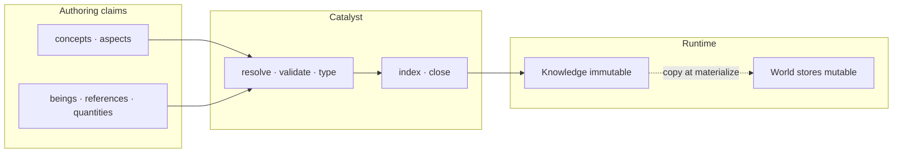
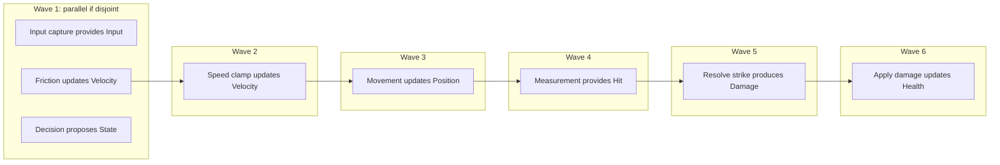
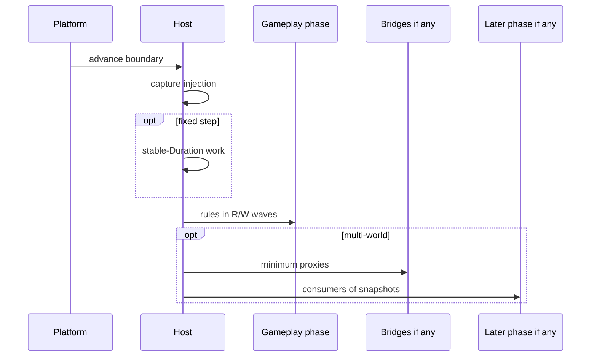

I've argued elsewhere that a game, at minimum, is a rule-constituted possibility space providing Agents the capacity to alter its operating trajectory. That claim can be wrong or right, it isn't the point here. The point is a smaller, more embarrassing question: why do so many of us, as indie developers, keep building our games as parasites living inside someone else's blackbox? And what exactly is wrong with how we picture "architecture" in the first place?

## Table of contents

## Misconceptions

Ask a room of developers what "game architecture" means and you'll get folder diagrams, benchmark numbers, and a suspicious number of opinions about where `Utils.cs` should live. Underneath that surface is a quieter confusion: we've started treating the game as indistinguishable from the tools used to build it. Worth asking why that habit took root.

Picture a game as nothing but a database, and the reflex is to protect table schemas long before anyone has decided what a punch actually _means_. Picture it as a pile of scripts, and every design problem becomes a rigid call graph. Either way, the same thing happens: the ability to weave possibilities quietly disappears, events get bolted into forced sequences, and agency, the whole reason a _game_ is a game and not a slideshow, evaporates.

Infrastructure can host a world. It is not the world. Engines, design patterns, elegant class hierarchies, all the diagrams people love to screenshot, genuinely useful, and entirely replaceable. None of them are the essence of the game.

So what does the architecture of a game actually look like, once you strip the furniture out?

## Start from the thing being built

Calling a game a simulation tends to summon weather systems, rigid bodies, and people arguing about realism. I mean something much smaller. A game-form constitutes possible states and the laws by which one state may become another. A game-instance begins somewhere in that space and actualizes one trajectory through it. Running that transition is simulation, whether the pieces are armies, falling blocks, playing cards, or two numbers on a sheet of paper.

That does not make every simulation a game. A weather model may evolve under laws and parameters without providing any Agent the capacity to alter its operating trajectory. Simulation is the operational form being discussed here; Agency is the additional relation that matters to gamehood. Architecture has to preserve both without confusing one for the other.

Let $S_n$ be the instance-relative truth sufficient to determine what may happen after transition boundary $n$. Let $K$ be the accepted design that stays fixed while this configured instance runs: movement limits, strike power, mode links, material properties, whatever the authors supplied. Let $I_n$ be an intervention the possibility space permits an Agent to make, and $M_n$ the complete observations an apparatus admits under the game's measurement contracts. Then the operation of the game has this shape:

$$
S_{n+1} = \Phi_R(S_n, I_n, M_n; K)
$$

$R$ is the set of laws constituting the transition, and $\Phi_R$ is those laws being applied at one traceable boundary. Repeated application from an admitted initial condition gives the trajectories the game may actualize. The possibility space is therefore not a bag the engine stores somewhere. It is what these laws, parameters, initial conditions, permitted interventions, and measurement contracts make reachable. Call that configured game-form $G$ and the space $\Omega_G$; $R$ constitutes the law, but $R$ alone does not name which concrete game has been configured.

This is the same separation any useful scientific model begins with. A law is not the current value of its variables. $F=ma$ does not change when the mass changes. A chemical relation does not become a new law for every concentration placed in the vessel. Even a probabilistic theory produces a definite distribution under its stated conditions; uncertainty in an outcome is not an absent law.

A game rule should be presentable with the same honesty: here is the domain in which it applies, here are the quantities it reads, here are the fixed parameters, and here is the definite relation it establishes. Theme and implementation may express that relation in a thousand ways without changing the relation itself.

This is also why mechanic and rule cannot be synonyms here. A mechanic is one expression of a relation through controls, timing, presentation, or physical procedure. Replace that expression with a structurally equivalent one and the rule may survive. Replace the relation and the possibility space changes, even if the mechanic still looks identical on screen.

Now the line I keep taping back onto the wall is no longer a slogan. It falls straight out of the operation above:

> **Designers parameterize the game. Programmers write rules. The boundary between those jobs is enforced by construction, not by code review and good intentions, that is architecture.**

These are logical roles, not necessarily two job titles. Parameterization supplies $K$, initial conditions, and authored possibilities. Rules supply the generic relations in $R$. Agents supply permitted $I$. Infrastructure stores $S$, supplies contract-bound $M$, executes $\Phi_R$, and presents the result on a machine.

The moment a programmer hardcodes a _proper noun_ into a rule, `if (isPlayer)`, `if (enemyType == "Bat")`, one parameter value has been promoted into a new law. The reverse mistake is just as bad: asking authored data to contain procedures turns parameters into scripts. If some piece of the codebase cannot preserve that separation, let it fall. C# appears below only because it can draw a few directions compactly; another language or a node graph still has to express the same model.

## Game & infrastructure

A design document doesn't talk about GPU types or engine internals. It says _hit lands_, _knockback_, _opening_, _the bat is chasing_. Infrastructure talks about overlaps, atlases, device polls, solver steps. The instant those two vocabularies share a function body, changing the machine changes the game, and that's the first failure mode worth guarding against.

A theory is not the apparatus used to measure it. In the same way, a game rule is not the collider used to discover contact or the sprite used to show position. Infrastructure may measure some relation $M_n=\mu(S_n,X_n)$ and may present some observation $P_n=\pi(S_n)$, but neither $\mu$ nor $\pi$ gets to redefine what the relation means inside $\Phi_R$. Here $X_n$ is the apparatus-visible condition outside the game truth already represented by $S_n$. Measurement is still causal: a different observed contact may actualize a different trajectory. Replaceability means satisfying the same contract, not being irrelevant.

| Design says             | Game rule                                     | Infrastructure                          |
| ----------------------- | --------------------------------------------- | --------------------------------------- |
| Hit lands               | strike definition, hit relation, health write | overlap / distance / contact generation |
| Push apart              | space claim, separation policy                | circle-push or physics penetration math |
| Opening                 | vulnerability condition                       | measured timing or contact, if required |
| Knockback               | impulse and stagger law                       | body integration, if delegated          |
| Movement                | velocity, movement profile, world position    | optional character-controller solver    |
| Appearance              | silhouette intent (kind, palette...)          | sprite atlas, draw calls, shaders       |
| Button                  | input snapshot / commands                     | hardware polling, focus, rebinding UI   |
| Terrain                 | authored walkability quantities               | tile collision, nav-mesh build          |
| Camera / render / audio | follow intent, if authored                    | matrices, viewports, mixers, voices     |

Rules never name colliders, hitboxes, sprites, textures, draw calls, shader channels, or audio graphs, infrastructure owns that vocabulary. Rules only own what a hit _means_, once a hit is already known to have happened.

Here's the test I keep applying: strip the visuals, run the game as pure text. Does it still run cleanly? Or does it suddenly need a runtime type from nowhere, some stray reflection call, or, worst case, refuse to compile at all? The moment a rule reaches into infrastructure "just for a vector type," the camel's nose is already inside the tent, and the rest of the math will not stay outside for long.

Take something as ordinary as "a hit lands." In design terms: the player swings, something in range gets hit, damage is dealt, the target is knocked back. Split _measurement_ from _resolution_:

- Infrastructure measures space against a range intent and provides one input row for each hit it actually finds.
- A rule turns each hit into damage; another applies that damage to health; knockback is another result of the same measured relation.
- Rule never picks the intersection algorithm. Infrastructure never decides what the damage number means.


```mermaid
sequenceDiagram
    participant Design
    participant Rule
    participant Infra

    Design->>Rule: strike numbers, range intent, knockback
    Design->>Rule: what a hit means
    Design->>Rule: on hit → health, knockback

    Design->>Infra: measure space against range intent
    Infra->>Rule: one row for each measured hit

    Note over Rule,Infra: Rule never chooses the intersection algorithm Infra never chooses how much damage means
```

Architecture, in this narrow sense, is just the refusal to let one function do both jobs forever. Measurement can sit right next to gameplay in the schedule and still be infrastructure: it supplies the measured relation, it doesn't own the damage table. One function holding both isn't pragmatism, it's debt with a grace period.

And this is exactly why the "parasite" question matters: if a rule is written in the engine's own words, the game isn't _hosted_ by the engine. It's _trapped_ inside it.

Fast or fun, doesn't matter, it has to be a game first. So instead of leaning on inheritance chains and vague abstraction, here's the model I actually use.

## A, B, or C, what is that?

Rule and design still need a shared vocabulary for $K$ and for the domains in which laws apply. `HpComponent` and `MoveComp` are storage slang, not that vocabulary. I don't want a second entity model, and I'm not claiming the game _is_ a database of objects. I need to say “every mobile thing has the quantities required by movement” without listing every thing that happens to move. Three primitives have covered every case I've hit so far:

- **Aspect** is a glance: one minimal, pure quantity or structure a law may read. Zero behavior.
- **Being** is... a thing. That's it. A state, a character definition, an effect, doesn't matter which. It is a named coordinate in the parameter space.
- **Concept** is a viewpoint that declares a lawful domain across many Beings, revealing every Aspect that viewpoint promises.


```mermaid
graph TB
    B["Being named coordinate in design space"]
    C["Concept orthogonal viewpoint"]
    A["Aspect pure data · zero behavior"]

    B -->|"claims"| C
    C -->|"reveals"| A
    A -.->|"may free-float"| A
```

$$B_i = \bigl(C_{B_i},\; A_{B_i}\bigr) \quad \text{where} \quad A_{B_i} = \bigcup_{c \,\in\, C_{B_i}} \text{Reveals}(c)$$

Two rules keep this from decaying into a taxonomy tree:

- **Reveals is total.** Claim `Mobile`, and you get _every_ aspect `Mobile` reveals, no cherry-picking. Partial claims produce "almost Mobile" rows that break queries and quietly train designers to distrust the system.
- **Aspects aren't exclusive property of one concept.** A concept only opens a window; the same data can free-float when no viewpoint wrapper actually earns its keep, a single loyalty scalar doesn't need a concept standing guard over it.

This is no stranger than a physical law referring to mass and velocity instead of “the third red ball,” or a chemical law referring to substances and quantities instead of “the flask on my left.” A law needs the properties that make it applicable. The proper noun of the object carrying them is irrelevant.

Now give a thing four independent properties: breakable, flammable, affected by gravity, and conductive. That's already sixteen possible combinations. If the program names the combinations, `BurningCrate`, `FallingBurningCrate`, `FallingBurningMetalCrate`, every new property multiplies the number of cases somebody eventually has to remember. It can look wonderfully organized while there are only three crates.

Name the properties instead, and the crate is merely authored as breakable and flammable. The breaking rule already knows what breakable means. The burning rule already knows what flammable means. A second crate changes data, not either rule.

That's the part of abstraction I actually care about. A new Being assembled entirely from meanings the game already understands should add no new rule code. A genuinely new meaning costs the data that describes it and the rules that make it matter; it should not require reopening every old Being. If adding `Wet` means editing fire, electricity, movement, every creature class, and three factories, the combinations were only given tidier names.

ABC is useful only while it preserves that property. A Concept gives a rule one stable way of looking at many things. An Aspect is the smallest piece that view needs. A Being composes those meanings but never becomes the reason a rule runs. Get those boundaries right and one rule covers a great deal of design. Get them wrong and the code grows with the combinations, which is a much faster kind of growth than it first appears.

### How do I know the vocabulary is doing real work?

Counting A, B, and C cannot answer that. There is no first-principle reason a healthy game should contain similar numbers of Aspects, Beings, and Concepts. In fact, successful parameterization often lets Beings outgrow the vocabulary by orders of magnitude: a few material laws may govern a thousand authored blocks. A tidy ratio can be produced by an excellent model or by thirty beautifully balanced names that no rule ever reads.

The only useful test is operational. Change one authored value while holding the state, interventions, and every other parameter fixed. If no permitted trajectory or observation can change, that value is not parameterizing the game. It may be a note for an author or unfinished work, but it has no place pretending to be an operative quantity.

For a parameter $k_i$, the question has this shape:

$$
\exists\ S,I,M,k_i' :
\Phi_R(S,I,M;K)
\neq
\Phi_R(S,I,M;K[k_i \leftarrow k_i'])
$$

That equation writes the gameplay case. For an authored presentational value, apply the same counterfactual to $\pi$ instead. The point is not that every parameter must change simulation; it is that the parameter must change the operation it claims to parameterize.

The same test works in the other direction. Add a new Being using only Concepts, Aspects, and laws that already exist. If some rule must now learn that Being's name, the vocabulary failed to express the law's real domain. If no new rule is needed, the abstraction has actually bought something.

This leaves three questions worth asking during design. Can every rule name its domain without a proper noun? Does claiming a Concept provide every quantity that rule requires, without null or an exception path? Can a new Being composed from existing meanings alter trajectories through data alone? Those questions follow from the simulation. Corpus ratios do not.


```mermaid
graph LR
    Player((Player))

    Mobile
    Combatant
    Striker
    Visual

    Player --- Mobile
    Player --- Combatant
    Player --- Striker
    Player --- Visual

    Mobile --> WorldPosition
    Mobile --> Velocity
    Mobile --> MovementProfile
    Mobile --> SpaceClaim
    Combatant --> HealthPool
    Striker --> StrikeDef
    Visual --> Silhouette
```

Not every Being is viewable through every Concept: an enemy might skip `Striker`, a pot might only have `Breakable` and `Visual`, and an authored mode or probe might expose only the lens that gives it meaning. One Knowledge base, many viewpoints. Generic rules key off lawful meanings, never marketing names.

In an action game specifically, the split might look like: `Mobile` opens movement profile; `Combatant` opens health design; `Striker` opens strike definition; `Vulnerable` and `Knockable` open vulnerability and knockback; `Visual` opens silhouette intent; `Breakable` opens durability and authored aftermath. A project may also author modes, probes, links, or groups as Beings. Your own set will differ; the demand behind it will not: viewpoints stay explicit, data stays pure, composition stays orthogonal.

One more authoring rule worth keeping: a number without a quantity is not yet a parameter. The vocabulary declares whether a value means distance, duration, damage, probability, direction, or something else, including its unit where a conversion is meaningful. Designers supply values in that language; they do not choose `Single` versus `Double`. Catalyst maps the declared quantity to concrete storage and rejects inconsistent claims. No `any`, no `unknown`, no untyped bag sitting at the authoring boundary, because runtime guessing is exactly how design truth stops being _Knowledge_.

Also worth being pedantic about: **a being is not an entity.**

|                  | Being       | Entity         |
| ---------------- | ----------- | -------------- |
| Lives in         | Knowledge   | a world store  |
| Mutates in play? | No          | Yes            |
| Identified by    | design name | a local handle |

An entity is a bag of live fields, and it doesn't need to _know_ it's "Player." Debug tooling can show spawn source if it wants, but a rule that scales by `if (is Player)` will not scale, no matter how convenient it looks today.

To be clear, none of this means "the game is a schema." It's just how design and rule share coordinates without collapsing into storage slang or class trees, viewpoint against free-form bags, role against proper noun.

## Knowledge, and... life?

"Player max HP is 4" is design. "Subject 17 currently has 2 HP" is life. Two different kinds of truth. Cram them into the same address space and you get one of two failure modes: live changes quietly rewriting the design every future instance reads from, or endless reparsing because authored claims never became accepted truth.

The distinction is not merely “read-only versus writable.” $K$ helps select the configured game-form; $S_n$ tells us where one instance of that form currently is. Hold $K$, the rest of the form, and future inputs fixed, and two instances with the same sufficient $S_n$ must admit the same future evolution. If an extra stored flag cannot change that prediction except through some framework side door, it is not an independent part of game state. It is a cache, a projection, or bookkeeping pretending to be ontology.

Designers write structured data, JSON, tables, graphs, whatever format is convenient; the format is a mechanism, not the point. Those rows are claims. Catalyst resolves, validates, types, indexes, and closes them. Only then do they become **Knowledge**: not config, not a prefab, not memory of intent, but accepted operative design truth for one configured game-form. Changing that truth changes the configuration; it is not an ordinary mutation smuggled into the same trajectory under the polite name “reload.”


```mermaid
flowchart LR
    subgraph Authoring claims
        C["concepts · aspects"]
        B["beings · references · quantities"]
    end

    subgraph Catalyst
        I["resolve · validate · type"]
        E["index · close"]
    end

    subgraph Runtime
        K["Knowledge immutable"]
        W["World stores mutable"]
    end

    C --> I
    B --> I
    I --> E
    E --> K
    K -.->|"copy at materialize"| W
```

Catalysis is a logical boundary, not a mandated list of class names: merge sources under an explicit policy, resolve prototypes so runtime never walks a parent chain, cross-reference every pointer so it lands on a Being viewable through the promised Concept, select a layout, then close. Knowledge does not mutate, full stop. Static checking, generated tables, startup validation, or an authoring tool are mechanisms for failing early; none is the idea itself. Total Knowledge and accountable Rules are the point.

Through a conceptual lens, you always ask for the aspect that concept actually reveals, `Mobile` plus movement profile is valid, `Combatant` plus world position is not, because `Combatant` never claimed that window. Direct aspect access stays available for free-floating aspects, since a concept is a viewpoint, not a taxonomy, a unique loyalty scalar doesn't need to borrow someone else's lens. An invalid lens or an ambiguous reference should fail before play, whenever the toolchain allows it; resist the temptation to invent a third path that quietly returns null and hopes for the best. In one possible C# notation:

```csharp
var player = In.Being<Player>();

var movement = knowledge.Of<Mobile, MovementProfile>(player);
var health   = knowledge.Of<Combatant, HealthPool>(player);
var loyalty  = knowledge.About<Loyalty>(player);

var links = knowledge.Of<Mode, Links>(current.Mode);
```

The spelling isn't important. Read it as: choose a thing, look through one Concept, receive the Aspect that Concept promised. The compiler may enforce that promise, an authoring tool may enforce it, or the game may validate it before play. What matters is that `Combatant` cannot suddenly become a back door to position merely because both values happen to live on the same entity.

Collections have the same obligation. A mutable array hidden behind a read-only property is still a mutable array wearing a hat. Knowledge must not hand its authoring buffer back to a rule and hope nobody notices.

Here's the part people trip over most often: **reading Knowledge is not a mutable read/write conflict against other rules**, because Knowledge is immutable by construction. Treat `Of`/`About` as scheduling noise and you'll invent false dependencies, and quietly train everyone to stop trusting the real dependency graph, the one that actually lives over mutable life. No locks are needed for Knowledge reads. No mystery about who last wrote `MaxSpeed`, because design does not change during the transition.

Design and life also need different kinds of references. Authoring sometimes means this exact Player definition or this exact Bat definition. Life may point to the current authored Mode, equipped Effect, or another design coordinate through the Concept that gives that reference meaning. The Ref may reveal only what its Concept promises. Otherwise the proper noun slips back into the Rule through a more respectable-looking door.

And even that is not the identity of a living participant. Two bats materialized from the same Being read the same design and remain two different bats. A relation such as Hit therefore needs an opaque, World-local subject, enough to say which life participates and nothing more. It is not a Knowledge reference and it is not permission to query an ECS handle. Confuse those three identities and either every bat becomes the same bat, or the storage engine quietly becomes the ontology again.

Knowledge holds design; fields hold life. Some design values may be copied into life when a Being participates in initial composition; timers, input samples, and other instance values simply begin there. The same value shape can therefore be immutable design in one place and mutable life in another. Authority is a property of _where_ the value lives, not of its type name. References such as a current Mode are how life points back at Knowledge without pretending to become a Being itself.

A Being is an authored thing, not necessarily a blueprint. An entity is one possible storage representation of a running Subject. For the Beings that participate in initial composition, materialization is a one-way mapping from Knowledge and an initial condition into life:

$$
S_0 = \operatorname{Materialize}(K, C_0)
$$

Copy the design values life needs, apply its initial values, and never write back. After that point the instance is independent; changing this entity's `MaxSpeed` cannot touch Knowledge, and another instance still reads the authored value. The important part here is the direction of the mapping, not an API for rules to create and destroy things.

That initial mapping is deliberately boring and pure. C# might write one function like this:

```csharp
static Health MaterializeHealth(in HealthPool design)
    => new(design.Maximum, design.Maximum);
```

Do not stretch that mapping into mode or lifecycle management. Changing a current Mode changes one reference. Rules that care about it read the appropriate design through that reference. Copying authored Aspects onto the entity and later revoking them only invents a second lifecycle for data that already has a perfectly good home in Knowledge.

Why fight this hard for the Knowledge/life split? Because the moment you can no longer tell "design fact" from "this-instance-right-now," you've already lost the distinction between rule and possibility space, and once that's gone, the blackbox owns you again.

## Rules, and the greatness of honest reads and writes

Rules need mutable life to work with. That life may live in an ECS, an SoA table, an object graph, or something stranger; storage is not the architectural decision. The decision is that a rule can name what it observes and changes without importing the storage engine's vocabulary, and that every mutable touch remains visible to scheduling. "Ordering" without visible dependence is just theater.

Before it is a method, a rule is a relation over a declared domain:

$$
r : \mathcal D_r \longrightarrow \mathcal Y_r,
\qquad
\mathcal D_r \subseteq K \times S \times I \times M \times Q
$$

$\mathcal D_r$ is not an `if` ladder inside the rule. It is the set of complete tuples for which the law has meaning, the Concepts and relations that supply every quantity it requires. $Q$ stands only for exact additional quantities, such as Duration, that this Rule actually needs. $\mathcal Y_r$ is the definite change or result established for each tuple.

Movement can be written without knowing whether the moving thing is a player or a falling stone:

$$
Position_{n+1} = Position_n + Velocity_n\,Duration_n
$$

A strike can be resolved without knowing the name of either participant:

$$
Damage = Power \cdot Exposure,
\qquad
Health' = \max(0, Health - Damage)
$$

A chemical rate may evaluate to zero, and a quantum model may produce a probability distribution, but both are still definite results of their stated model. A neutral quantity or a distribution is information. `null` is the program declining to state a law.

“Presentable as a law” does not mean every rule must be arithmetic. A legal move may be a predicate, a state link may be a relation, and a choice may be an ordering over candidates. What they share is a declared domain and a definite consequence, not an equals sign.

Every rule needs to reveal three ordinary directions: what comes in, what is changed in place, and what comes out. C# happens to have `in`, `ref`, and `out`, so the silhouette is almost embarrassingly small:

```csharp
static void ResolveStrike(in Hit hit, in Strike strike, out Damage damage)
{
    damage = new(strike.Power * hit.Exposure);
}

static void ApplyDamage(in Damage damage, ref Health health)
{
    health = health.DamagedBy(damage.Amount);
}
```

There is nothing C#-specific about the idea. The notation only has to make three ordinary things visible:

- `in` reads an input without changing it.
- `ref` reads and replaces life already owned by the World.
- `out` writes the result of every valid application of the rule.
- Knowledge is immutable context, so reading it creates no mutable conflict.
- Time is an input only to laws that genuinely depend on time.

`out` does not mean “add a component,” “publish when convenient,” or “return maybe.” It is a definite value that any downstream rule may read. If there is no hit, `ResolveStrike` is not applied. If there is a hit and a strike, `Damage` is certain. Absence belongs outside the value, in whether a complete input tuple exists at all. Once the tuple exists, the rule is total over it.

This is also why `nullable`, `Maybe`, and their better-dressed relatives do not belong on this boundary. They make one signature describe both a rule and the absence of that rule's inputs. The architecture already knows which complete inputs exist; asking the result to repeat that uncertainty only smuggles control flow back into the data.

The ideal rule remains one short sentence. No entity handle, store, query, dependency container, or global mutable state needs to enter it. The World works out which complete tuples match the signature and where the guaranteed result belongs.

Limiting a rule to one lasting change is useful pressure, not a theorem about reality. If a rule appears to change four unrelated things, there are usually four rules hiding under one name. Creating an entity, removing a component, or scheduling destruction is not another kind of rule output. Those operations manipulate the representation's lifecycle, so they do not belong in the rule vocabulary at all.

Chemistry describes a change in composition; it does not ask a storage engine to allocate a water object. A block game can say

$$
BlockAt_{n+1}(p) = Air,
\qquad
Drops = Loot(BlockAt_n(p), Tool)
$$

without a `DestroyEntity(block)` law. `Drops` may be an empty collection, which is still a definite value. How a backend represents air, compacts a table, or recycles a handle is machinery reacting to the modeled state, not a new rule of the game.

This isn't a matter of API taste. A nullable output lets the rule decide whether its outgoing row exists. A `Death()` marker turns that decision into a piece of fake state. An add/remove/destroy API then uses the marker to change the shape of the World. By the end of that chain, the signature no longer describes what the program does; a hidden runtime procedure does.

With definite outputs, the shape stays put. One matching input tuple produces one result; several tuples produce several results; an explicit reduction turns several results into one. The scheduler can compile those relations once, while the runtime only supplies their values. The rule chooses the value, never whether its declared edge or somebody else's storage should exist.

A useful gut check: **if you can't state a rule in one short sentence, split it.**

- Friction slows velocity.
- Speed cannot exceed the movement profile's max.
- Velocity changes position.
- An agent picks the next legal state.
- A hit determines damage.
- Damage reduces health.

Multi-sentence rules hide extra writes and slowly turn into dumping grounds.

A Rule belongs to one mutable owner, which I'll call a World below. Because its reads and writes are visible, the scheduler can compare it with every other Rule in that World. A helper must not be able to hide a write. Knowledge is immutable, so reading it adds no conflict; only life can be changed underneath another Rule.

> Remember to focus on where fact and rule intersect, that's where the architecture actually lives.
> At that intersection, the signature states a complete relation: what the rule accepts, what it changes, and what it necessarily produces. It is not an imperative script driving other rules, hiding order inside a call stack, or manufacturing temporary states so a later step can “notice” them. Procedure _inside_ one transformation, clamp, integrate, is fine. Orchestration between transformations belongs to their shared data and the schedule.

A `Hit` can be a legitimate input because it describes a measured relation: this strike reached this target with this exposure. `Death()` is something else entirely. It is usually a control message disguised as game state, invented so some later system can destroy an entity. Zero health is already visible in health. If a particular game defines dying as a real authored trajectory, that trajectory belongs in its design. The architecture has no right to fabricate a universal death object, nor to give it a one-transition lifecycle.

Several hits do not require an event cardinality taxonomy either. They are several matching input tuples, so the same total rule is applied several times. If several results must become one, reduction is another explicit rule over those results. Nothing becomes nullable, and no gameplay rule has to create, retain, or sweep a temporary object.

The visible directions tell us which Rules cannot run together. They do not always tell us which one should go first. That question belongs to the complete transition relation, after routing, ownership, Phases, reductions, and Bridges are visible too.

Clockwork, intervention, decision, and resolution can all participate in the same flow without sharing meaning. Friction, decay, integration, no choice involved, purely mechanical. Input is agency entering from outside as an intervention, not an agent receiving unrestricted access to the World. Decision chooses among legal edges. Strike and health are consequences of complete inputs. Measurement that provides `Hit` rows is infrastructure even when it sits right next to gameplay, because it measures space and never owns the damage table.

Behavior over life has to stay small, accountable in its reads and writes, and free of content proper nouns. Break that discipline and parameterization quietly dies in the programmer's calendar, while ordering dies in hope. Once consequences can be stated and ordered this way, agency no longer needs a privileged object model; it can enter as one more influence on the trajectory.

## Actually, why isolate decision at all?

$I_n$ is not permission for an Agent to write arbitrary state. It is a permitted intervention presented to $\Phi_R$. The Rules still decide what that intervention means and which continuations it can reach. A button, an AI policy, and a referee ruling may arrive through different apparatus, but none stands above the transition law.

That is why decision deserves isolation from consequence. It selects one permitted continuation; it does not perform all of that continuation's effects while nobody is looking. But isolation does not earn a privileged framework subsystem. A project may author hard edges, scores, gates, priorities, candidate sets, or something else entirely. Those are one game's Knowledge and Rules, not the universal identity of intelligence.

A graph is one authoring shape for legal trajectories. A scorer is one total relation over candidates and complete readings. The current authored Mode may be one Ref into Knowledge. Replacing that Ref is an ordinary Rule result; consequences such as damage acceptance remain separate Rules reading the chosen Mode's Aspects. No overlay needs to be copied onto life, no entry hook needs to add a tag, and no exit hook needs to remember to remove it.

Readings deserve the same restraint. If health ratio follows from Health, then

$$
HealthRatio=f(Health)
$$

is just another Rule with an ordinary `in` and definite `out`. If proximity requires a native acceleration structure, it enters through Measurement. Neither case requires a provider registry, a mutable bag of senses, or a special execution path. The abstraction gets smaller precisely because the existing law and boundary already say enough.

There is still a totality trap. If a `Mode` Concept reveals `DamageAcceptance`, every Being viewed as `Mode` supplies that Aspect, including a neutral value where damage is unchanged. `Maybe<DamageAcceptance>` would only move a bad Concept boundary into the value. If only some modes carry that meaning, the Concept boundary is wrong.

If any of this starts to feel like “the game is a graph of states,” stop right there. The graph is one parameterized model inside the game. The game remains the possibility space constituted by all its Rules, Knowledge, admitted inputs, and initial conditions.

## Transition, Phase, World

A transition is one traceable application from $S_n$ to $S_{n+1}$. It may be advanced by a fixed tick, a turn, an action resolution, a referee ruling, or another boundary. The host mechanism does not qualify the Rule, and it does not force every transition to carry `(index, time, duration)` as one bundle.

Duration is a quantity. Boundary identity is another fact. A Rule asks for whichever quantity changes its relation. Phase names belong to the project, and the host advances the declared temporal policy; it does not call individual Rules.

Three things get conflated constantly, so it is worth separating them cleanly:

- A **Phase** expresses temporal meaning or advancement policy.
- A **World** is one closed owner of mutable authority and identity.
- A **Binding** realizes a World using one storage and execution backend.

If a simulation uses several Worlds, its mutable state is partitioned rather than shared:

$$
S = S^{(1)} \oplus S^{(2)} \oplus \cdots \oplus S^{(n)}
$$

The symbol matters less than the wall: no mutable quantity belongs to two terms. A bridge may derive a value from one settled World and provide it to another at a known boundary, but that is a directional mapping, not shared life.

There is no sacred lineup of `RenderWorld` and `AudioWorld` waiting to be declared. Walls go up when mutable authority actually divides, not merely because cadence, layout, backend, or failure policy differs. Those are Phase, Binding, and apparatus concerns until another owner truly exists. Ordinary presentation is a Projection, not a World drawn so a diagram can have another box.

We don't chase a global service locator, we chase visible flow. Outputs already connect producers to consumers; a second, invisible broadcast network would only give the same information another route through the program.

Subject 42 in World A is not Subject 42 in World B. A Rule in A can never receive mutable truth from B, and cross-wall data moves only through Bridges at declared boundaries. A single-World project simply has no Bridges; that is honesty, not a missing pillar. Split when authority divides, not because a blog post once showed three boxes and it looked tidy.

Capture may be where external input is admitted. Fixed may hold Rules needing stable Duration. Later Phases may project settled truth. These names are examples. World and Phase remain orthogonal: Rules over one World may participate in several Phases, and the waves inside each boundary come from the Rules rather than a table somebody keeps rearranging by hand.

### When reads and writes aren't enough

Equations may be written as if their relations simply hold. A computer still has to evaluate them in finite steps, and evaluation order can change the simulated law. Updating position from the old velocity is not the same model as updating it from the velocity after friction and clamping. That choice is semantics wearing the clothes of scheduling.

Suppose friction changes velocity, a speed limit changes velocity too, and movement reads velocity to update position. The signatures tell us that none of those touches may overlap carelessly. They do not, by themselves, say whether movement wants the velocity before or after the limit.

But the scheduler isn't looking at those three rules in a vacuum. If the game says friction happens before the speed limit, and movement consumes the result of the speed limit, then friction is already before movement. No third annotation is needed. If movement and collision live in different phases, that relation is already known too. If one rule's `out Damage` satisfies another rule's `in Damage`, the producer already comes first.

Worlds remove another pile of false questions. Ordinary rules in two different Worlds do not share mutable data at all. If something crosses between them, a bridge says which World is the source and which is the destination, so the direction is not ambiguous there either.

Only after all of that should `run before` or `run after` appear: for a real game relation that no signature, Phase, or Bridge can imply. What remains is a partial order, although the name matters less than the consequence: state a few meaningful relations, let the scheduler infer the rest, and reject the transition model if two observable answers are still possible or the relations form a cycle. File order and alphabetical order do not become game design merely because they are deterministic.


```mermaid
flowchart LR
    subgraph W1["Wave 1: parallel if disjoint"]
        Input["Input capture provides Input"]
        Friction["Friction updates Velocity"]
        Decision["Decision proposes State"]
    end
    subgraph W2["Wave 2"]
        Clamp["Speed clamp updates Velocity"]
    end
    subgraph W3["Wave 3"]
        Move["Movement updates Position"]
    end
    subgraph W4["Wave 4"]
        Overlap["Measurement provides Hit"]
    end
    subgraph W5["Wave 5"]
        Strike["Resolve strike produces Damage"]
    end
    subgraph W6["Wave 6"]
        Health["Apply damage updates Health"]
    end

    Friction --> Clamp
    Clamp --> Move
    Move --> Overlap
    Overlap --> Strike
    Strike --> Health
```

The diagram is the result, not the input. The scheduler's job is not to invent a convenient order; it is to prove an execution order consistent with the declared relations. Once that order is known, waves are merely the sets that may run together without changing $\Phi_R$. Parallelism is a consequence of independence, not an extra rule pasted on top. A single meaningful before/after relation may settle an entire chain; a cycle or a genuinely ambiguous read means the game has not said enough yet. That is what “enforced by construction” means when applied to time.


```mermaid
sequenceDiagram
    participant Platform
    participant Host
    participant G as Gameplay phase
    participant Br as Bridges if any
    participant L as Later phase if any

    Platform->>Host: advance boundary
    Host->>Host: capture injection
    opt fixed step
        Host->>Host: stable-Duration work
    end
    Host->>G: rules in R/W waves
    opt multi-world
        Host->>Br: minimum proxies
        Host->>L: consumers of snapshots
    end
```

Bridges only earn their keep when two genuine Worlds need to exchange values without sharing a store. They run after the source has settled, copy only what the destination needs, and finish before the destination starts reading. Ordinary presentation receives a Projection instead; it does not become a World merely because data crosses a boundary. Game Rules never reference the Bridge itself, and a game with one World needs no Bridge at all.

The concrete storage binding belongs in infrastructure and nowhere else. Native handles, queries, pools, and bridge maps may all exist behind it; they simply aren't words a gameplay law needs to know. How a project wires those mechanisms is secondary to keeping their vocabulary on the correct side of the wall.

Worlds, Rules, Bridges, Phases, reductions, and result routing already contain the dependence truth needed to derive a schedule. The host advancing boundaries and supplying exact temporal quantities stays deliberately thin. The moment someone hand-edits that schedule to slot in one extra Rule without updating the underlying truth, the whole model becomes theater. The platform is not the game, and it shouldn't get to pretend otherwise.

Agency enters, rules advance the possibility space under an order that follows honest reads and writes, machinery measures what needs measuring, and presentation is free to watch, without ever rewriting the law. That's the exact opposite of living as a parasite inside a blackbox: the host can change out from under you, and the rule still stands.

## When the separations are real

At this point the architecture can be tested without naming a package. Take any gameplay Rule. It should be possible to write its domain and relation using only game quantities, Knowledge, intervention, measurement, and the exact temporal quantities it requires. Every result is definite. No proper noun, engine handle, hidden service, nullable escape, or storage-lifecycle command is required to finish the statement.

Now change one authored Being without adding a new meaning. $K$ changes and the reachable trajectories may change; $R$ does not. Add a genuinely new law and $R$ changes; the old Beings do not need to be rewritten merely to survive it. Replace the collider, renderer, store, or input library and $\mu$, $\pi$, or the execution mechanism changes; the law does not. Those are not aspirations. They are direct tests of whether the terms in the model have actually remained separate.

Feature pressure will keep trying to falsify them. The camera quietly becomes a global singleton. A dodge rule starts adding and removing an `Invulnerable` tag by hand. Zero health produces a `Death()` object whose only purpose is to make another system destroy something. Each shortcut promotes machinery into the game model, then forces later rules to understand the machinery. The smaller rule, complete inputs, one honest transformation, definite results, is not merely cleaner. It is the only one that still resembles a law.

## Well, it really is about the game itself

If the engine you're standing on suddenly fell behind, changed its license terms, or simply stopped scaling with your ambitions, what happens to your project? Do you lose years of work, or do you just write a new set of infrastructure bindings for the rules you already have?

There's nothing wrong with commercial engines. The problem starts the moment we let an engine's internal structure quietly dictate the boundaries of our design space.

> After all, as indie developers, the goal is to make games, not to run as a parasite inside someone else's blackbox.

This was never meant to be an architecture overview. It is one demand placed on the software: preserve the separation already present in the simulation. Parameters select the game. Laws transform its state. Agents intervene only through possibilities those laws provide. Machinery measures, executes, and presents the result.

If every rule can still be stated as plainly as a physical or chemical relation, the architecture is probably serving the game. When a rule needs a proper noun, a nullable result, an entity lifecycle, or an engine object to complete its meaning, the furniture has started pretending to be the house again, including, probably, in a few places I have not noticed yet.
