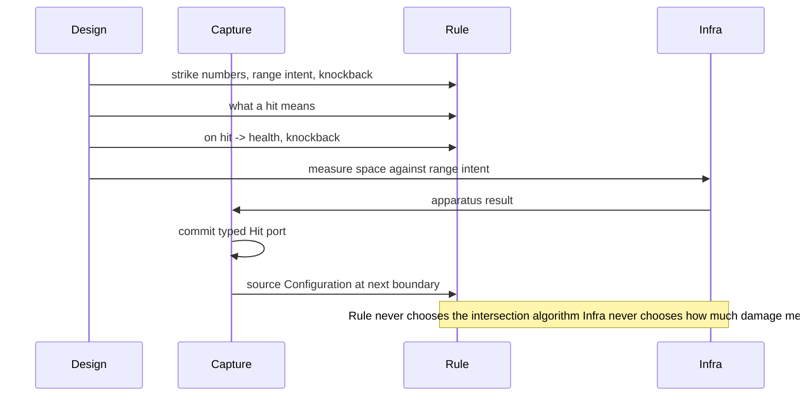
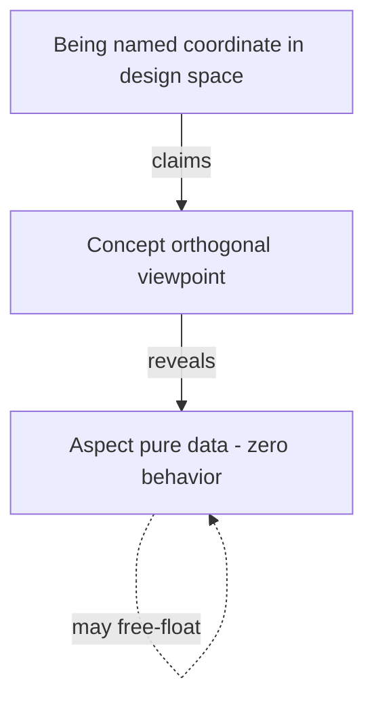
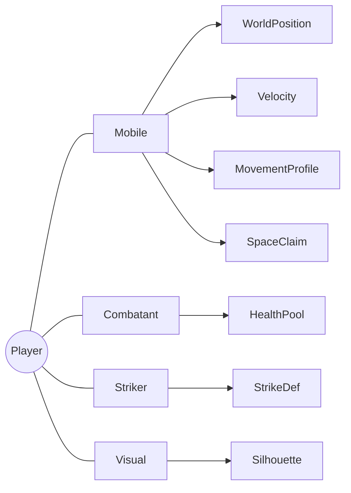
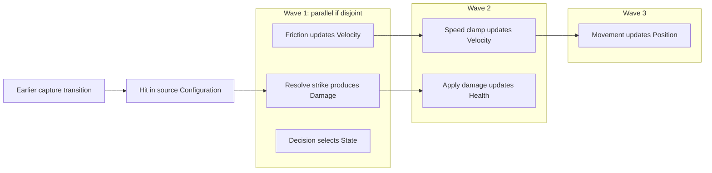
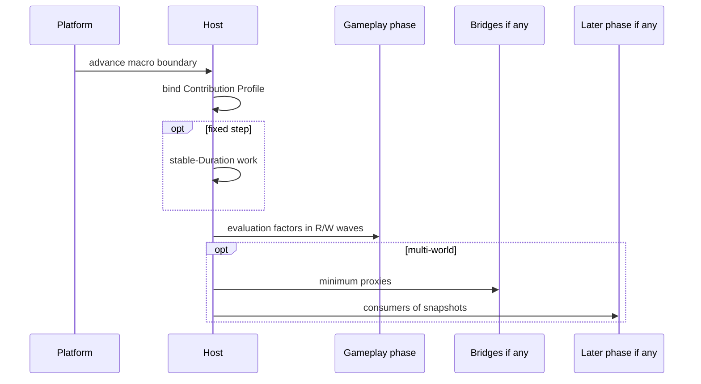

I've argued elsewhere that a game, at minimum, is a rule-constituted possibility space whose continuations can answer differently to admitted intervention. That claim can be wrong or right, it isn't the point here. The point is a smaller, more embarrassing question: why do so many of us, as indie developers, keep building our games as parasites living inside someone else's blackbox? And what exactly is wrong with how we picture "architecture" in the first place?

## Table of contents

## Misconceptions

Ask a room of developers what "game architecture" means and you'll get folder diagrams, benchmark numbers, and a suspicious number of opinions about where `Utils.cs` should live. Underneath that surface is a quieter confusion: we've started treating the game as indistinguishable from the tools used to build it. Worth asking why that habit took root.

Picture a game as nothing but a database, and the reflex is to protect table schemas long before anyone has decided what a punch actually _means_. Picture it as a pile of scripts, and every design problem becomes a rigid call graph. Either way, the same thing happens: the ability to weave possibilities quietly disappears, events get bolted into forced sequences, and agency, the whole reason a _game_ is a game and not a slideshow, evaporates.

Infrastructure can host a world. It is not the world. Engines, design patterns, elegant class hierarchies, all the diagrams people love to screenshot, genuinely useful, and entirely replaceable. None of them are the essence of the game.

So what does the architecture of a game actually look like, once you strip the furniture out?

## Start from the thing being built

Take that simulation-first game-form as already configured. Architecture begins one layer later: it must carry the authored form through configuration and execution without quietly adding another one underneath. That requires keeping several kinds of input apart:

| Kind | What it means here |
| --- | --- |
| Configured design | Authored quantities and relations accepted before the instance runs. This becomes **Knowledge**. |
| Raw configuration | Mutable truth of one operating instance. I will call it **life**. |
| Intervention profile | Contributions admitted through the game's Roles at one boundary. It supplies input; Rules determine the consequence. |
| Measurement | Causal evidence supplied by an apparatus under a declared contract, such as a measured contact. |
| Disclosure | A reading the configured game-form permits a Role to receive. It is not whatever the apparatus happened to know. |

Here, capitalized **Knowledge** names accepted configured design. Lowercase knowledge elsewhere remains what a Source knows. They are different carriers.

A Measurement has two honest places to land. If the measured value can remain operative after capture, a represented preparation transition commits it to a typed configuration port. The next macro-transition reads it from its source Configuration. If the value exists only while realizing one macro relation, it remains an internal value in that factorization, and anything consuming it there is an evaluation factor rather than another Rule cell. Neither case gives a Rule cell a third input family beside configuration ports and Role contributions. A Measurement is not a contribution through an intervention Role. If changing its contract changes admitted continuations or disclosures, the configured form has changed with it.

Those distinctions already contain most of the architecture. Knowledge configures the form. Life locates one instance inside it. Intervention enters through declared Role inputs. A committed Measurement is already part of the source Configuration; an internal one disappears inside the realized relation. Disclosure leaves through declared readings. Repeated Rule application from an admitted initial Configuration gives the Trajectories the game may actualize.

The possibility space is therefore not a bag the engine stores somewhere. It is what the configured Rules, Knowledge, initial configurations, admitted interventions, and measurement contracts make reachable. A scheduler, component store, collider, or render graph may realize part of that operation. None gets to amend it by accident.

A game Rule should be presentable honestly: here is its application domain, here are the typed positions it reads, here are the fixed quantities it may use, and here is the relation it establishes. Theme and implementation may express that relation in a thousand ways without changing the relation itself.

That demand is the line I keep taping back onto the wall:

> **Designers parameterize the game. Programmers write rules. The boundary between those jobs is enforced by construction, not by code review and good intentions. That is architecture.**

These are logical roles, not necessarily two job titles. Designers supply configured quantities, initial conditions, and authored possibilities. Programmers express generic Rule relations. Sources supply admitted Contributions through Roles. Infrastructure stores raw configuration, supplies contract-bound Measurement, executes the relations, and presents permitted readings on a machine.

The moment a programmer hardcodes a _proper noun_ into a rule, `if (being == PlayerDefinition)` or `if (target == CaveBat07)`, one parameter value has been promoted into a new law. The reverse mistake is just as bad: asking authored data to contain procedures turns parameters into scripts. If some piece of the codebase cannot preserve that separation, let it fall. C# appears below only because it can draw a few directions compactly; another language or a node graph still has to express the same model.

## Game & infrastructure

A design document doesn't talk about GPU types or engine internals. It says _hit lands_, _knockback_, _opening_, _the bat is chasing_. Infrastructure talks about overlaps, atlases, device polls, solver steps. The two vocabularies may meet at a declared contract. The failure begins when they become one vocabulary, because changing the machine then changes the language in which the game itself is defined.

Two abstraction boundaries can coexist. The abstractions this article introduces model the game; an engine may supply another set for hosting it:

| Boundary | What may vary | What the abstraction preserves |
| --- | --- | --- |
| Game model | content identity, authored values, mechanics | Rule domains, Aspect topology, quantities, and relations |
| Infrastructure | engine, backend, storage, renderer, apparatus | the represented execution, Measurement, and disclosure contracts |

An engine belongs comfortably on the second row. A good engine is useful precisely because its abstractions solve storage, scheduling, presentation, tooling, and platform problems without asking every Game Rule to solve them again. The boundary fails when one of those mechanisms becomes the only language in which the game can state what a hit, a State, or a consequence means.

A theory is not the apparatus used to measure it. In the same way, a game Rule is not the collider used to discover contact or the sprite used to show position. Once landed by either case above, Measurement remains causal: a different measured contact may lead the Rules to a different Continuation. A disclosure goes the other way: it is a reading the configured form permits some Role to receive. Rendering may present that reading and a collider may supply that Measurement, but neither apparatus gets to redefine the relation it serves. Replaceability means satisfying the same contract, not being irrelevant.

| Design says             | Configured quantities             | Rule relation                                      | Infrastructure                          |
| ----------------------- | --------------------------------- | -------------------------------------------------- | --------------------------------------- |
| Hit lands               | strike, exposure, health          | measured hit determines damage; damage changes health | overlap / distance / contact generation |
| Push apart              | space claim, separation profile   | measured overlap determines separation             | circle-push or physics penetration math |
| Opening                 | vulnerability and timing policy   | measured condition changes damage acceptance       | measured timing or contact, if required |
| Knockback               | impulse and stagger quantities    | hit determines impulse and stagger                 | body integration, if delegated          |
| Movement                | movement profile and velocity     | velocity and duration change position              | optional character-controller solver    |
| Appearance              | silhouette and palette intent     | configured visibility or disclosure, if any        | sprite atlas, draw calls, shaders        |
| Button                  | command vocabulary                | admitted command enters an intervention Role       | hardware polling, focus, rebinding UI    |
| Terrain                 | walkability and material values   | terrain constrains movement and space claims        | tile collision, nav-mesh build           |
| Camera / render / audio | follow and presentation intent    | configured projection or disclosure, if any         | matrices, viewports, mixers, voices      |

Rules do not name the collider, sprite, draw call, shader channel, or audio graph used to realize them. Infrastructure owns that vocabulary. Rules own the represented quantities and what a hit _means_, once a hit has entered through its declared Measurement contract.

For a Rule whose meaning does not depend on presentation, I keep applying one particularly rude test: strip the visuals and run the same relation as pure text. Does it still run cleanly? Or does it suddenly need a runtime type from nowhere, some stray reflection call, or, worst case, refuse to compile at all? The moment a Rule reaches into infrastructure "just for a vector type", the camel's nose is already inside the tent, and the rest of the math will not stay outside for long.

Take something as ordinary as "a hit lands". In design terms: the player swings, something in range gets hit, damage is dealt, the target is knocked back. Split _measurement_ from _resolution_:

- Infrastructure measures space against a range intent. A represented capture relation may commit one typed `Hit` row for each contact it admits.
- The configured Rule relates that committed fact, strike quantities, health, and knockback. One realization may factor the relation into `ResolveStrike`, `ApplyDamage`, and other small transformations.
- Rule never picks the intersection algorithm. Infrastructure never decides what the damage number means.


```mermaid
sequenceDiagram
    participant Design
    participant Capture
    participant Rule
    participant Infra

    Design->>Rule: strike numbers, range intent, knockback
    Design->>Rule: what a hit means
    Design->>Rule: on hit -> health, knockback

    Design->>Infra: measure space against range intent
    Infra->>Capture: apparatus result
    Capture->>Capture: commit typed Hit port
    Capture->>Rule: source Configuration at next boundary

    Note over Rule,Infra: Rule never chooses the intersection algorithm Infra never chooses how much damage means
```

Architecture, in this narrow sense, is just the refusal to let one function do both jobs forever. Measurement can sit right next to gameplay in the schedule and still be infrastructure: it supplies the measured relation, it doesn't own the damage table. One function holding both isn't pragmatism, it's debt with a grace period.

And this is exactly why the "parasite" question matters: if a rule is written in the engine's own words, the game isn't _hosted_ by the engine. It's _trapped_ inside it.

Fast or fun, doesn't matter, it has to be a game first. So instead of leaning on inheritance chains and game abstractions unable to say which game relation they model, here's the model I actually use.

## A, B, or C, what is that?

Rule and design still need a shared vocabulary for Knowledge and for the domains in which Rules apply. `HpComponent` and `MoveComp` are storage slang, not that vocabulary. I don't want a second entity model, and I'm not claiming the game _is_ a database of objects. I need to say "every mobile thing has the quantities required by movement" without listing every thing that happens to move. That requires abstraction, deliberately: one that models the authored topology of the game instead of merely adding another layer to the program. Three primitives have covered every case I've hit so far:

- **Aspect** is a glance: one pure data position or structure at the granularity chosen for this authoring vocabulary. Zero behavior.
- **Being** is... a thing. That's it. A state, a character definition, an effect, doesn't matter which. It is a named coordinate in the parameter space.
- **Concept** is a viewpoint that declares a lawful domain across many Beings, revealing every Aspect that viewpoint promises.


```mermaid
graph TB
    B["Being named coordinate in design space"]
    C["Concept orthogonal viewpoint"]
    A["Aspect pure data - zero behavior"]

    B -->|"claims"| C
    C -->|"reveals"| A
    A -.->|"may free-float"| A
```

Each Being carries three authored things: the Concepts it claims, any directly authored free-floating Aspect positions, and the values filling every position made available by either route. The Concept claims, direct Aspect incidence, and `Reveals` edges together form its Aspect topology. Its available positions are exactly the free-floating Aspects plus every Aspect revealed by every Concept it claims. Values arrive only after that topology already exists.

That order matters. A Rule first needs a complete tuple of Aspect positions on which it can apply. Only then do the values occupying those positions decide whether the tuple lies in its application domain and which result the relation establishes. A value can tune or activate one application; the topology decides whether that tuple can be stated at all.

Two rules keep this from decaying into a taxonomy tree:

- **Reveals is total.** Claim `Mobile`, and you get _every_ aspect `Mobile` reveals, no cherry-picking. Partial claims produce "almost Mobile" rows that break queries and quietly train designers to distrust the system.
- **Aspects aren't exclusive property of one concept.** A concept only opens a window. The same data can free-float when no viewpoint wrapper actually earns its keep; a single loyalty scalar doesn't need a concept standing guard over it.

These properties, rather than the carrier's identity, determine where a Rule applies.

Now give a thing four independent properties: breakable, flammable, affected by gravity, and conductive. That's already sixteen possible combinations. If the program names the combinations, `BurningCrate`, `FallingBurningCrate`, `FallingBurningMetalCrate`, every new property multiplies the number of cases somebody eventually has to remember. It can look wonderfully organized while there are only three crates.

Name the properties instead, and the crate is merely authored as breakable and flammable. The breaking rule already knows what breakable means. The burning rule already knows what flammable means. A second crate changes data, not either rule.

That's the part of abstraction I actually care about. A new Being assembled entirely from meanings the game already understands should add no new rule code. A genuinely new meaning costs the data that describes it and the rules that make it matter; it should not require reopening every old Being. If adding `Wet` means editing fire, electricity, movement, every creature class, and three factories, the combinations were only given tidier names.

ABC is useful only while it preserves that property. A Concept gives a rule one stable way of looking at many things. An Aspect is one piece that view needs at the chosen authoring granularity. A Being composes those meanings but never becomes the reason a rule runs. Get those boundaries right and one rule covers a great deal of design. Get them wrong and the code grows with the combinations, which is a much faster kind of growth than it first appears.

### How do I know the vocabulary is doing real work?

Counting A, B, and C cannot answer that. There is no first-principle reason a healthy game should contain similar numbers of Aspects, Beings, and Concepts. In fact, successful parameterization often lets Beings outgrow the vocabulary by orders of magnitude: a few material laws may govern a thousand authored blocks. A tidy ratio can be produced by an excellent model or by thirty beautifully balanced names that no rule ever reads.

The first test I care about is topological. Change which Concept a Being claims, or which Aspect position a viewpoint reveals, while using a declared neutral value wherever the new position needs one. If the set of Rule applications, readings, or continuations changes, that incidence is operative. If nothing in the configured form can ever reach it, the new edge in the authoring graph is merely another line for the diagram.

The value test comes second. Once the Aspect topology is fixed, change one authored value while holding the source Configuration, Contribution Profile, realized Measurement values, and every other configured quantity fixed. If no permitted Continuation or declared reading can change, that value is idle. But values are not the unit that gives the architecture its shape. They fill a domain the topology has already made available.

`Health = 2` and `MaxHealth = 4` are two values in two different positions, one in life and one in Knowledge. The deeper architectural fact is that `Health` and `HealthPool` exist at all, and that Rules can lawfully relate the Subjects and Beings carrying them. A Subject with no `Health` position is outside a Health Rule's domain. No clever choice of number repairs the missing topology.

The same test works in the other direction. Add a new Being using only an existing Aspect topology and existing laws. If some Rule must now learn that Being's name, the vocabulary failed to express the law's real domain. If no new Rule is needed, the abstraction has actually bought something.

This leaves three questions worth asking during design. Can every Rule name its authored applicability domain through Concepts and Aspects alone? Does claiming a Concept provide the complete Aspect topology that domain requires, without a missing-position escape? Can a new Being composed from existing meanings alter trajectories through data alone? Those questions follow from the simulation. Corpus ratios do not.


```mermaid
graph LR
    Player((Player))

    Mobile
    Combatant
    Striker
    Visual

    Player --- Mobile
    Player --- Combatant
    Player --- Striker
    Player --- Visual

    Mobile --> WorldPosition
    Mobile --> Velocity
    Mobile --> MovementProfile
    Mobile --> SpaceClaim
    Combatant --> HealthPool
    Striker --> StrikeDef
    Visual --> Silhouette
```

Not every Being is viewable through every Concept: an enemy might skip `Striker`, a pot might only have `Breakable` and `Visual`, and an authored State or Sensor might expose only the lens that gives it meaning. One Knowledge base, many viewpoints. Generic rules key off lawful meanings, never marketing names.

In an action game specifically, the split might look like: `Mobile` opens movement profile; `Combatant` opens health design; `Striker` opens strike definition; `Vulnerable` and `Knockable` open vulnerability and knockback; `Visual` opens silhouette intent; `Breakable` opens durability and authored aftermath. For Decision, concrete states and sensor definitions are Beings. `State` and `Sensor` are the Concepts through which their relevant views are opened. State groups remain authored coordinates of their own, as Beings or through a project-specific Concept, rather than becoming another Aspect merely because the evaluator reads them. Your own set will differ; the demand behind it will not: viewpoints stay explicit, data stays pure, composition stays orthogonal.

One more authoring rule worth keeping: a number without a quantity is not yet a parameter. The vocabulary declares whether a value means distance, duration, damage, probability, direction, or something else, including its unit where a conversion is meaningful. Designers supply values in that language; they do not choose `Single` versus `Double`. Knowledge maps the declared quantity to concrete storage and rejects inconsistent claims. No `any`, no `unknown`, no untyped bag sitting at the authoring boundary, because runtime guessing is exactly how design truth stops being _Knowledge_.

Also worth being pedantic about: **a being is not an entity.**

|                  | Being       | Entity         |
| ---------------- | ----------- | -------------- |
| Lives in         | Knowledge   | a world store  |
| Mutates in play? | No          | Yes            |
| Identified by    | design name | a local handle |

An entity is a bag of live fields, and it doesn't need to _know_ it's "Player". Debug tooling can show spawn source if it wants, but a Rule that depends on that debug label has abandoned the generic domain ABC was meant to provide.

ABC is an abstraction of game semantics, not a storage schema. It is how design and Rule share coordinates without collapsing into storage slang or class trees, viewpoint against free-form bags, role against identity. A database, ECS, object graph, or generated table may realize the same topology without becoming the topology itself.

## Knowledge, and... life?

Before "Player max HP is 4" and "Subject 17 currently has 2 HP" can differ as values, `HealthPool` and `Health` have to exist as two different positions. One belongs to design, the other to life. The numbers merely fill them. Cram the positions into the same address space and you get one of two failure modes: live changes quietly rewriting the design every future instance reads from, or endless reparsing because authored claims never became accepted truth.

The distinction is not merely "read-only versus writable". Knowledge helps select the configured game-form; raw configuration says where one operating instance currently is. Hold Knowledge, the rest of the form, and future inputs fixed, and two instances with the same operative raw configuration must admit the same future evolution. An extra stored flag that cannot change that prediction through a declared Rule is a cache, a projection, or bookkeeping pretending to be ontology.

Designers write structured data, JSON, tables, graphs, whatever format is convenient; the format is a mechanism, not the point. Those rows are claims. Knowledge resolves, validates, types, indexes, and closes them. Only then do they become **Knowledge**: not config, not a prefab, not memory of intent, but accepted operative design truth for one configured game-form. Changing that truth changes the configured form; it is not an ordinary mutation smuggled into the same trajectory under the polite name "reload".


```mermaid
flowchart LR
    subgraph Authoring claims
        C["concepts - aspects"]
        B["beings - references - quantities"]
    end

    subgraph Knowledge
        I["resolve - validate - type"]
        E["index - close"]
    end

    subgraph Runtime
        K["Knowledge immutable"]
        W["World stores mutable"]
    end

    C --> I
    B --> I
    I --> E
    E --> K
    K -.->|"copy at materialize"| W
```

Catalysis is a logical boundary, not a mandated list of class names: merge sources under an explicit policy, resolve prototypes so runtime never walks a parent chain, cross-reference every pointer so it lands on a Being viewable through the promised Concept, select a layout, then close. Knowledge does not mutate, full stop. Static checking, generated tables, startup validation, or an authoring tool are mechanisms for failing early; none is the idea itself. Total Knowledge and accountable Rules are the point.

Through a conceptual lens, you always ask for the aspect that concept actually reveals. `Mobile` plus movement profile is valid; `Combatant` plus world position is not, because `Combatant` never claimed that window. Direct aspect access stays available for free-floating aspects, since a concept is a viewpoint, not a taxonomy; a unique loyalty scalar doesn't need to borrow someone else's lens. An invalid lens or an ambiguous reference should fail before play whenever the toolchain allows it. Resist the temptation to invent a third path that quietly returns a missing value and hopes for the best. In one possible C# notation:

```csharp
var player = In.Being<Player>();

var movement = knowledge.Of<Mobile, MovementProfile>(player);
var health   = knowledge.Of<Combatant, HealthPool>(player);
var loyalty  = knowledge.About<Loyalty>(player);

var links = knowledge.Of<State, Link>(current.State);
```

The spelling isn't important. Read it as: choose a thing, look through one Concept, receive the Aspect that Concept promised. The compiler may enforce that promise, an authoring tool may enforce it, or the game may validate it before play. What matters is that `Combatant` cannot suddenly become a back door to position merely because both values happen to live on the same entity.

Collections have the same obligation. A mutable array hidden behind a read-only property is still a mutable array wearing a hat. Knowledge must not hand its authoring buffer back to a rule and hope nobody notices.

Here's the part people trip over most often: **reading Knowledge is not a mutable read/write conflict against other rules**, because Knowledge is immutable by construction. Treat `Of`/`About` as scheduling noise and you'll invent false dependencies, and quietly train everyone to stop trusting the real dependency graph, the one that actually lives over mutable life. No gameplay dependency serializes two Knowledge reads; safe publication and storage remain infrastructure concerns. No mystery about who last wrote `MaxSpeed`, because design does not change during the transition.

Design and life also need different kinds of references. Authoring sometimes means this exact Player definition or this exact Bat definition. Life may point to the current authored State, equipped Effect, or another design coordinate through the Concept that gives that reference meaning. The Ref may reveal only what its Concept promises. Otherwise authored identity slips back into the Rule through a more respectable-looking door.

And even that is not the identity of a living participant. Two bats materialized from the same Being read the same design and remain two different bats. Call the opaque, World-local participant a **Subject**: enough to say which life participates and nothing more. It is not a Knowledge reference and it is not permission to query an ECS handle. Confuse those three identities and either every bat becomes the same bat, or the storage engine quietly becomes the ontology again.

Knowledge holds configured design; fields hold life. Some design values may be copied into life when a Being participates in initial composition; timers, input samples, and other instance values simply begin there. The same value shape can therefore be immutable design in one place and mutable life in another. Its kind of truth follows from _where_ the position exists, not from its type name or current value. References such as a current State are how life points back at Knowledge without pretending to become a Being itself.

A Being is an authored thing, not necessarily a blueprint. An entity is one possible storage representation of a running Subject. For the Beings that participate in initial composition, `Materialize(Knowledge, initial condition)` is a one-way mapping into the initial raw configuration. Copy the design values life needs, apply its initial values, and never write back. After that point the instance is independent; changing this entity's `MaxSpeed` cannot touch Knowledge, and another instance still reads the authored value. The important part here is the direction of the mapping, not an API for Rules to create and destroy things.

That initial mapping is deliberately boring and pure. C# might write one function like this:

```csharp
static Health MaterializeHealth(in HealthPool design)
    => new(design.Maximum, design.Maximum);
```

Do not stretch that mapping into state management. Changing `CurrentState` changes one reference. Rules that care about the State read the appropriate design through that reference. Applying Decision changes `CurrentState`, not the entity's topology. A consequence Rule may read another Aspect carried by the selected State Being, but it does not need to copy that Aspect onto life and later remember to revoke it.

Why fight this hard for the Knowledge/life split? Because the moment you can no longer tell "design fact" from "this-instance-right-now", you've already lost the distinction between Rule and possibility space, and once that's gone, the blackbox owns you again.

## Rules, and the greatness of honest reads and writes

Rules need mutable life to work with. That life may live in an ECS, an SoA table, an object graph, or something stranger; storage is not the architectural decision. The decision is that a Rule cell can name what it observes and changes without importing the storage engine's vocabulary, and that every mutable touch in its realization remains visible to scheduling. "Ordering" without visible dependence is just theater.

A Rule cell is a scoped relation before any method realizes it. It declares an application domain, typed input positions, mutable positions, output positions, and the relation among their values. The application domain is not an `if` ladder hidden inside the Rule. It says which complete tuples give the Rule something to speak about.

Software may factor one Rule cell, the join of several active cells, or the entire macro relation into smaller executable transformations. I will call those **evaluation factors**. A factor may happen to state the same sentence as one Rule cell, but a function boundary does not make it one. Formal Rule cells inspect the same source Configuration and constrain the same target Configuration. Values passed only between evaluation factors are internal to that realization until the configured form exposes them at another transition boundary.

That distinction leaves room for more than one kind of cell. Outside its application domain, a Rule cell is inactive. A deterministic transformation is total over the inputs it accepts and supplies its declared result. A constraint may instead inspect a complete tuple and actively refuse it. A declared nondeterministic relation may admit several results. Inactivity, refusal, and plurality of permitted results are three different facts; a missing return value should not be asked to impersonate all of them.

Movement can be written without knowing whether the moving thing is a player or a falling stone. Its current Position, Velocity, and Duration determine the next Position. A strike can likewise be resolved without knowing the name of either participant: Power and Exposure determine Damage, and Damage reduces Health without taking it below zero.

A neutral quantity, an empty collection, a probability distribution, or a set of permitted successors can all be stated results. "Presentable as a law" does not mean every Rule must be arithmetic or deterministic. A legal move may be a constraint, a state link may be a relation, and a choice may be an ordering over candidates. What they share is a declared scope and an explicit relation, not an equals sign.

The factorization still needs to reveal three ordinary directions: what comes in, what is changed in place, and what comes out. A particular evaluation factor may use only the directions its part of the relation requires. C# happens to have `in`, `ref`, and `out`, so the silhouette is almost embarrassingly small:

```csharp
static void ResolveStrike(in Hit hit, in Strike strike, out Damage damage)
{
    damage = new(strike.Power * hit.Exposure);
}

static void ApplyDamage(in Damage damage, ref Health health)
{
    health = health.DamagedBy(damage.Amount);
}
```

There is nothing C#-specific about the idea. The notation only has to make three ordinary things visible:

- `in` reads an input without changing it.
- `ref` reads and replaces life already owned by the World.
- `out` writes the result of an accepted transformation application.
- Knowledge is immutable context, so reading it creates no mutable conflict.
- Time is an input only to laws that genuinely depend on time.

`out` does not mean "add a component", "publish when convenient", or "return maybe". If the source Configuration contains no committed hit and the macro relation has no internal measured hit, `ResolveStrike` has no tuple to evaluate. Given a complete hit and strike tuple, the factor produces `Damage`. Whether the formal Rule cell is inactive, refuses a candidate transition, or admits one is stated at the cell boundary, not smuggled through a nullable factor result.

Typed semantic absence is different. `CurrentTarget` may lawfully range over `Target | None` when having no target is itself represented game truth. An empty `Drops` collection may be a real output. The problem is using `Maybe<Damage>` to merge "this factor had no tuple to evaluate" with "the Rule applied and produced the represented value None". Application belongs to Rule scope; semantic absence belongs to the value only when the game actually has that value.

The ideal Rule cell remains one short sentence. No entity handle, store, query, dependency container, or global mutable state needs to enter it. For transformation cells, the realization works out which complete tuples match the signature and where each declared result belongs.

Limiting a Rule to one lasting change is useful pressure, not a theorem about reality. If a Rule appears to change four unrelated things, there are usually four Rules hiding under one name. A change in population, occupancy, or existence may be real game truth and therefore belongs in the represented relation. An ECS command to add a component or recycle a handle is merely one backend's reaction to that truth.

A block game can say that breaking the block at one position leaves Air there and produces Drops determined by the previous block and the Tool, without a `DestroyEntity(block)` law. How a backend represents air, compacts a table, or recycles a handle is machinery reacting to the modeled state. The same applies to `Death()` when it exists only so a later system can destroy an entity. If dying is an authored trajectory, represent that trajectory. If zero health is already the whole fact, a temporary control message adds procedure, not meaning.

For accepted transformation applications, the output shape stays declared. One matching input tuple produces one result; several tuples produce several results; an explicit reduction may turn several results into one. Constraint cells can still refuse, and declared nondeterminism can still preserve several permitted results. The factorization must preserve those relations; the scheduler does not invent their cardinality.

A useful gut check for an evaluation factor: **if you can't state what it realizes in one short sentence, split it.**

- Friction slows velocity.
- Speed cannot exceed the movement profile's max.
- Velocity changes position.
- Decision selects the next legal represented State.
- A hit determines damage.
- Damage reduces health.

Multi-sentence factors hide extra writes and slowly turn into dumping grounds.

In this construction, an evaluation factor writes within one mutable owner, which I'll call a World below. Because its reads and writes are visible, the scheduler can compare it with every other factor in that World. A helper must not be able to hide a write. Knowledge is immutable, so reading it adds no mutable conflict; only life can be changed underneath another factor.

> Remember to focus on where fact and rule intersect, that's where the architecture actually lives.
> At that intersection, the Rule signature states a complete relation: where the cell applies, what it may refuse, what it changes, and what an accepted transformation produces. Its realization is not an imperative script driving undeclared consequences or hiding order inside a call stack. Procedure inside one evaluation factor, clamp, integrate, is fine. Orchestration between factors belongs to their shared data and the schedule.

Several measured hits are several matching input tuples. The same evaluation factor runs for each, or an explicit reduction relates the collection to one result. No factor has to create, retain, broadcast, or sweep a temporary event object merely to make the next factor notice what already crossed a declared port.

The visible directions tell us which evaluation factors cannot run together. They do not always tell us which one should go first. That question belongs to the complete transition relation, after routing, ownership, Phases, reductions, and Bridges are visible too.

Clockwork, intervention, Decision, and resolution can all participate in the same flow without sharing meaning. Friction, decay, integration, no choice involved, purely mechanical. A Source may supply a Contribution that changes what Decision can read or select, but that does not define Decision. Decision chooses the next represented State among legal candidates. Strike, health, and every other effect remain consequences of complete inputs. The apparatus measuring a `Hit` remains infrastructure even when its output is committed at the adjacent boundary, because it measures space and never owns the damage table.

Behavior over life has to stay small and accountable in its reads and writes. Break that discipline and parameterization quietly dies in the programmer's calendar, while ordering dies in hope. Agency still belongs to the configured continuation structure. The architecture only gives admitted contributions an honest route into it.

## Actually, why isolate decision at all?

An admitted intervention profile is not permission for an Agent to write arbitrary life. The Rules still decide what its Contributions mean and which continuations they can reach. A button, an AI policy, and a referee ruling may arrive through different apparatus, but none stands above the configured relation.

Decision is not another name for Agency. It is the represented relation that selects the next State from the legal candidates supplied by the configured form. It may read a Contribution through a Role. It may also be intervention-free and evaluate an internal policy entirely from Knowledge and life. In the second case the simulation is deciding what one of its Subjects does, but no Source acquires Agency merely because an evaluator ran.

That is why I isolate Decision from consequence. The evaluator selects the next `State` Ref. It does not also grant invulnerability, spawn a volume, change velocity, deal damage, and reshape the entity while nobody is looking. Those are separate Rules that may read the selected State and establish their own consequences.

The ABC section was not a decorative detour. Decision uses its topology directly:

| ABC position | Decision vocabulary | What it supplies |
| --- | --- | --- |
| Concept | `State` | The common view claimed by authored State Beings |
| Being | Each concrete State | One candidate coordinate in the decision space |
| Aspect | `Link` | A directed relation to another State Being |
| Aspect | `Gate` | A condition over sensed values, including thresholds and hysteresis |
| Aspect | `Desirability` | Priority and weighted sensor references used to rank candidates |
| Being / Concept | State group | An authored coordinate or view selecting candidate State Beings, tiers, or defaults |
| Being | Sensor definition | The identity and configured parameters of one sensed quantity |
| Concept | `Sensor`, when useful | A lawful view shared by sensor Beings, not another runtime value |

There are exactly three Decision Aspects: `Gate`, `Desirability`, and `Link`. Everything else occupies Being or Concept because it is an authored coordinate or a viewpoint over such coordinates. A sensed result is not another Aspect in Knowledge either. It is a runtime value supplied to the evaluator by a closed provider.

This topology is what lets one evaluator cover hard edges, scores, or a hybrid without knowing the proper name of any State. Links establish the graph. Gates filter its edges. Desirability orders what remains. A State group selects the candidate region in which that topology is evaluated. The thresholds and weights fill those positions, but they do not create the graph by themselves. And no, I do not need another behavior-tree soup to rename the same relations.

The evaluator stays pure:

```text
Evaluate(Knowledge, current State Ref, State group, sensed values)
    -> next State Ref or the current one
```

Applying the result changes `CurrentState`, not the entity's shape. If rolling changes damage acceptance, a damage Rule reads that authored meaning from the selected State Being through the appropriate Concept or free-floating Aspect. Nothing needs to copy an `Invulnerable` tag onto life and remember to remove it later.

There is still a totality trap. If `State` reveals `Link`, every State Being supplies a Link position, including an empty value where there is no outgoing edge. If another Concept reveals `Gate` or `Desirability`, every Being claiming that view supplies the corresponding position, including a lawful neutral value. A typed None is valid only when None is one of the Aspect's meanings; it does not excuse a hole in the topology.

Decision also needs changing facts without importing the whole World. A sensor definition is a Being in Knowledge, while its provider is one closed extraction from declared life or Measurement ports to a typed value. Health ratio may follow from `Health`; State duration may follow from the current timer; proximity may require a spatial apparatus. The evaluator consumes those values and never the query internals that produced them. None automatically becomes a disclosure to a Role merely because Decision can read it.

Dispatch should remain closed and typed, not a reflective provider soup on the hot path. Adding another State Being with the same three-Aspect topology is authoring. Adding another sensor Being uses the existing provider vocabulary when its extraction already exists. A genuinely new topology or relation may require a new Rule. The evaluator itself should not need another branch every time a designer invents a new State.

That asymmetry is the **Leverage** I care about. Values tune one authored coordinate. Aspect topology determines which generic laws can see it at all. If every new State requires another evaluator branch, parameterization has failed no matter how carefully somebody balanced its scores.

If any of this starts to feel like "the game is a graph of states", stop right there. The graph is one parameterized model inside the game. The game remains the possibility space constituted by all its Rules, Knowledge, admitted inputs, and initial conditions.

## Transition, Phase, World

A macro-transition is one traceable step of the configured form. It may be advanced by a fixed tick, a turn, an action resolution, a referee ruling, or another boundary. Its software realization may use several microsteps or waves, but those steps compose one transition unless the configured form itself exposes them. The host mechanism does not qualify the Rule, and it does not force every transition to carry `(index, time, duration)` as one bundle.

The small transformations inside those waves are evaluation factors of the macro relation, not automatically separate time-polarized Rule cells of the formal game-form. Their composite realizes the declared Rule relation. If a project wants a wave boundary to become a configured transition, it must expose the intermediate configuration and let the rest of the form inspect it.

Duration is a quantity. Boundary identity is another fact. A Rule asks for whichever quantity changes its relation. Phase names belong to the project, and the host advances the declared temporal policy; it does not call individual Rules.

Three things get conflated constantly, so it is worth separating them cleanly:

- A **Phase** expresses temporal meaning or advancement policy.
- A **World** is one closed owner of mutable life and local identity.
- A **Backend Binding** realizes a World using one storage and execution backend.

If a simulation uses several Worlds, assign every mutable port to exactly one of them. The global raw Configuration is composed from those local Configurations, but no mutable position appears in two Worlds at once. The exact representation matters less than the wall. A Bridge may derive a value from one settled World and provide it to another at a known boundary, but that is a directional relation between distinct ports, not shared life. If the relation can change a permitted continuation or disclosed reading, it belongs to the represented game-form. Only the copying mechanism remains infrastructure.

There is no sacred lineup of `RenderWorld` and `AudioWorld` waiting to be declared. Walls go up when mutable ownership actually divides, not merely because cadence, layout, backend, or failure policy differs. Those are Phase, Backend Binding, and apparatus concerns until another owner truly exists. Ordinary presentation consumes a declared projection or disclosure; it is not a World drawn so a diagram can have another box.

We don't chase a global service locator, we chase visible flow. Outputs already connect producers to consumers; a second, invisible broadcast network would only give the same information another route through the program.

Subject 42 in World A is not Subject 42 in World B. An evaluation factor in A never reaches directly into mutable life owned by B, and cross-wall data moves only through Bridges at declared boundaries. A single-World project simply has no Bridges; that is honesty, not a missing pillar. Split when ownership divides, not because a blog post once showed three boxes and it looked tidy.

Capture may be where external input is admitted. Fixed may hold transformations needing stable Duration. Later Phases may project settled truth. These names are examples. World and Phase remain orthogonal: evaluation factors over one World may participate in several Phases, and the waves inside each boundary come from declared dependence rather than a table somebody keeps rearranging by hand.

### When reads and writes aren't enough

Rules may be stated as if their relations simply hold. A computer still has to realize one macro-transition through finite microsteps, and evaluation order can change the simulated law. Updating position from the old velocity is not the same model as updating it from the velocity after friction and clamping. That choice is semantics wearing the clothes of scheduling. Intermediate wave values are part of the realization; they become game configurations or disclosures only when the configured form represents them as such.

Suppose friction changes velocity, a speed limit changes velocity too, and movement reads velocity to update position. The signatures tell us that none of those touches may overlap carelessly. They do not, by themselves, say whether movement wants the velocity before or after the limit.

But the scheduler isn't looking at those three transformations in a vacuum. If the game says friction happens before the speed limit, and movement consumes the result of the speed limit, then friction is already before movement. No third annotation is needed. If movement and collision live in different Phases, that relation is already known too. If one transformation's `out Damage` satisfies another transformation's `in Damage`, the producer already comes first.

Worlds remove another pile of false questions. Ordinary transformations in two different Worlds do not share mutable data at all. If something crosses between them, a Bridge says which World is the source and which is the destination, so the direction is not ambiguous there either.

Only after all of that should `run before` or `run after` appear: for a real relation that no signature, Phase, or Bridge can imply. What remains is usually a partial order. State the meaningful relations, let the scheduler infer the rest, and reject an execution plan when undeclared order-dependence makes two schedules realize different macro-results. Declared nondeterminism is part of the game-form and must survive. A cycle is acceptable when the configured form gives it explicit iteration or fixed-point semantics; a bare call cycle gives the scheduler no such relation to realize. File order and alphabetical order do not become game design merely because they are deterministic.

In the example below, contact Measurement has already been committed by an earlier represented capture transition. The waves contain only evaluation factors for the following macro relation.


```mermaid
flowchart LR
    Capture["Earlier capture transition"]
    Hit["Hit in source Configuration"]

    subgraph W1["Wave 1: parallel if disjoint"]
        Friction["Friction updates Velocity"]
        Strike["Resolve strike produces Damage"]
        Decision["Decision selects State"]
    end
    subgraph W2["Wave 2"]
        Clamp["Speed clamp updates Velocity"]
        Health["Apply damage updates Health"]
    end
    subgraph W3["Wave 3"]
        Move["Movement updates Position"]
    end

    Capture --> Hit
    Hit --> Strike
    Friction --> Clamp
    Clamp --> Move
    Strike --> Health
```

The diagram is the result, not the input. The scheduler's job is not to invent a convenient order; it is to produce an execution whose microsteps compose the declared macro-transition. Once that order is known, waves are merely the sets that may run together without introducing undeclared order-dependence. Parallelism is a consequence of independence, not an extra Rule pasted on top. A single meaningful before/after relation may settle an entire chain. A declared fixed point may settle a cycle. An ambiguous read with neither relation leaves the realization underspecified. That is what "enforced by construction" means when applied to time.


```mermaid
sequenceDiagram
    participant Platform
    participant Host
    participant G as Gameplay phase
    participant Br as Bridges if any
    participant L as Later phase if any

    Platform->>Host: advance macro boundary
    Host->>Host: bind Contribution Profile
    opt fixed step
        Host->>Host: stable-Duration work
    end
    Host->>G: evaluation factors in R/W waves
    opt multi-world
        Host->>Br: minimum proxies
        Host->>L: consumers of snapshots
    end
```

Bridges only earn their keep when two genuine Worlds need to exchange values without sharing a store. They run after the source has settled, carry only what the destination needs, and finish before the destination starts reading. Ordinary presentation receives a declared projection or disclosure instead; it does not become a World merely because data crosses a boundary. No evaluation factor needs to import a Bridge object, but any behavior-changing relation the Bridge carries must already be represented. A game with one World needs no Bridge at all.

The concrete Backend Binding belongs in infrastructure and nowhere else. Native handles, queries, pools, and Bridge maps may all exist behind it; they simply aren't words a gameplay law needs to know. How a project wires those mechanisms is secondary to keeping their vocabulary on the correct side of the wall.

Worlds, the Rule denotation, evaluation factors, Bridges, Phases, reductions, and result routing already contain the dependence truth needed to derive a schedule. The host advancing boundaries and supplying exact temporal quantities stays deliberately thin. The moment someone hand-edits that schedule to slot in one extra factor without updating the underlying truth, the whole model becomes theater. The platform is not the game, and it shouldn't get to pretend otherwise.

Sources supply intervention through Roles. Rules constitute the possible transitions. Evaluation factors realize them under an order that follows honest reads and writes. Machinery measures what needs measuring, and presentation receives declared readings without rewriting the law. Agency remains where those interventions alter Continuation. That's the exact opposite of living as a parasite inside a blackbox: the host can change out from under you, and the Rule still stands.

## When the separations are real

At this point the architecture can be tested without naming a package. Take any gameplay Rule. Its scope and relation should be expressible through configured quantities, source-Configuration ports, Role Contributions, and the exact temporal quantities it requires. A measured fact that remains operative must already occupy one of those configuration ports. An accepted transformation states its output. A constraint states what it refuses. Declared nondeterminism states its permitted plurality. None needs an engine handle, hidden service, missing-application value, or storage-lifecycle command to finish the statement.

Now hold one Being's Aspect topology fixed and change only its values. Knowledge and reachable trajectories may change, while the generic Rule vocabulary and its application shape remain. Add another Being with the same topology and no Rule should learn its proper name. Change the topology by introducing a genuinely new Aspect position or Concept incidence, and the domains in which Rules may apply can change before any interesting number has been chosen. Add a genuinely new relation and the Rules change. Replace the collider while preserving its Measurement contract, the renderer while preserving its disclosures, or the store while preserving the same Rule applications. The machinery changes; the configured game-form does not. Those are the checks I use to see whether the terms have actually remained separate.

An abstraction earns its place by preserving one of those invariants across the variation it hides. If it models no Rule, no topology, no quantity, no ownership boundary, and no replaceable mechanism, it has nothing to preserve. It is another place to look, wearing the name of an explanation.

Feature pressure will keep trying to falsify them. The camera quietly becomes a global singleton. A shortcut writes life through a hidden service. A storage callback becomes the only place where a gameplay consequence exists. Each shortcut promotes machinery into the game model, then forces later Rules to understand the machinery. The small Rule with complete inputs, an honest scope, and a declared relation is the one I can still trust when the host changes.

## Well, it really is about the game itself

If the engine you're standing on suddenly fell behind, changed its license terms, or simply stopped scaling with your ambitions, what happens to your project? Do you lose years of work, or do you just write a new set of infrastructure bindings for the rules you already have?

There's nothing wrong with commercial engines. The problem starts the moment we let an engine's internal structure quietly dictate the boundaries of our design space.

> After all, as indie developers, the goal is to make games, not to run as a parasite inside someone else's blackbox.

This was never meant to be an architecture overview. It is one demand placed on the software: preserve the separation already present in the simulation. Parameters select the game. Laws transform its raw configuration. Sources contribute through Roles. Agency appears where those Contributions alter Continuation. Machinery measures, executes, and presents the result.

If every Rule can still be stated as plainly as a physical or chemical relation, the architecture is probably serving the game. When a Rule needs a proper noun, a nullable result standing in for missing application, an unrepresented storage-lifecycle operation, or an engine object to complete its meaning, the furniture has started pretending to be the house again, including, probably, in a few places I have not noticed yet.
